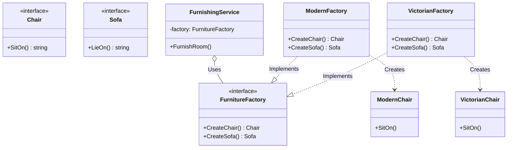

# Go Abstract Factory Pattern Example (Clean Architecture)

This project is an educational sample code that implements the **Abstract Factory Pattern** using the **Go** language. You will learn how to create a family of related objects without specifying their concrete classes.

## What This Example Shows

- Creating a *family* of related products (chair + sofa) via a single factory
- Keeping the client (`usecase`) independent of concrete styles; only `main.go` selects which factory to inject

## Quick Start

In the `abstract-factory-example` directory:

```bash
go run main.go
```

## 🛋 Scenario: Furniture Sets (Modern vs. Victorian)

When buying furniture, you might want a matching set of a "chair" and a "sofa" that fits a specific style (e.g., Modern, Victorian).
If you were to instantiate classes separately, you might accidentally end up with a Victorian chair in a modern room.
The Abstract Factory pattern ensures stylistic consistency.

### Key Roles

1. **Abstract Product (`domain.Chair`, `domain.Sofa`)**: Interfaces for the products that will be created.
2. **Abstract Factory (`domain.FurnitureFactory`)**: An interface that defines methods for creating a set of products (`CreateChair`, `CreateSofa`).
3. **Client (`usecase.FurnishingService`)**: The business logic that uses a factory to furnish a room. It is unaware of concrete "Modern" or "Victorian" implementation classes.
4. **Concrete Factory (`adapter.ModernFactory`, `adapter.VictorianFactory`)**: Factories that produce products for a specific style.
5. **Concrete Product**: The actual product implementations (e.g., `ModernChair`, `VictorianSofa`).

## 🏗 Architecture



### Role of Each Layer

1. **Domain (`/domain`)**:
    * Contains only the definitions of abstract products (`Chair`, `Sofa`) and the factory that creates them (`FurnitureFactory`).
2. **Usecase (`/usecase`)**:
    * `FurnishingService`: Describes only the procedure of "getting a chair and sofa from the factory and placing them," without worrying about what kind of furniture it is.
3. **Adapter (`/adapter`)**:
    * Contains the concrete classes for each actual style (Modern, Victorian) and the factory implementations that create them.

## 💡 Architectural Design Notes (Q&A)

### Q1. What is the difference between this and the Factory Method?

**A. The difference is whether you are creating a "single product" or a "family of products."**

* **Factory Method**: Creates a single product in a single method (polymorphism through inheritance/implementation).
* **Abstract Factory**: An interface for creating a set of **multiple related products** (a chair and a sofa). Internally, each method is often a Factory Method.

### Q2. How would I add a new style (e.g., Art Deco)?

**A. You can extend it without modifying existing code (OCP).**

1. Create `ArtDecoChair` and `ArtDecoSofa` in the `adapter` package.
2. Create an `ArtDecoFactory` that produces them.
3. In `main.go`, simply pass the `ArtDecoFactory` to the `FurnishingService`.
No changes are needed in the `FurnishingService` or `domain` code.

## 🚀 How to Run

```bash
go run main.go
```
