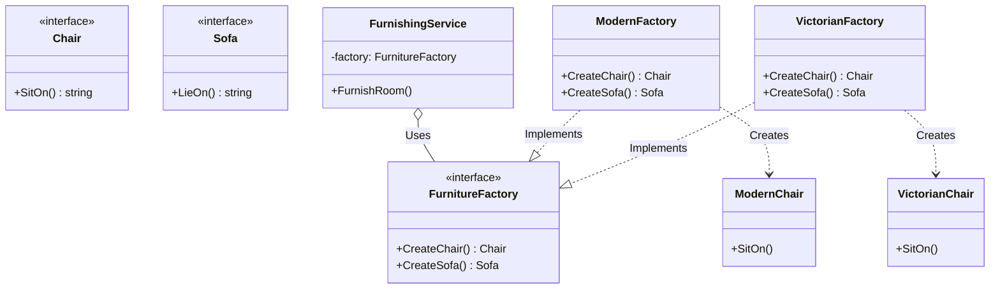

# Go Abstract Factory Pattern Example (Clean Architecture)

このプロジェクトは、**Go**言語を用いて**Abstract Factory Pattern（アブストラクトファクトリーパターン）**を実装した教育用のサンプルコードです。具体的な実装クラスを指定せずに、関連する一連のオブジェクト群（製品ファミリ）を生成する方法を学びます。

## この例で学べること

- 1つのファクトリーから「椅子＋ソファ」という関連製品の*ファミリ*を生成する流れ
- クライアント（`usecase`）は具象スタイルを知らず、どのファクトリーを使うかは `main.go` が注入で選ぶ設計

## すぐ試す

`abstract-factory-example` ディレクトリで実行します。

```bash
go run main.go
```

## 🛋 シナリオ: 家具セット（モダン vs ビクトリア調）

家具を購入する際、スタイル（モダン、ビクトリア調など）に合わせて「椅子」と「ソファ」をセットで揃えたい場合があります。
もし、バラバラにクラスを指定して生成していると、モダンな部屋にビクトリア調の椅子が混ざってしまうかもしれません。
Abstract Factoryを使って、スタイルの整合性を保証します。

### 登場人物
1.  **Abstract Product (`domain.Chair`, `domain.Sofa`)**: 生成される製品のインターフェース。
2.  **Abstract Factory (`domain.FurnitureFactory`)**: 一連の製品を作成するためのメソッド(`CreateChair`, `CreateSofa`)を定義するインターフェース。
3.  **Client (`usecase.FurnishingService`)**: ファクトリーを使って家具を揃えるビジネスロジック。具体的な「モダン」「ビクトリア」の実装クラスは知りません。
4.  **Concrete Factory (`adapter.ModernFactory`, `adapter.VictorianFactory`)**: 特定のスタイル向けの製品を生成する工場。
5.  **Concrete Product**: 実際の製品実装（`ModernChair`, `VictorianSofa`など）。

## 🏗 アーキテクチャ構成



### 各レイヤーの役割

1.  **Domain (`/domain`)**:
    *   抽象的な製品（`Chair`, `Sofa`）と、それらを生み出す工場の定義（`FurnitureFactory`）のみを持ちます。
2.  **Usecase (`/usecase`)**:
    *   `FurnishingService`: 「どんな家具か」は気にせず、「工場から椅子とソファをもらって配置する」という手順だけを記述します。
3.  **Adapter (`/adapter`)**:
    *   実際のスタイル（モダン、ビクトリア調）ごとの具象クラスと、それを生成するファクトリーの実装が含まれます。

## 💡 アーキテクチャ設計ノート (Q&A)

### Q1. Factory Methodとの違いは何ですか？

**A. 「一つの製品」を作るか、「製品のファミリ（群）」を作るかの違いです。**

*   **Factory Method**: 一つのメソッドで一つの製品を作ります（継承/実装によるポリモーフィズム）。
*   **Abstract Factory**: **関連し合う複数の製品**（椅子とソファ）をセットで作るためのインターフェースです。通常、内部的には各メソッドがFactory Methodになっています。

### Q2. 新しいスタイル（例：アールデコ）を追加するには？

**A. 既存コードを修正せずに拡張可能です（OCP）。**

1.  `adapter` パッケージに `ArtDecoChair`, `ArtDecoSofa` を作ります。
2.  それらを生成する `ArtDecoFactory` を作ります。
3.  `main.go` で `FurnishingService` に `ArtDecoFactory` を渡すだけです。
`FurnishingService` や `domain` のコードは一切変更する必要がありません。

## 🚀 実行方法

```bash
go run main.go
```