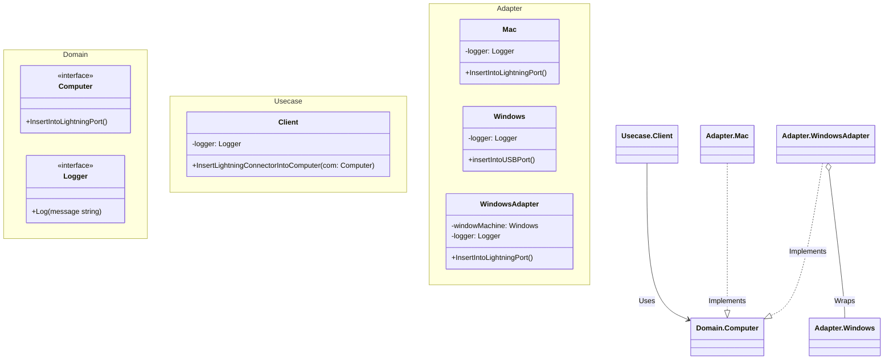

# Go Adapter Pattern Example (Clean Architecture)

This project is an educational sample code that implements the **Adapter Pattern** using the **Go** language. You will learn how to connect classes with incompatible interfaces and reuse existing code without modification.

## What This Example Shows

- Converting an incompatible interface (USB) into the expected one (Lightning)
- Reusing an existing implementation without modifying it
- Implementing the adapter via composition/delegation, which is idiomatic in Go
- Using **Clean Architecture** to separate the client logic (`usecase`) from the concrete adapters (`adapter`)

## Quick Start

In the `adapter-example` directory:

```bash
go run main.go
```

## 🔌 Scenario: Lightning Connector and USB Port

A user (client) wants to plug in a "Lightning connector."
However, the machine they have (service) is a "Windows" machine with only a "USB port."
Since they cannot connect directly, they use a "Windows adapter" to convert the Lightning signal to USB for connection.

### Key Roles

1. **Client Interface (`domain.Computer`)**: The interface the client expects (inserting into a Lightning port).
2. **Service (`adapter.Windows`)**: The existing class you want to use, but with a different interface (inserting into a USB port).
3. **Adapter (`adapter.WindowsAdapter`)**: The intermediary. It implements the Client Interface and internally calls the Service's method.

## 🏗 Architecture



### Role of Each Layer

1. **Domain (`/domain`)**:
    * `Computer`: An interface that defines the operation "insert into Lightning port." The client logic depends on this.
2. **Usecase (`/usecase`)**:
    * `Client`: Represents the business logic of using a computer. It only knows about the `Computer` interface, not whether it's a Mac or a Windows PC.
3. **Adapter (`/adapter`)**:
    * `Mac`: A native class that implements the interface directly.
    * `Windows`: A class with an incompatible interface. It does not have `InsertIntoLightningPort`.
    * `WindowsAdapter`: Implements the `Computer` interface. When `InsertIntoLightningPort` is called, it internally calls the `Windows`'s `insertIntoUSBPort` to make things work.

## 💡 Architectural Design Notes (Q&A)

### Q1. When should I use it?

**A. When you want to use an existing library or old code with a new interface.**

For example, suppose you have a newly defined `Logger` interface and want to reuse an `OldLogLib` class from a past project. Modifying the `OldLogLib` code is risky, so wrapping it with an Adapter is a safer approach.

### Q2. What are the key points for an Adapter in Go?

**A. It's common to use Composition (delegation).**

Since Go does not have inheritance, the Adapter struct holds the "target struct to be converted" as a field (`Embedded` or `Field`) and implements wrapper methods. This corresponds to the "Object Adapter" pattern rather than the "Class Adapter" pattern.

## 🚀 How to Run

```bash
go run main.go
```