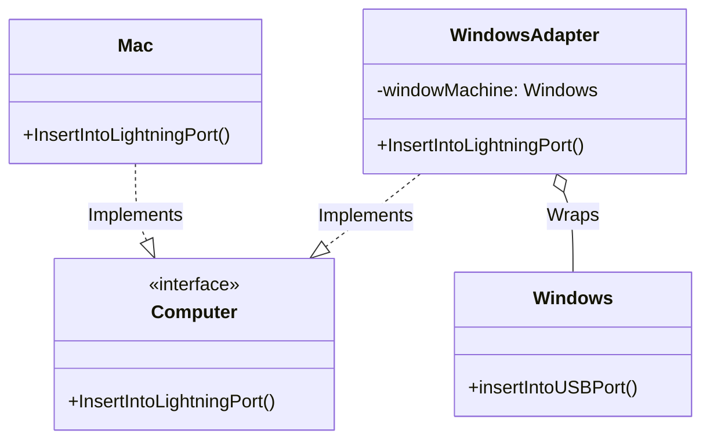

# Go Adapter Pattern Example (Clean Architecture)

このプロジェクトは、**Go**言語を用いて**Adapter Pattern（アダプターパターン）**を実装した教育用のサンプルコードです。互換性のないインターフェースを持つクラス同士を接続し、既存のコードを修正せずに再利用する方法を学びます。

## この例で学べること

- 互換性のないインターフェース（USB）を期待される形（Lightning）へ変換する流れ
- 既存実装を修正せずに再利用できること
- Go では継承ではなく合成/委譲で Adapter を作るのが自然なこと

## すぐ試す

`adapter-example` ディレクトリで実行します。

```bash
go run main.go
```

## 🔌 シナリオ: LightningコネクタとUSBポート

Macユーザー（クライアント）は「Lightningコネクタ」を挿したいと考えています。
しかし、手元にあるマシン（サービス）は「Windows」で、「USBポート」しか持っていません。
そのままでは接続できないため、「Windowsアダプタ」を介して、Lightningの信号をUSBに変換して接続します。

### 登場人物
1.  **Client Interface (`domain.Computer`)**: クライアントが期待しているインターフェース（Lightningポートへの挿入）。
2.  **Service (`adapter.Windows`)**: 使いたい既存クラス。インターフェースが異なる（USBポートへの挿入）。
3.  **Adapter (`adapter.WindowsAdapter`)**: 仲介役。Client Interfaceを実装し、内部でServiceのメソッドを呼び出します。

## 🏗 アーキテクチャ構成



### 各レイヤーの役割

1.  **Domain (`/domain`)**:
    *   `Computer`: 「Lightningポートに挿す」という操作を定義したインターフェース。クライアント（`main.go`のClient struct）はこれに依存します。
2.  **Adapter (`/adapter`)**:
    *   `Mac`: インターフェースをそのまま実装しているネイティブなクラス。
    *   `Windows`: 互換性のないインターフェースを持つクラス。`InsertIntoLightningPort` を持っていません。
    *   `WindowsAdapter`: `Computer` インターフェースを実装し、`InsertIntoLightningPort` が呼ばれたら、内部で `Windows` の `insertIntoUSBPort` を呼び出して辻褄を合わせます。

## 💡 アーキテクチャ設計ノート (Q&A)

### Q1. いつ使いますか？

**A. 既存のライブラリや古いコードを、新しいインターフェースで使いたいときです。**

例えば、新しく定義した `Logger` インターフェースがあり、過去のプロジェクトで使っていた `OldLogLib` クラスを再利用したいとします。
`OldLogLib` のコードを書き換えるのはリスクがあるため、Adapterを作ってラップするのが安全です。

### Q2. GoにおけるAdapterのポイントは？

**A. Composition（委譲）を使うのが一般的です。**

Goには継承がないため、Adapter構造体の中に「変換対象の構造体」をフィールドとして持ち（`Embedded` または `Field`）、ラッパーメソッドを実装します。
「継承状のアダプタ（Class Adapter）」ではなく「委譲状のアダプタ（Object Adapter）」の形式になります。

## 🚀 実行方法

```bash
go run main.go
```
