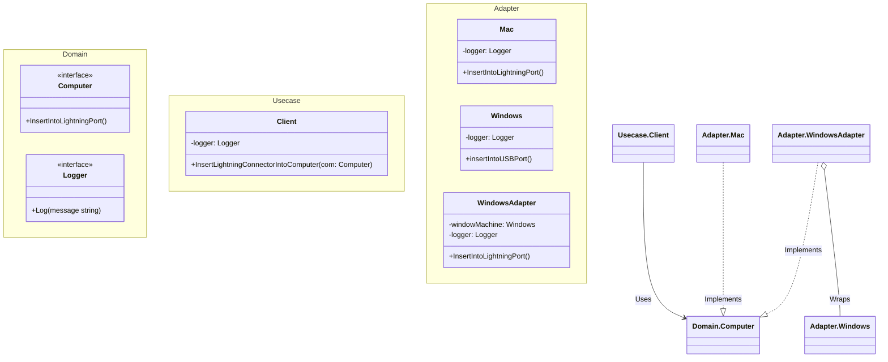

# Go Adapter Pattern Example (Clean Architecture)

このプロジェクトは、**Go**言語を用いて**Adapter Pattern（アダプターパターン）**を実装した教育用のサンプルコードです。互換性のないインターフェースを持つクラス同士を接続し、既存のコードを変更せずに再利用する方法を学びます。

## この例で学べること

- 互換性のないインターフェース（USB）を期待するインターフェース（Lightning）に変換する
- 既存の実装（Windowsマシン）を変更することなく再利用する
- Goのイディオムであるコンポジション（委譲）を使ったアダプターの実装
- **Clean Architecture**を用いたクライアントロジック（`usecase`）と具体的なアダプター（`adapter`）の分離

## すぐ試す

`adapter-example` ディレクトリで実行します。

```bash
go run main.go
```

## 🔌 シナリオ：LightningコネクタとUSBポート

ユーザー（クライアント）は「Lightningコネクタ」を挿したいと考えています。
しかし、持っているマシン（サービス）は「Windows」マシンで、「USBポート」しかありません。
直接接続できないため、「Windowsアダプター」を使ってLightning信号をUSBに変換して接続します。

### 登場人物

1. **Client Interface (`domain.Computer`)**: クライアントが期待するインターフェース（Lightningポートへの挿入）。
2. **Service (`adapter.Windows`)**: 利用したい既存のクラスだが、インターフェースが異なる（USBポートへの挿入）。
3. **Adapter (`adapter.WindowsAdapter`)**: 仲介役。クライアントのインターフェースを実装し、内部でサービスのメソッドを呼び出す。

## 🏗 アーキテクチャ構成



### 各レイヤーの役割

1. **Domain (`/domain`)**:
    * `Computer`: 「Lightningポートに挿入する」という操作を定義するインターフェース。クライアントロジックはこれに依存します。
2. **Usecase (`/usecase`)**:
    * `Client`: コンピュータを利用するビジネスロジックを表します。相手がMacかWindowsかを知らず、単に`Computer`インターフェースを使います。
3. **Adapter (`/adapter`)**:
    * `Mac`: インターフェースを直接実装するネイティブなクラス。
    * `Windows`: 互換性のないインターフェースを持つクラス。`InsertIntoLightningPort` を持ちません。
    * `WindowsAdapter`: `Computer` インターフェースを実装します。`InsertIntoLightningPort` が呼ばれると、内部で `Windows` の `insertIntoUSBPort` を呼び出して辻褄を合わせます。

## 💡 アーキテクチャ設計ノート (Q&A)

### Q1. どんな時に使うべき？

**A. 既存のライブラリや古いコードを、新しいインターフェースに合わせて再利用したい時です。**

例えば、新しく定義した `Logger` インターフェースがあり、過去のプロジェクトで作った `OldLogLib` クラスを再利用したいとします。`OldLogLib` のコードを書き換えるのはリスクが高いため、Adapterでラップして使うのが安全です。

### Q2. GoでのAdapter実装のポイントは？

**A. コンポジション（委譲）を使うのが一般的です。**

Goには継承がないため、Adapter構造体が「変換対象の構造体」をフィールド（埋め込みまたは通常のフィールド）として持ち、ラッパーメソッドを実装します。これは「クラスアダプター」パターンではなく「オブジェクトアダプター」パターンに相当します。

## 🚀 実行方法

```bash
go run main.go
```