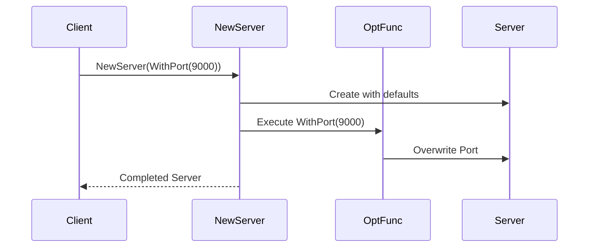

# Day 1: Idiomatic Initialization

On the first day, we focus on "object initialization," which is most frequently used in Go.
Since Go does not have constructors or inheritance like other languages, unique initialization patterns have evolved.
The most important among them is the **Functional Options Pattern**.

Today, we will learn the following pattern:

1.  **Functional Options**: Flexible and safe initialization for Go

---

## 1. Functional Options

### 📖 Story: The Highly Customizable Server

Imagine you are building a library for a web server.
By default, it operates on port 8080 with a 30-second timeout.
However, some users might want to say, "I want port 9000" or "I want a shorter timeout."

If you try to pass these as arguments, like `NewServer(port int, timeout time.Duration, ...)`, the number of arguments grows every time a configuration item is added, breaking existing code.
On the other hand, if you pass a "configuration struct," users must set every value, making default values hard to use.

This is where **Functional Options** comes in: you pass **"functions that change settings"** as options.

### 💡 Concept

Pass variable arguments of functions (options) to the initialization function. These options are executed after applying default values to overwrite the state.



### 🐹 The Essence of Go Implementation

This pattern is used in the Go standard library (like `grpc`) and many famous libraries.
The key point is that option functions can safely modify a struct with unexported (private) fields, like `Server`.

```go
type Server struct {
    port    int
    timeout time.Duration
}

type Option func(*Server)

func WithPort(p int) Option {
    return func(s *Server) {
        s.port = p
    }
}

func NewServer(opts ...Option) *Server {
    s := &Server{port: 8080, timeout: 30 * time.Second} // Defaults
    for _, opt := range opts {
        opt(s)
    }
    return s
}
```

### 🧪 Hands-on

Take a look at the `functional-options-example` directory.
Try adding a new option (e.g., `WithMaxConnections`) and extending `NewServer` to use it.

### ❓ Quiz

**Q1. What is the biggest advantage of the Functional Options pattern?**
A. It reduces memory usage.
B. You can freely add configuration items later without changing the arguments of the public API (New function).
C. It increases the compilation speed of the program.

<details>
<summary>Answer</summary>
**B**. Its greatest strength is the ability to flexibly increase options while maintaining backward compatibility.
</details>

---

Great job! Day 1 is now complete.
By mastering idiomatic initialization in Go, you can now design APIs that are easy to use and hard to break.
Tomorrow, we will learn about "Structural" patterns. Stay tuned!