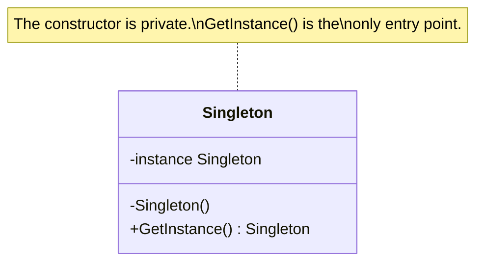
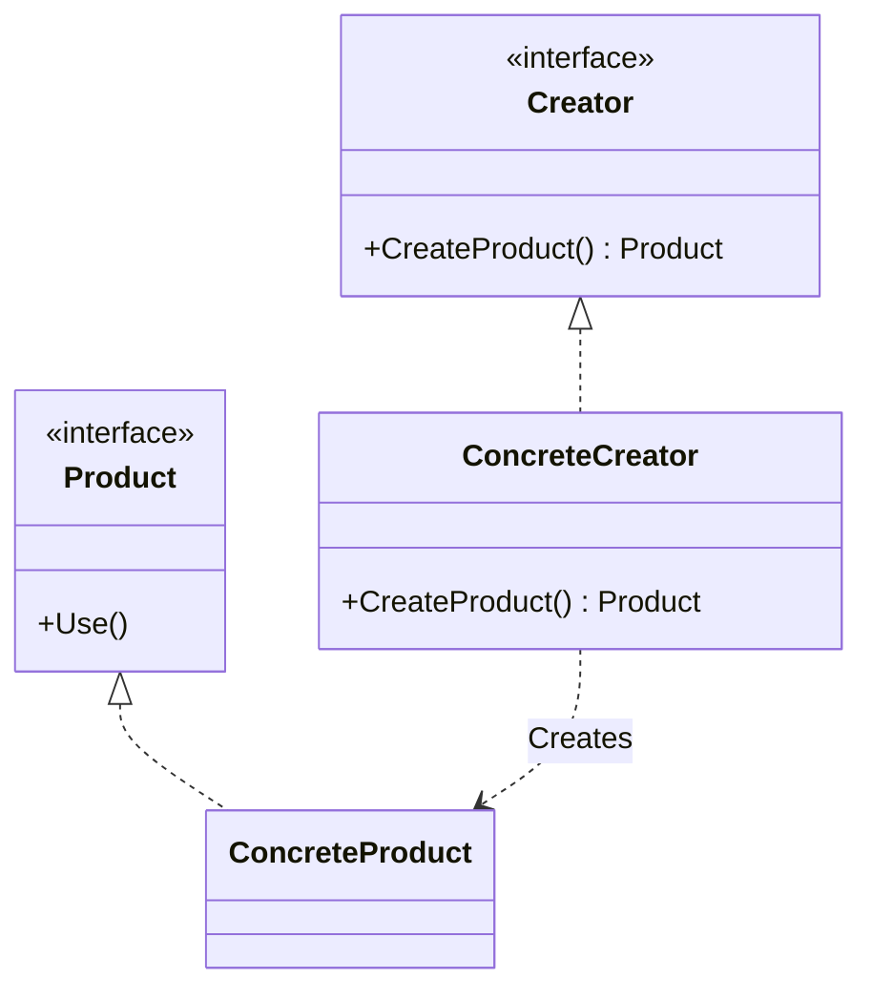
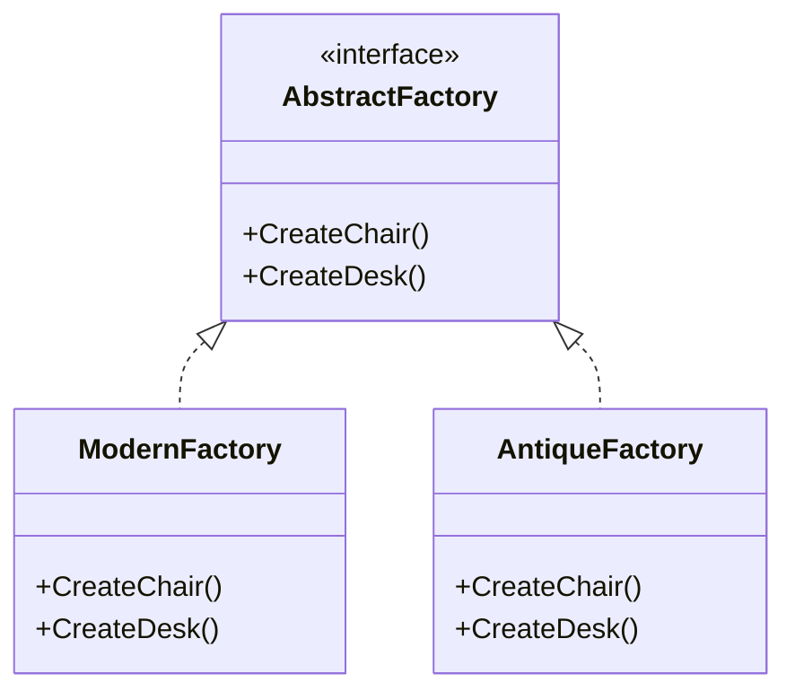
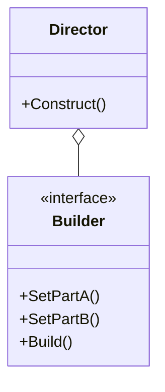

# Day 1: The Magic of Object Creation (Creational Patterns)

On the first day, we focus on the beginning of everything: "object creation."
Did you think, "Isn't it just about using `new`?"
In large-scale applications, "who," "when," and "how" objects are created greatly affects the system's flexibility.

Today, we will learn the following five patterns:

1. **Singleton**: The one and only absolute existence
2. **Factory Method**: Delegating the responsibility of creation
3. **Abstract Factory**: A group of factories for related products
4. **Builder**: Step-by-step complex assembly
5. **Prototype**: Multiply by copying

---

## 1. Singleton

### 📖 Story: The Kingdom's Throne

In a certain kingdom, there is a "throne." There is only one throne.
What would happen if a carpenter decided to build new thrones and place them everywhere?
Multiple kings would appear, and the chain of command would be in chaos.
The Singleton pattern is used to represent things that **"should be the only one in the world,"** such as a "configuration management class" or a "database connection pool" for the entire system.

### 💡 Concept

It ensures that a class has only one instance and provides a global point of access to it.



### 🐹 Go Implementation Tips

Go doesn't have `private` constructors, but we can control this with package visibility (lowercase starting letter).
And it's standard practice to use `sync.Once` to make it thread-safe (safe for concurrent processing).

```go
package singleton

import "sync"

type singleton struct {}

var instance *singleton
var once sync.Once

func GetInstance() *singleton {
    once.Do(func() {
        instance = &singleton{}
    })
    return instance
}
```

### 🧪 Hands-on

Let's look at the `singleton-example` directory.
Try writing code that calls `GetInstance()` multiple times and confirms that the returned pointer addresses are the same.

### ❓ Quiz

**Q1. When should the Singleton pattern be used?**
A. When you want to create a different object for each row in a database.
B. When you want to manage configuration information shared across the entire application.
C. When you want to encapsulate a complex calculation algorithm.

<details>
<summary>Correct Answer</summary>
**B**. It is suitable for managing shared resources like configuration information or a log manager.
</details>

---

## 2. Factory Method

### 📖 Story: The Pizzeria

You are the owner of a pizzeria. At first, you only made "Margherita" pizza.
But as it became popular, you wanted to make "Seafood Pizza" and "Cheese Pizza" as well.
It would be a hassle if every time an order came in, the staff had to wonder, "Um, how do I make a Margherita...?"
Let's hire a "pizza maker (Factory)" so that when you say, "I'll have a Margherita!", the right pizza comes out.

### 💡 Concept

Defines an interface for creating an instance, but lets subclasses (or implementers in Go) decide which class to instantiate.



### 🐹 Go Implementation Tips

In Go, "constructor functions" often serve the role of a Factory.
From a Clean Architecture perspective, when the `usecase` layer needs an interface from the `domain` layer (like a Repository), it can go through a Factory to avoid knowing the concrete implementation (like MySQLRepository).

```go
type Pizza interface {
    Prepare()
}

type PizzaFactory interface {
    CreatePizza(type string) Pizza
}
```

### 🧪 Hands-on

Let's run `factory-example`.
Try adding a new type of `Product` (e.g., `SpecialProduct`) and extend the Factory to be able to create it. Were you able to extend it without changing the existing client code?

### ❓ Quiz

**Q2. What is the main benefit of the Factory Method?**
A. It can separate the object creation process from the client code.
B. The program's execution speed is dramatically improved.
C. It eliminates the need for a database connection.

<details>
<summary>Correct Answer</summary>
**A**. The client no longer needs to know "what to create," which reduces coupling.
</details>

---

## 3. Abstract Factory

### 📖 Story: Furniture Set

You bought a "modern chair" at a furniture store. If you then buy an "antique desk," the room's cohesiveness is lost, right?
A "modern chair" goes with a "modern desk," and an "antique chair" goes with an "antique desk."
The Abstract Factory is what ensures these sets (product families) are provided without mistakes.

### 💡 Concept

Provides an interface for creating families of related or dependent objects without specifying their concrete classes.



### 🐹 Go Implementation Tips

In `abstract-factory-example`, this can be applied when switching database types (e.g., PostgreSQL vs. MySQL).
Imagine a `DaoFactory` interface with methods like `CreateUserDao()` and `CreateItemDao()`.

### 🧪 Hands-on

In `abstract-factory-example`, add a new factory (e.g., a `MockFactory` for the `RdbFactory`) and use DI (Dependency Injection) in your test code.

### ❓ Quiz

**Q3. What is the difference between Factory Method and Abstract Factory?**
A. Abstract Factory creates one product. Factory Method creates multiple products.
B. Factory Method creates one product. Abstract Factory creates a family of related products.
C. There is no difference. Only the names are different.

<details>
<summary>Correct Answer</summary>
**B**. The major difference is whether it deals with a "family" of products.
</details>

---

## 4. Builder

### 📖 Story: Ordering at Subway

When you order at a sandwich shop, you specify details like, "Wheat bread, extra veggies, no pickles, Caesar dressing..." right?
If the menu only had finished products like "Wheat-ExtraVeggies-NoPickles-Caesar Sandwich," the menu would explode.
The Builder pattern separates the **construction steps**, like "choose bread," "choose veggies," and finally says "Done!".

### 💡 Concept

Separates the construction of a complex object from its representation, so that the same construction process can create different representations.



### 🐹 Go Implementation Tips

While the "Functional Options Pattern" is also commonly used in Go, the Builder pattern is more suitable for more complex construction processes (where order matters, a Director exists, etc.).
It's elegant to implement it using method chaining (`b.SetA().SetB().Build()`).

### 🧪 Hands-on

In `builder-example`, create a new builder (e.g., `IglooHouseBuilder`) and try building a house of ice.

### ❓ Quiz

**Q4. When is the Builder pattern suitable?**
A. For initializing simple structs.
B. For creating objects that have many parameters and complex combinations.
C. For converting the interface of an existing class.

<details>
<summary>Correct Answer</summary>
**B**. It also helps solve the Telescoping Constructor Problem (too many constructor arguments).
</details>

---

## 5. Prototype

### 📖 Story: Cell Division

An amoeba doesn't build its body from scratch; it multiplies by dividing (copying) itself.
In programming, if you have an object that takes a very long time to initialize (e.g., a state loaded with huge initial data from a database),
it can be faster to "copy" the finished product rather than `new`-ing it every time.

### 💡 Concept

Creates new instances by copying a prototypical instance.

### 🐹 Go Implementation Tips

Go does not have a standard feature like a `Clone()` method.
You need to implement the `Clone()` method yourself.
When doing so, you must be careful about whether it's a **Deep Copy** or a **Shallow Copy**.
If it contains pointers, a simple copy will result in the referenced data being shared.

### 🧪 Hands-on

In `prototype-example`, create a struct that includes slices and maps, and verify that the `Clone()` method performs a correct Deep Copy.

### ❓ Quiz

**Q5. What is the biggest caution with the Prototype pattern?**
A. The original object is destroyed.
B. Bugs caused by the difference between Deep Copy and Shallow Copy.
C. Memory usage doubles.

<details>
<summary>Correct Answer</summary>
**B**. When dealing with fields of reference types, unintended sharing is likely to occur, so caution is needed.
</details>

---

Well done! That's the end of Day 1.
By mastering object creation patterns, your code has taken its first flexible step against "change."
Tomorrow, we will learn about patterns related to "structure." Look forward to it!
