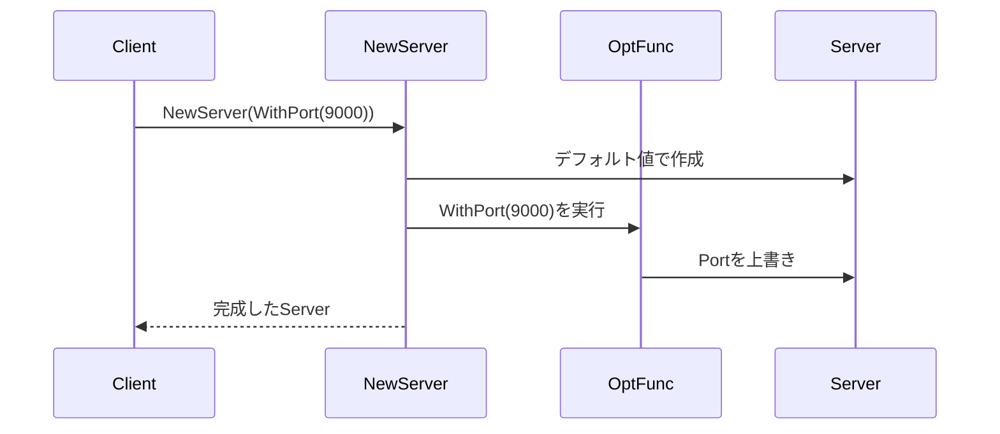

# Day 1: Go らしい初期化 (Initialization)

初日は、Go において最も多用される「オブジェクトの初期化」に焦点を当てます。
Go には他の言語にあるようなコンストラクタや継承がないため、独自の初期化パターンが発展してきました。
その中でも特に重要なのが、この **Functional Options Pattern** です。

本日は以下のパターンを学びます。

1. **Functional Options**: Go のための柔軟で安全な初期化

---

## 1. Functional Options (ファンクショナルオプション)

### 📖 ストーリー：カスタマイズ自在なサーバー

あなたが Web サーバーのライブラリを作っているとしましょう。
デフォルトではポート 8080、タイムアウト 30 秒で動作します。
しかし、ユーザーによっては「ポートは 9000 がいい」「タイムアウトは短くしたい」といった要望があります。

もしこれを引数で渡そうとすると、`NewServer(port int, timeout time.Duration, ...)` となり、設定項目が増えるたびに引数が増えて、既存のコードを壊してしまいます。
かといって「設定用構造体」を渡すと、すべての値を設定しなければならず、デフォルト値が使いにくくなります。

そこで、**「設定を変更する関数」をオプションとして渡す**のが Functional Options です。

### 💡 コンセプト

初期化関数に可変長引数の関数（オプション）を渡し、デフォルト値を適用した後にそれらのオプションを実行して状態を上書きします。



### 🐹 Go 実装の極意

このパターンは、Go の標準ライブラリ（`grpc` など）や多くの有名ライブラリで使用されています。
ポイントは、オプション関数が `Server` のような非公開フィールドを持つ構造体を安全に変更できる点にあります。

```go
type Server struct {
    port    int
    timeout time.Duration
}

type Option func(*Server)

func WithPort(p int) Option {
    return func(s *Server) {
        s.port = p
    }
}

func NewServer(opts ...Option) *Server {
    s := &Server{port: 8080, timeout: 30 * time.Second} // デフォルト
    for _, opt := range opts {
        opt(s)
    }
    return s
}
```

### 🧪 ハンズオン

`functional-options-example` ディレクトリを見てみましょう。
新しいオプション（例: `WithMaxConnections`）を追加し、`NewServer` でそれを利用できるように拡張してみてください。

### ❓ クイズ

**Q1. Functional Options パターンの最大の利点は？**
A. メモリ使用量が削減される
B. 公開 API（New 関数）の引数を変えずに、後から設定項目を自由に追加できる
C. プログラムのコンパイル速度が上がる

<details>
<summary>正解</summary>
**B**. 後方互換性を保ったまま、柔軟にオプションを増やせるのが最大の強みです。
</details>

---

お疲れ様でした！ Day 1 はこれで終了です。
Go らしい初期化をマスターすることで、使いやすく、壊れにくい API 設計ができるようになりました。
明日は「構造」に関するパターンを学びます。お楽しみに！
