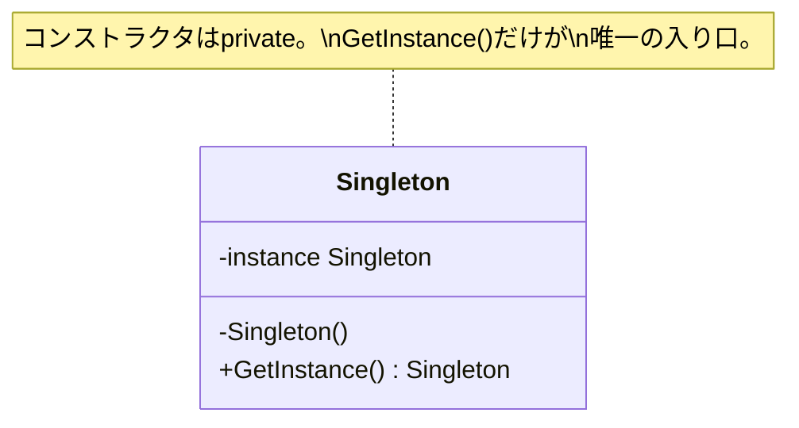
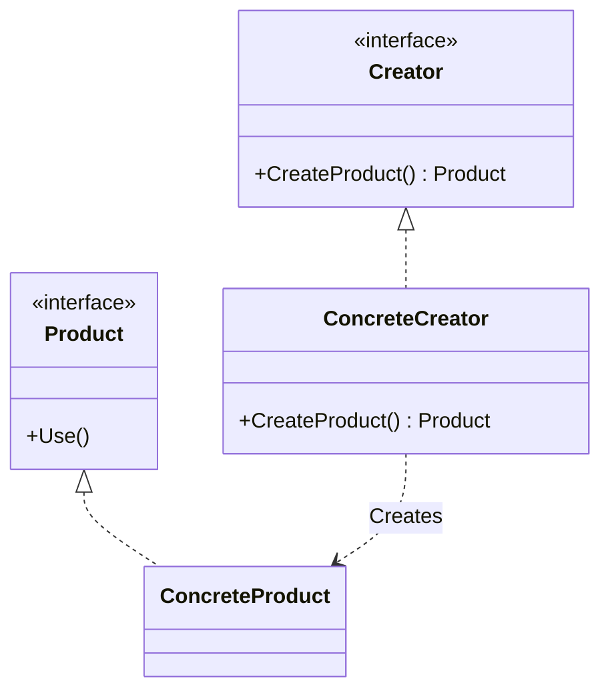
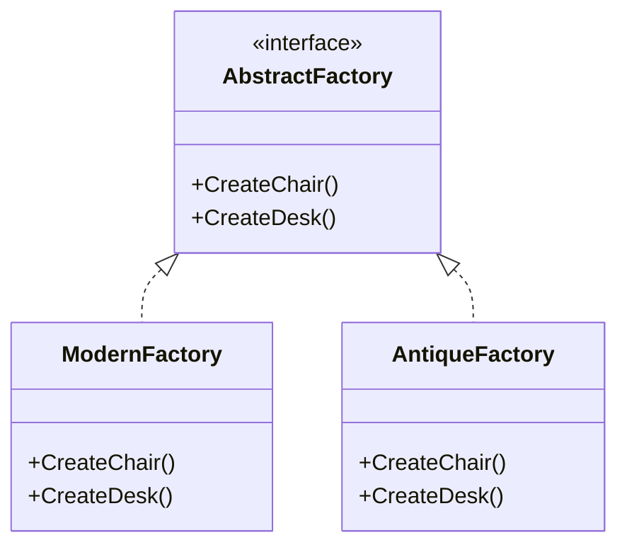
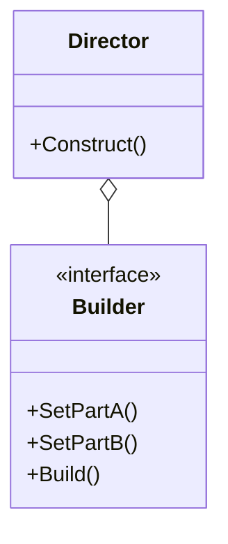

# Day 1: オブジェクト生成の魔法 (Creational Patterns)

初日は、すべての始まりである「オブジェクトの生成」に焦点を当てます。
「`new` するだけじゃないの？」と思いましたか？
大規模なアプリケーションでは、「誰が」「いつ」「どのように」オブジェクトを作るかが、システムの柔軟性を大きく左右します。

本日は以下の 5 つのパターンを学びます。

1.  **Singleton**: たった一つの絶対的な存在
2.  **Factory Method**: 生成の責任を委譲する
3.  **Abstract Factory**: 関連製品の工場群
4.  **Builder**: 複雑な組み立てをステップバイステップで
5.  **Prototype**: コピーして増やす

---

## 1. Singleton (シングルトン)

### 📖 ストーリー：王国の玉座

ある王国に「玉座」があります。玉座は一つしかありません。
もし、大工さんが勝手に新しい玉座を作って、あちこちに玉座があったらどうなるでしょう？
王様が複数人現れて、命令系統が大混乱してしまいますね。
システム全体で「設定管理クラス」や「データベース接続プール」など、**「世界に一つだけであってほしいもの」**を表現するのが Singleton です。

### 💡 コンセプト

クラスのインスタンスが 1 つしか生成されないことを保証し、そのインスタンスへのグローバルなアクセスポイントを提供します。



### 🐹 Go 実装の極意

Go には `private` コンストラクタはありませんが、パッケージの可視性（小文字始まり）で制御します。
そして、スレッドセーフ（並行処理で安全）に作るために `sync.Once` を使うのが定石です。

```go
package singleton

import "sync"

type singleton struct {}

var instance *singleton
var once sync.Once

func GetInstance() *singleton {
    once.Do(func() {
        instance = &singleton{}
    })
    return instance
}
```

### 🧪 ハンズオン

`singleton-example` ディレクトリを見てみましょう。
`GetInstance()` を複数回呼んで、返ってくるポインタのアドレスが同じであることを確認するコードを書いてみてください。

### ❓ クイズ

**Q1. Singleton パターンを使うべき場面は？**
A. データベースの行ごとに異なるオブジェクトを作りたいとき
B. アプリケーション全体で共有する設定情報を管理したいとき
C. 複雑な計算アルゴリズムをカプセル化したいとき

<details>
<summary>正解</summary>
**B**. 設定情報やログマネージャーなど、共有リソースの管理に適しています。
</details>

---

## 2. Factory Method (ファクトリーメソッド)

### 📖 ストーリー：ピザ屋さん

あなたはピザ屋のオーナーです。最初は「マルゲリータ」しか作っていませんでした。
しかし、人気が出て「シーフードピザ」も「チーズピザ」も作りたくなりました。
注文が入るたびに、店員さんが「えーと、マルゲリータの作り方は…」と悩んでいては大変です。
「ピザを作る人（Factory）」を雇って、「マルゲリータ頼む！」と言えば、適切なピザが出てくるようにしましょう。

### 💡 コンセプト

インスタンス生成のインターフェースを定義し、具体的なクラスの決定はサブクラス（Go では実装者）に任せます。



### 🐹 Go 実装の極意

Go では「コンストラクタ関数」が Factory の役割を果たすことが多いですが、
Clean Architecture 的には、`usecase` 層が `domain` 層のインターフェース（Repository など）を必要とする際、
具体的な実装（MySQLRepository など）を知らなくて済むように、Factory を経由することがあります。

```go
type Pizza interface {
    Prepare()
}

type PizzaFactory interface {
    CreatePizza(type string) Pizza
}
```

### 🧪 ハンズオン

`factory-example` を実行してみましょう。
新しい種類の `Product` (例: `SpecialProduct`) を追加し、Factory がそれを生成できるように拡張してみてください。既存のクライアントコードを変更せずに拡張できましたか？

### ❓ クイズ

**Q2. Factory Method の主な利点は？**
A. オブジェクトの生成処理をクライアントコードから分離できる
B. プログラムの実行速度が劇的に向上する
C. データベースへの接続が不要になる

<details>
<summary>正解</summary>
**A**. クライアントは「何を作るか」を知る必要がなくなり、結合度が下がります。
</details>

---

## 3. Abstract Factory (アブストラクトファクトリー)

### 📖 ストーリー：家具セット

家具屋さんで「モダンな椅子」を買いました。次に机を買うとき、「アンティークな机」を買うと部屋の統一感がなくなりますよね。
「モダンな椅子」には「モダンな机」、「アンティークな椅子」には「アンティークな机」。
これらをセット（製品群）として間違いなく提供してくれるのが Abstract Factory です。

### 💡 コンセプト

関連する一連のオブジェクト群を、具体的なクラスを指定せずに生成するためのインターフェースを提供します。



### 🐹 Go 実装の極意

`abstract-factory-example` では、データベースの種類（PostgreSQL vs MySQL）などを切り替える際に応用できます。
`DaoFactory` インターフェースがあり、`CreateUserDao()`, `CreateItemDao()` などのメソッドを持つイメージです。

### 🧪 ハンズオン

`abstract-factory-example` に新しいファクトリー（例: `RdbFactory` に対する `MockFactory`）を追加し、テストコードで DI（依存性注入）してみましょう。

### ❓ クイズ

**Q3. Factory Method と Abstract Factory の違いは？**
A. Abstract Factory は一つの製品を作る。Factory Method は複数の製品を作る。
B. Factory Method は一つの製品を作る。Abstract Factory は関連する製品群を作る。
C. 違いはない。名前が違うだけ。

<details>
<summary>正解</summary>
**B**. 製品「群（ファミリー）」を扱うかどうかが大きな違いです。
</details>

---

## 4. Builder (ビルダー)

### 📖 ストーリー：サブウェイの注文

サンドイッチ屋さんで注文するとき、「パンはウィートで、野菜多めで、ピクルス抜きで、ドレッシングはシーザーで…」と細かく指定しますよね。
もしメニューに「ウィート・野菜多め・ピクルス抜き・シーザーサンド」という完成品しかなかったら、メニューが爆発してしまいます。
「パンを選ぶ」「野菜を選ぶ」といった**構築手順**を分けて、最後に「完成！」とするのが Builder です。

### 💡 コンセプト

複雑なオブジェクトの構築プロセスを分離し、同じプロセスで異なる表現形式を作れるようにします。



### 🐹 Go 実装の極意

Go では「Functional Options Pattern」もよく使われますが、Builder パターンはより複雑な構築プロセス（順序がある、Director が存在するなど）に適しています。
メソッドチェーン（`b.SetA().SetB().Build()`）を使って実装すると美しいです。

### 🧪 ハンズオン

`builder-example` で、新しいビルダー（例: `IglooHouseBuilder`）を作成し、氷の家を作ってみましょう。

### ❓ クイズ

**Q4. Builder パターンが適しているのは？**
A. 単純な構造体の初期化
B. 多数のパラメータを持ち、その組み合わせが複雑なオブジェクトの生成
C. 既存のクラスのインターフェース変換

<details>
<summary>正解</summary>
**B**. コンストラクタの引数が多すぎる問題（Telescoping Constructor Problem）の解決にも役立ちます。
</details>

---

## 5. Prototype (プロトタイプ)

### 📖 ストーリー：細胞分裂

アメーバは、ゼロから体を作るのではなく、自分自身を分裂（コピー）して増えます。
プログラムでも、初期化にすごく時間がかかるオブジェクト（例: 巨大なデータベースの初期データをロードした状態）がある場合、
毎回 `new` するより、その完成品を「コピー」した方が速いことがあります。

### 💡 コンセプト

原型（プロトタイプ）となるインスタンスをコピーして新しいインスタンスを生成します。

### 🐹 Go 実装の極意

Go には `Clone()` メソッドのような標準機能はありません。
自分で `Clone()` メソッドを実装する必要があります。
この時、**Deep Copy（深いコピー）** か **Shallow Copy（浅いコピー）** かに注意が必要です。
ポインタを含んでいる場合、単純にコピーすると参照先が共有されてしまいます。

### 🧪 ハンズオン

`prototype-example` で、スライスやマップを含む構造体を作成し、`Clone()` メソッドで正しく Deep Copy されるか確認してみましょう。

### ❓ クイズ

**Q5. Prototype パターンの最大の注意点は？**
A. コピー元のオブジェクトが消滅すること
B. Deep Copy と Shallow Copy の違いによるバグ
C. メモリ使用量が倍になること

<details>
<summary>正解</summary>
**B**. 参照型のフィールドを持つ場合、意図しない共有が発生しやすいので注意が必要です。
</details>

---

お疲れ様でした！ Day 1 はこれで終了です。
オブジェクト生成のパターンをマスターすることで、あなたのコードは「変更」に対して柔軟な第一歩を踏み出しました。
明日は「構造」に関するパターンを学びます。お楽しみに！
