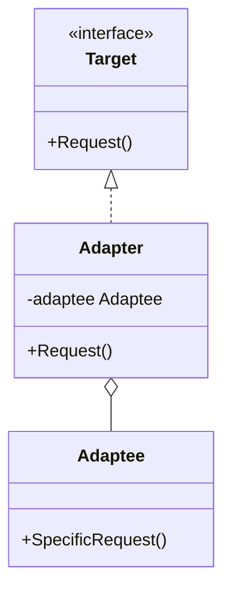
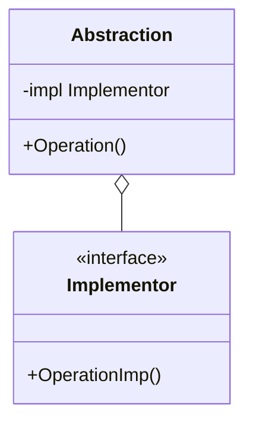
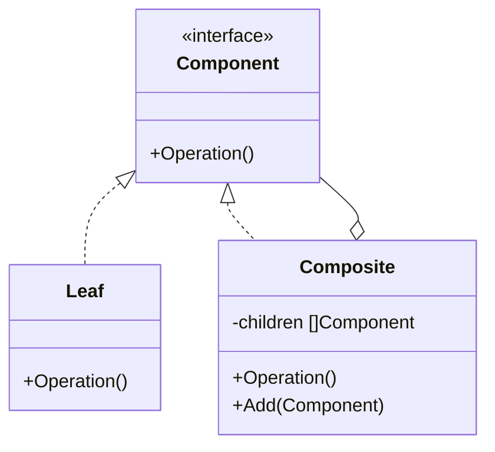
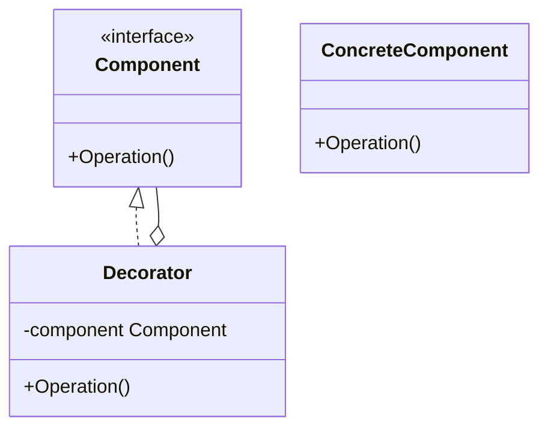

# Day 2: Organizing and Extending Structure (Structural Patterns Part 1)

Well done on Day 1!
Today, we move into patterns related to "structure."
How can we combine classes and objects to create a structure that is robust to change and easy to reuse?
You often hear the phrase "composition over inheritance," and its essence lies here.

Today, we will learn the following four patterns:

1. **Adapter**: Connecting two people who speak different languages
2. **Bridge**: A bridge between function and implementation
3. **Composite**: A recursive structure like a Matryoshka doll
4. **Decorator**: Adding functions like dressing up a doll

---

## 6. Adapter

### 📖 Story: Power Outlet on an International Trip

Have you ever been on an overseas trip and found that the plug of your hair dryer from Japan doesn't fit the wall socket?
In such cases, you use a "conversion plug (adapter)."
The hair dryer (Client) expects a Japanese plug (Target), but the wall (Adaptee) has a foreign shape.
By having an adapter in between, you can use the electricity from the wall without modifying the hair dryer.

### 💡 Concept

Connects classes with incompatible interfaces.



### 🐹 Go Implementation Tips

In Go, this is often used to adapt the struct of an existing library or external API to your domain's interface.
In Go, which lacks "inheritance," this is implemented using struct embedding or by holding it as a field (composition).

```go
// Target Interface
type Logger interface {
    Log(msg string)
}

// Adaptee (3rd party library)
type FancyLogger struct {}
func (f *FancyLogger) FancyLog(msg string) { fmt.Println("***" + msg + "***") }

// Adapter
type LoggerAdapter struct {
    fancyLogger *FancyLogger
}
func (l *LoggerAdapter) Log(msg string) {
    l.fancyLogger.FancyLog(msg) // Convert and call
}
```

### 🧪 Hands-on

In the `adapter-example` directory, create a new `Adaptee` (e.g., `JsonLogger`) and write an `Adapter` to make it conform to the `Target` interface.

### ❓ Quiz

**Q1. What is the main purpose of the Adapter pattern?**
A. To add new functionality.
B. To make an existing class usable with a different interface without modifying it.
C. To manage object creation.

<details>
<summary>Correct Answer</summary>
**B**. It is very effective for reusing existing assets (Legacy Code or external libraries).
</details>

---

## 7. Bridge

### 📖 Story: Remote Control and TV

Let's consider the relationship between a "remote control" and a "TV."
The remote has functions like "power ON/OFF" and "channel change."
The TV has implementations like "Sony-made" and "Panasonic-made."
If you were to create a "Sony remote," "Panasonic remote," etc., you would need to remake all manufacturers' remotes every time a new function (e.g., voice control) is added.
By separating the "remote (function)" and the "TV (implementation)" and creating a Bridge, they can evolve independently.

### 💡 Concept

Decouples an abstraction from its implementation so that the two can vary independently.



### 🐹 Go Implementation Tips

This is the basic form of a Go interface.
The `Abstraction` struct holds the `Implementor` interface as a field and delegates processing to it.
This allows the `Implementor` to be swapped without changing the logic of the `Abstraction`, and vice versa.

### 🧪 Hands-on

Let's look at `bridge-example`.
Confirm that adding a new `Implementor` (e.g., `PDFPrinter` for `PrinterAPI`) does not require changing the code of the `Abstraction` (`MacComputer` or `WindowsComputer`).

### ❓ Quiz

**Q2. What is the benefit of using the Bridge pattern?**
A. It prevents a class explosion (a sharp increase in the number of classes due to combinations).
B. The number of lines in the program decreases.
C. Execution speed increases.

<details>
<summary>Correct Answer</summary>
**A**. By separating the functional hierarchy from the implementation hierarchy, you don't need to create as many classes as there are combinations.
</details>

---

## 8. Composite

### 📖 Story: File System

A folder contains files. But a folder can also contain "another folder," right?
From the user's perspective, deleting a file and deleting a folder are the same "delete" operation.
It's convenient to be able to treat the "contents (Leaf)" and the "container (Composite)" as the same thing.

### 💡 Concept

Composes objects into tree structures to represent part-whole hierarchies. Composite lets clients treat individual objects and compositions of objects uniformly.



### 🐹 Go Implementation Tips

Define a `Component` interface, and have both `Leaf` and `Composite` implement it.
The `Composite` holds a `[]Component` (slice), and when its `Operation()` is called, it recursively calls the `Operation()` of its children.

### 🧪 Hands-on

In `composite-example`, run the program that displays the directory structure.
Try adding a new type of `Component` (e.g., `Link`).

### ❓ Quiz

**Q3. What data structure does the Composite pattern handle?**
A. List structure
B. Tree structure
C. Graph structure (with cycles)

<details>
<summary>Correct Answer</summary>
**B**. It is ideal for handling recursive tree structures.
</details>

---

## 9. Decorator

### 📖 Story: Matryoshka Coffee

You order a coffee. You want to add "milk." And "sugar." And "whipped cream."
It's a pain to create a "coffee with milk" class, a "coffee with milk and sugar" class, and so on.
The idea is to "wrap" the base coffee with a layer of milk, a layer of sugar, etc.
From the outside, no matter how many layers you add, it's still "coffee."

### 💡 Concept

Attaches additional responsibilities to an object dynamically. Decorators provide a flexible alternative to subclassing for extending functionality.



### 🐹 Go Implementation Tips

In Go, `http.Handler` middleware is a perfect example of this.
A function like `func(next http.Handler) http.Handler`, which takes a handler and returns a new handler, is the Decorator pattern itself.

```go
type Pizza interface {
    GetPrice() int
}

type TomatoTopping struct {
    pizza Pizza
}

func (t *TomatoTopping) GetPrice() int {
    return t.pizza.GetPrice() + 100 // Add to the original price
}
```

### 🧪 Hands-on

In `decorator-example`, create a new topping (e.g., `CheeseTopping`) and add it to the pizza price calculation.
Confirm that it works even if you change the order of the toppings.

### ❓ Quiz

**Q4. What is the benefit of the Decorator pattern?**
A. It allows for flexible addition and removal of functionality without using inheritance.
B. It can hide the internal state of an object.
C. It makes it easy to create a singleton.

<details>
<summary>Correct Answer</summary>
**A**. Instead of a static inheritance relationship, you can dynamically combine functionalities at runtime.
</details>

---

That's all for Day 2!
Did you feel how using "structural" patterns helped to neatly organize scattered classes and make them easier to extend?
Tomorrow, we'll dive into more advanced structural patterns and behavioral patterns.
