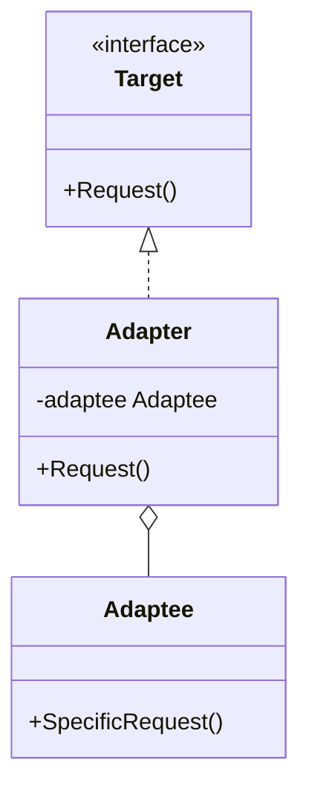
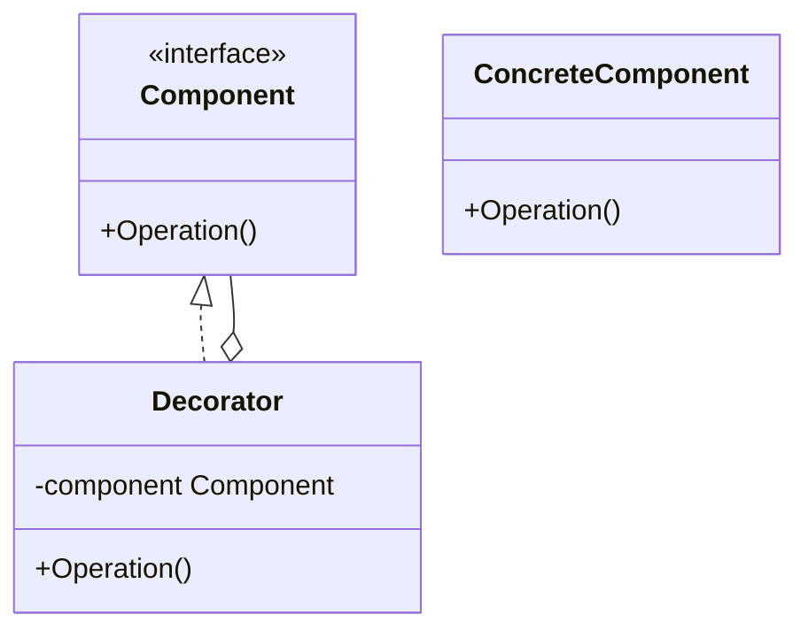

# Day 2: Organizing & Extending Structure (Structural Patterns)

Great job on Day 1!
Today, we move into "Structural" patterns.
How should we combine classes and objects to create structures that are resistant to change and easy to reuse?
You often hear the phrase "composition over inheritance," and the essence of that lies here.

Today, we will learn the following two patterns:

1.  **Adapter**: Connecting two people who speak different languages
2.  **Decorator**: Adding features like dressing up a doll

---

## 2. Adapter

### 📖 Story: Overseas Travel Outlets

When traveling abroad, have you ever been troubled because the plug of your hairdryer from home wouldn't fit into the wall outlet?
In such cases, you use a "conversion plug (adapter)," right?
The hairdryer (Client) expects a home-style plug (Target), but the wall (Adaptee) has a foreign shape.
By placing an adapter in between, you can use the electricity from the wall without modifying the hairdryer.

### 💡 Concept

Connects classes with incompatible interfaces.



### 🐹 The Essence of Go Implementation

In Go, this is often used to adapt structs from existing libraries or external APIs to your own domain's interfaces.
Since Go lacks "inheritance," it is implemented by embedding structs or holding them as fields (composition).

```go
// Target Interface
type Logger interface {
    Log(msg string)
}

// Adaptee (3rd party library)
type FancyLogger struct {}
func (f *FancyLogger) FancyLog(msg string) { fmt.Println("***" + msg + "***") }

// Adapter
type LoggerAdapter struct {
    fancyLogger *FancyLogger
}
func (l *LoggerAdapter) Log(msg string) {
    l.fancyLogger.FancyLog(msg) // Convert and call
}
```

### 🧪 Hands-on

In the `adapter-example` directory, create a new `Adaptee` (e.g., `JsonLogger`) and write an `Adapter` that fits it into the `Target` interface.

### ❓ Quiz

**Q1. What is the primary purpose of the Adapter pattern?**
A. To add new functionality.
B. To make an existing class usable with a different interface without modifying it.
C. To manage the creation of objects.

<details>
<summary>Answer</summary>
**B**. It is very effective for reusing existing assets (Legacy Code or external libraries).
</details>

---

## 3. Decorator

### 📖 Story: Matryoshka Coffee

You order a coffee. You want to add "milk." Also "sugar." And "whip."
Creating classes like "CoffeeWithMilk" or "CoffeeWithMilkAndSugar" is difficult.
Imagine "layering" a milk layer and a sugar layer over the base coffee.
From the outside, no matter how many layers you add, it is still "coffee."

### 💡 Concept

Dynamically adds features (responsibilities) to an object. It is a powerful technique for extending functionality without using inheritance.



### 🐹 The Essence of Go Implementation

In Go, `http.Handler` middleware is exactly this.
A function that takes a handler and returns a new handler, like `func(next http.Handler) http.Handler`, is the Decorator pattern itself.

```go
type Pizza interface {
    GetPrice() int
}

type TomatoTopping struct {
    pizza Pizza
}

func (t *TomatoTopping) GetPrice() int {
    return t.pizza.GetPrice() + 100 // Add to the original price
}
```

### 🧪 Hands-on

In `decorator-example`, create a new topping (e.g., `CheeseTopping`) and add it to the pizza price calculation.
Confirm that it works even if you change the order of the toppings.

### ❓ Quiz

**Q2. What is the benefit of the Decorator pattern?**
A. You can flexibly add or remove features without using inheritance.
B. You can hide the internal state of an object.
C. You can easily create Singletons.

<details>
<summary>Answer</summary>
**A**. Instead of a static inheritance relationship, you can combine functions dynamically at runtime.
</details>

---

That's it for Day 2!
By using "Structural" patterns, did you feel that the scattered classes became neatly organized and easy to extend?
Tomorrow, we will learn more advanced structural patterns. Stay tuned!