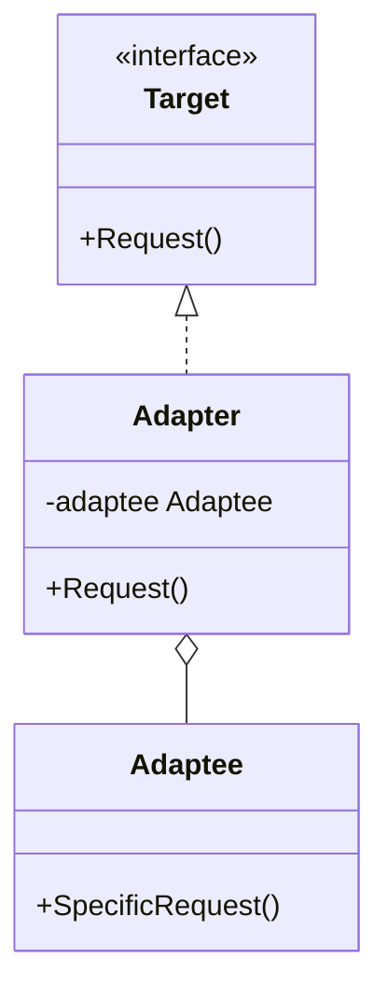
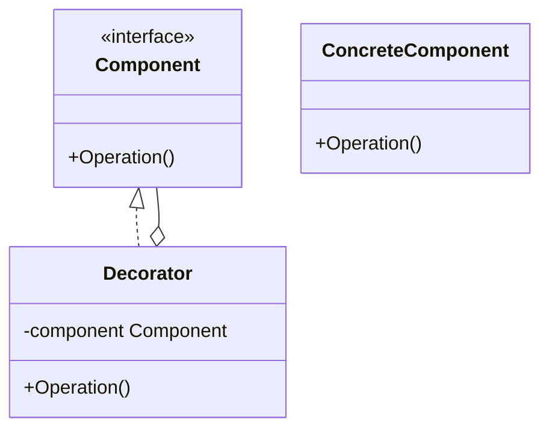
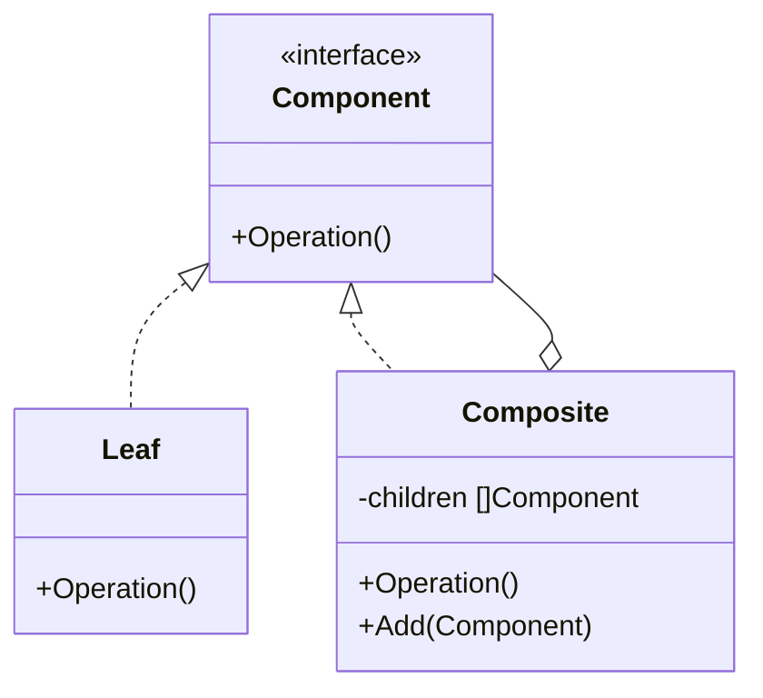

# Day 2: 構造の整理と拡張 (Structural Patterns)

Day 1 お疲れ様でした！
今日は「構造」に関するパターンに入ります。
クラスやオブジェクトをどのように組み合わせれば、変更に強く、再利用しやすい構造が作れるでしょうか？
「継承よりコンポジション（委譲）」という言葉をよく聞きますが、その真髄がここにあります。

本日は以下の 3 つのパターンを学びます。

1.  **Adapter**: 違う言葉を話す二人をつなぐ
2.  **Decorator**: 着せ替え人形のように機能を追加
3.  **Composite**: 部分と全体を同一視する

---

## 2. Adapter (アダプター)

### 📖 ストーリー：海外旅行のコンセント

海外旅行に行った時、日本のドライヤーのプラグが壁のコンセントに入らなくて困ったことはありませんか？
そんな時、「変換プラグ（アダプター）」を使いますよね。
ドライヤー（Client）は日本のプラグ（Target）を期待していますが、壁（Adaptee）は海外の形状です。
アダプターが間に入ることで、ドライヤーを改造することなく、壁の電気を使えるようになります。

### 💡 コンセプト

互換性のないインターフェースを持つクラス同士を接続します。



### 🐹 Go 実装の極意

Go では、既存のライブラリや外部 API の構造体を、自分のドメインのインターフェースに適合させる際によく使います。
「継承」がない Go では、構造体の埋め込みやフィールドとしての保持（コンポジション）で実装します。

```go
// 自分のドメインのインターフェース
type Computer interface {
    InsertIntoLightningPort()
}

// 既存の（互換性のない）構造体
type Windows struct {}
func (w *Windows) insertIntoUSBPort() { fmt.Println("USB plugged") }

// Adapter
type WindowsAdapter struct {
    windowMachine *Windows
}
func (w *WindowsAdapter) InsertIntoLightningPort() {
    w.windowMachine.insertIntoUSBPort() // 変換して呼び出し
}
```

### 🧪 ハンズオン

`adapter-example` ディレクトリで、新しい `Adaptee`（例えば `Linux` マシン）を作成し、それを `Computer` インターフェースに適合させる `Adapter` を書いてみましょう。
Lightning ポートを期待するクライアントが、Adapter 経由で Linux の USB ポートを使えるようにします。

### ❓ クイズ

**Q1. Adapter パターンの主な目的は？**
A. 新しい機能を追加すること
B. 既存のクラスを修正せずに、異なるインターフェースで利用可能にすること
C. オブジェクトの生成を管理すること

<details>
<summary>正解</summary>
**B**. 既存資産（Legacy Codeや外部ライブラリ）の再利用に非常に有効です。
</details>

---

## 3. Decorator (デコレーター)

### 📖 ストーリー：マトリョーシカ・コーヒー

コーヒーを注文します。「ミルク」を追加したい。「砂糖」も。「ホイップ」も。
「ミルク入りコーヒー」クラス、「ミルク砂糖入りコーヒー」クラス…と作るのは大変です。
ベースのコーヒーに、ミルクの層、砂糖の層を「被せて」いくイメージです。
外側から見れば、どれだけ被せても「コーヒー」であることに変わりはありません。

### 💡 コンセプト

オブジェクトに対して動的に機能（責任）を追加します。継承を使わずに機能を拡張する強力な手法です。



### 🐹 Go 実装の極意

Go では `http.Handler` のミドルウェアがまさにこれです。
既存のハンドラを別のハンドラで「包み込む」ことで、認証やログなどの機能を後付けできます。

```go
// ミドルウェア（Decorator）の例
func LoggingMiddleware(next http.Handler) http.Handler {
    return http.HandlerFunc(func(w http.ResponseWriter, r *http.Request) {
        fmt.Println("Before")
        next.ServeHTTP(w, r) // 包んでいる元のオブジェクト（next）を呼び出す
        fmt.Println("After")
    })
}
```

一般的な構造のイメージは以下の通りです（詳細は `decorator-example` を参照）。

```go
type Beverage interface {
    GetCost() float64
}

type MilkDecorator struct {
    beverage Beverage // 元のオブジェクトを保持
}

func (m *MilkDecorator) GetCost() float64 {
    return m.beverage.GetCost() + 0.15 // 元の機能に「上乗せ」する
}
```

### 🧪 ハンズオン

`decorator-example` で、新しいトッピング（例: `Soy`）を作成し、コーヒーの価格計算に追加してみましょう。
トッピングの順番を変えたり、二重に追加しても機能することを確認してください。

### ❓ クイズ

**Q2. Decorator パターンのメリットは？**
A. 継承を使わずに機能を柔軟に追加・削除できる
B. オブジェクトの内部状態を隠蔽できる
C. シングルトンを簡単に作れる

<details>
<summary>正解</summary>
**A**. 静的な継承関係ではなく、実行時に動的に機能を組み合わせることができます。
</details>

---

## 4. Composite (コンポジット)

### 📖 ストーリー：ファイルシステム

コンピュータのファイルとフォルダ（ディレクトリ）を思い浮かべてください。
「ファイル」は単体のアイテムです。「フォルダ」はファイルを入れることができる容器です。
しかし、よく考えると「フォルダ」の中に別の「フォルダ」を入れることもできますよね。
「ファイルを検索する」「合計サイズを計算する」といった操作をするとき、対象がファイルかフォルダかをいちいち気にしたくありません。単なる「アイテム」として扱いたいはずです。
このように、**単一のオブジェクトと集合オブジェクトを同一視して扱う**のが Composite パターンです。

### 💡 コンセプト

オブジェクトを木構造に構成して、部分と全体の階層を表現します。Composite パターンを使うと、クライアントは個々のオブジェクトとオブジェクトの合成物を一貫して扱うことができます。



### 🐹 Go 実装の極意

Go では、`Leaf`（例：`File`）と `Composite`（例：`Directory`）の両方の構造体に同じインターフェースを実装させます。
`Composite` 側はそのインターフェースのスライスを保持することで、中身が Leaf なのか Composite なのかを気にせずに保持・操作できます。

```go
type Component interface {
    Search(keyword string)
}

type File struct {
    Name string
}
func (f *File) Search(k string) { /* ファイル内を検索 */ }

type Directory struct {
    Name       string
    Components []Component
}
func (d *Directory) Search(k string) {
    for _, c := range d.Components {
        c.Search(k) // 再帰的に呼び出し
    }
}
```

### 🧪 ハンズオン

`composite-example` で、より深い階層（例：`root/home/user/docs/resume.pdf`）を構築してみましょう。
その後、`root` に対して `Search` を呼び出し、自動的にすべての階層が辿られることを確認してください。

### ❓ クイズ

**Q3. Composite パターンの最大の利点は？**
A. 実行速度が向上する
B. 共通のインターフェースを通じて、単一オブジェクトと集合オブジェクトを区別なく扱える
C. 定義するインターフェースの数を減らせる

<details>
<summary>正解</summary>
**B**. クライアント側で Leaf と Composite を判別するロジックが不要になり、コードがシンプルになります。
</details>

---

Day 2 はここまでです！
「構造」のパターンを使うことで、バラバラだったクラスたちが綺麗に整理され、拡張しやすい形になったのを感じましたか？
明日は、より高度な構造パターンを学びます。お楽しみに！