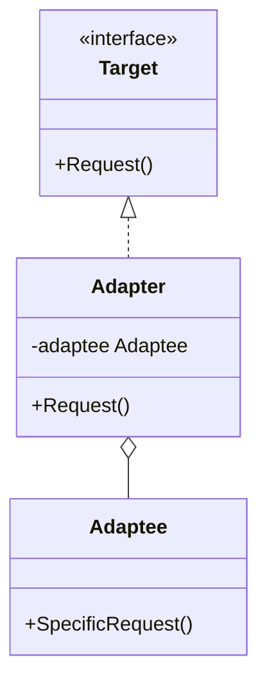
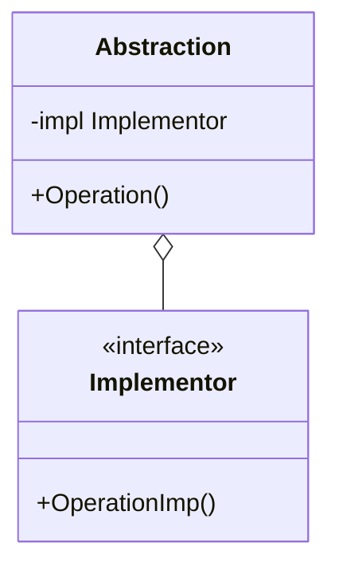
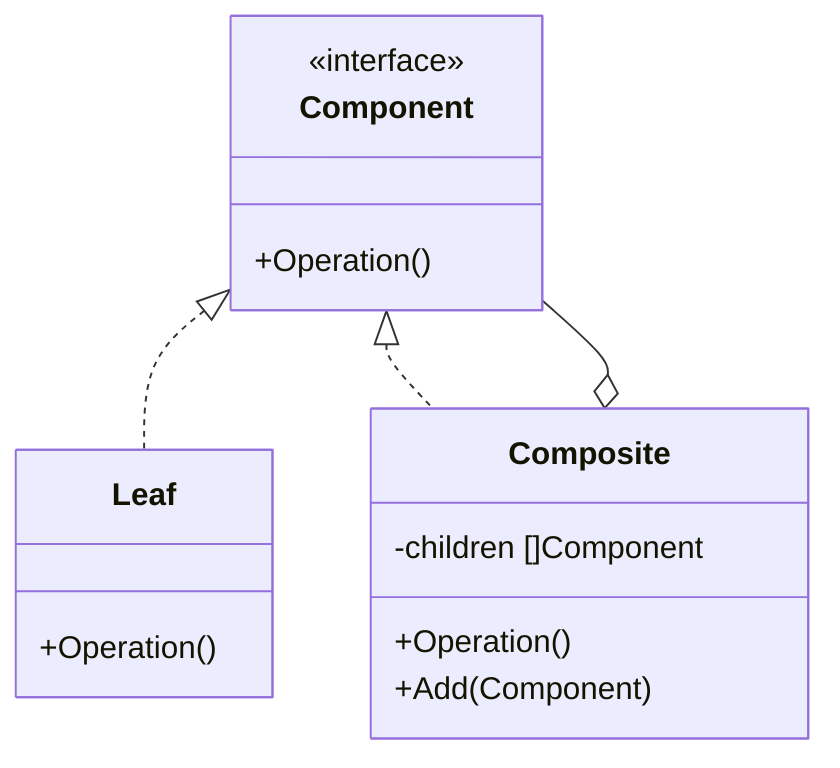
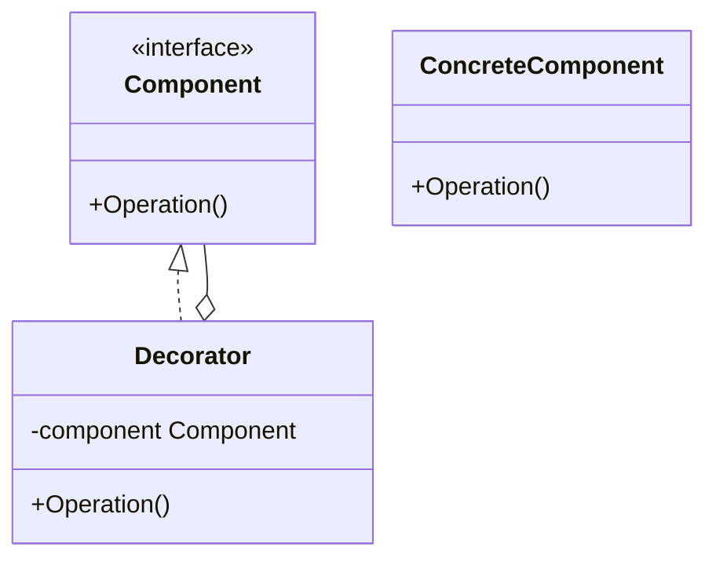

# Day 2: 構造の整理と拡張 (Structural Patterns Part 1)

Day 1 お疲れ様でした！
今日は「構造」に関するパターンに入ります。
クラスやオブジェクトをどのように組み合わせれば、変更に強く、再利用しやすい構造が作れるでしょうか？
「継承よりコンポジション（委譲）」という言葉をよく聞きますが、その真髄がここにあります。

本日は以下の 4 つのパターンを学びます。

1.  **Adapter**: 違う言葉を話す二人をつなぐ
2.  **Bridge**: 機能と実装の架け橋
3.  **Composite**: マトリョーシカのような再帰構造
4.  **Decorator**: 着せ替え人形のように機能を追加

---

## 6. Adapter (アダプター)

### 📖 ストーリー：海外旅行のコンセント

海外旅行に行った時、日本のドライヤーのプラグが壁のコンセントに入らなくて困ったことはありませんか？
そんな時、「変換プラグ（アダプター）」を使いますよね。
ドライヤー（Client）は日本のプラグ（Target）を期待していますが、壁（Adaptee）は海外の形状です。
アダプターが間に入ることで、ドライヤーを改造することなく、壁の電気を使えるようになります。

### 💡 コンセプト

互換性のないインターフェースを持つクラス同士を接続します。



### 🐹 Go 実装の極意

Go では、既存のライブラリや外部 API の構造体を、自分のドメインのインターフェースに適合させる際によく使います。
「継承」がない Go では、構造体の埋め込みやフィールドとしての保持（コンポジション）で実装します。

```go
// Target Interface
type Logger interface {
    Log(msg string)
}

// Adaptee (3rd party library)
type FancyLogger struct {}
func (f *FancyLogger) FancyLog(msg string) { fmt.Println("***" + msg + "***") }

// Adapter
type LoggerAdapter struct {
    fancyLogger *FancyLogger
}
func (l *LoggerAdapter) Log(msg string) {
    l.fancyLogger.FancyLog(msg) // 変換して呼び出し
}
```

### 🧪 ハンズオン

`adapter-example` ディレクトリで、新しい `Adaptee`（例えば `JsonLogger`）を作成し、それを `Target` インターフェースに適合させる `Adapter` を書いてみましょう。

### ❓ クイズ

**Q1. Adapter パターンの主な目的は？**
A. 新しい機能を追加すること
B. 既存のクラスを修正せずに、異なるインターフェースで利用可能にすること
C. オブジェクトの生成を管理すること

<details>
<summary>正解</summary>
**B**. 既存資産（Legacy Codeや外部ライブラリ）の再利用に非常に有効です。
</details>

---

## 7. Bridge (ブリッジ)

### 📖 ストーリー：リモコンとテレビ

「リモコン」と「テレビ」の関係を考えてみましょう。
リモコンには「電源 ON/OFF」「チャンネル変更」などの機能があります。
テレビには「ソニー製」「パナソニック製」などの実装があります。
もし「ソニー製リモコン」「パナソニック製リモコン」…と作っていくと、新しい機能（例：音声操作）を追加するたびに、全メーカー分のリモコンを作り直す必要があります。
「リモコン（機能）」と「テレビ（実装）」を分けて、橋渡し（Bridge）すれば、それぞれ独立に進化できます。

### 💡 コンセプト

抽象部分（Abstraction）と実装部分（Implementor）を分離し、それぞれを独立して拡張できるようにします。



### 🐹 Go 実装の極意

Go のインターフェースの基本形です。
`Abstraction` 構造体が `Implementor` インターフェースをフィールドとして持ち、処理を委譲します。
これにより、`Abstraction` のロジックを変更せずに `Implementor` を差し替えたり、その逆が可能になります。

### 🧪 ハンズオン

`bridge-example` を見てみましょう。
新しい `Implementor`（例: `PrinterAPI` に対する `PDFPrinter`）を追加しても、`Abstraction`（`MacComputer` や `WindowsComputer`）のコードを変更する必要がないことを確認してください。

### ❓ クイズ

**Q2. Bridge パターンを使うと何が嬉しい？**
A. クラス爆発（組み合わせによるクラス数の激増）を防げる
B. プログラムの行数が減る
C. 実行速度が上がる

<details>
<summary>正解</summary>
**A**. 機能の階層と実装の階層を分けることで、組み合わせの数だけクラスを作る必要がなくなります。
</details>

---

## 8. Composite (コンポジット)

### 📖 ストーリー：ファイルシステム

フォルダの中にはファイルが入っています。でも、フォルダの中には「別のフォルダ」も入りますよね？
ユーザーから見れば、ファイルを削除するのも、フォルダを削除するのも「削除」という同じ操作です。
「中身（Leaf）」と「容器（Composite）」を同じものとして扱えると便利です。

### 💡 コンセプト

部分と全体を同一視して、再帰的な木構造（ツリー構造）を作ります。



### 🐹 Go 実装の極意

`Component` インターフェースを定義し、`Leaf` と `Composite` の両方がそれを実装します。
`Composite` は `[]Component`（スライス）を持ち、自身の `Operation()` が呼ばれたら、子供たちの `Operation()` を再帰的に呼び出します。

### 🧪 ハンズオン

`composite-example` で、ディレクトリ構造を表示するプログラムを動かしてみましょう。
新しい種類の `Component`（例: `Link`）を追加してみてください。

### ❓ クイズ

**Q3. Composite パターンが扱うデータ構造は？**
A. リスト構造
B. ツリー構造
C. グラフ構造（循環あり）

<details>
<summary>正解</summary>
**B**. 再帰的なツリー構造を扱うのに最適です。
</details>

---

## 9. Decorator (デコレーター)

### 📖 ストーリー：マトリョーシカ・コーヒー

コーヒーを注文します。「ミルク」を追加したい。「砂糖」も。「ホイップ」も。
「ミルク入りコーヒー」クラス、「ミルク砂糖入りコーヒー」クラス…と作るのは大変です。
ベースのコーヒーに、ミルクの層、砂糖の層を「被せて」いくイメージです。
外側から見れば、どれだけ被せても「コーヒー」であることに変わりはありません。

### 💡 コンセプト

オブジェクトに対して動的に機能（責任）を追加します。継承を使わずに機能を拡張する強力な手法です。



### 🐹 Go 実装の極意

Go では `http.Handler` のミドルウェアがまさにこれです。
`func(next http.Handler) http.Handler` のように、ハンドラを受け取って新しいハンドラを返す関数は、Decorator パターンそのものです。

```go
type Pizza interface {
    GetPrice() int
}

type TomatoTopping struct {
    pizza Pizza
}

func (t *TomatoTopping) GetPrice() int {
    return t.pizza.GetPrice() + 100 // 元の価格に上乗せ
}
```

### 🧪 ハンズオン

`decorator-example` で、新しいトッピング（例: `CheeseTopping`）を作成し、ピザの価格計算に追加してみましょう。
トッピングの順番を変えても機能することを確認してください。

### ❓ クイズ

**Q4. Decorator パターンのメリットは？**
A. 継承を使わずに機能を柔軟に追加・削除できる
B. オブジェクトの内部状態を隠蔽できる
C. シングルトンを簡単に作れる

<details>
<summary>正解</summary>
**A**. 静的な継承関係ではなく、実行時に動的に機能を組み合わせることができます。
</details>

---

Day 2 はここまでです！
「構造」のパターンを使うことで、バラバラだったクラスたちが綺麗に整理され、拡張しやすい形になったのを感じましたか？
明日は、より高度な構造パターンと、振る舞いに関するパターンに入っていきます。
