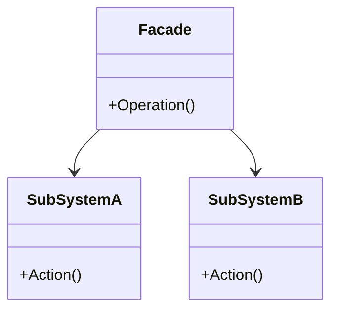
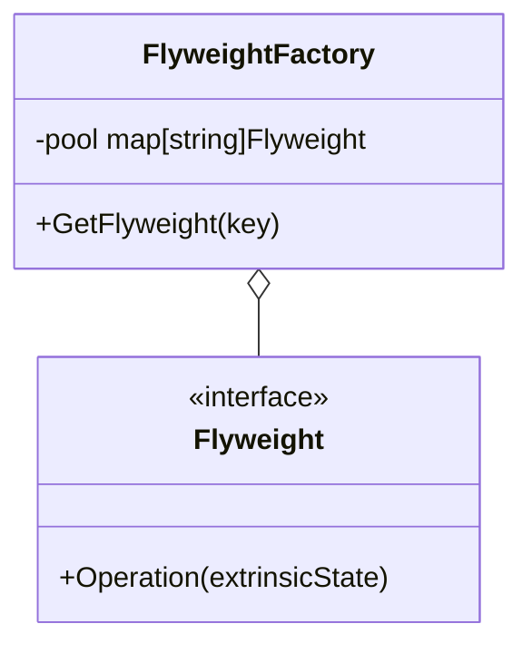
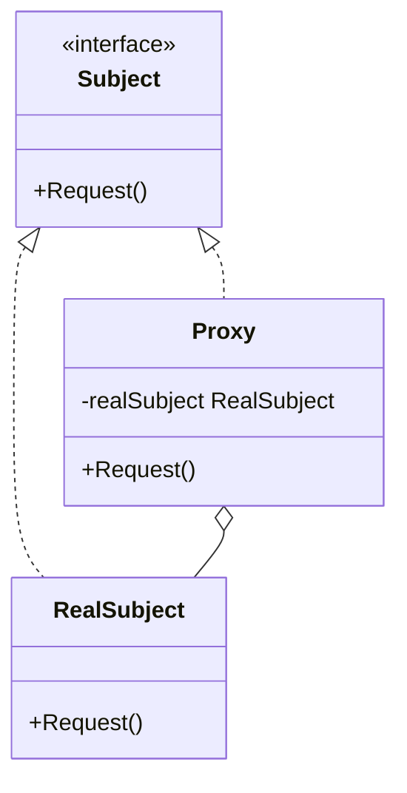
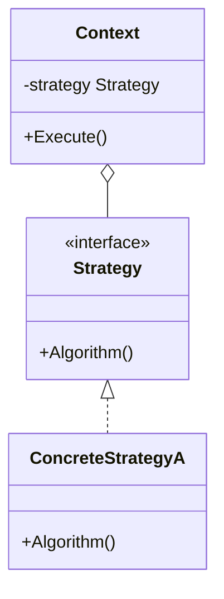

# Day 3: Efficiency and Interfaces (Structural Part 2 & Behavioral Intro)

We're at the halfway point, Day 3!
Today, we'll cover the rest of the "structural" patterns and finally dive into "behavioral" patterns.
As systems become more complex, the collaboration between classes also becomes more complex.
How to make it look simple, how to make it efficient, and how to switch it flexibly.
That's today's theme.

Today, we will learn the following four patterns:

1. **Facade**: The "front of the building" that hides the complex backend
2. **Flyweight**: Lightweight for mass production
3. **Proxy**: An agent controls access
4. **Strategy**: Swapping algorithms like cassettes

---

## 10. Facade

### 📖 Story: Hotel Concierge

Let's say you're staying at a luxury hotel.
Booking a restaurant, arranging a taxi, buying theater tickets... it's a lot of work to call each vendor yourself.
If there's a concierge (Facade), you can just say, "Please take care of this and that," and they will handle everything behind the scenes.
The guest (Client) doesn't need to know about the complex system (subsystems) in the background.

### 💡 Concept

Provides a simple, unified interface (a single point of contact) to a complex subsystem.



### 🐹 Go Implementation Tips

In Go, package design itself is close to the concept of a Facade.
By hiding complex structs and functions within a package as lowercase (private) and exposing only easy-to-use uppercase (public) functions and interfaces, you can create a user-friendly design for the package consumer.

### 🧪 Hands-on

Let's look at `facade-example`.
Notice how `WalletFacade` hides the internal subsystems like `Account`, `SecurityCode`, and `Notification`,
and provides only a simple method called `addMoneyToWallet`.

### ❓ Quiz

**Q1. Does using the Facade pattern prevent direct access to the subsystem?**
A. Yes, it is completely forbidden.
B. No, direct access is still possible if necessary.
C. The subsystem disappears.

<details>
<summary>Correct Answer</summary>
**B**. The Facade merely provides a "convenient entry point" and does not prohibit direct access (unless restricted by language features).
</details>

---

## 11. Flyweight

### 📖 Story: The Trees of the Forest

Suppose you want to render a vast forest in a game. There are a million trees.
If each and every tree held its own "leaf texture" and "trunk model data," you'd run out of memory.
If you share just one "tree model data" and have the million trees only hold their "coordinates," you can dramatically save memory.
This is "Flyweight" (as in, lightweight).

### 💡 Concept

To efficiently handle a large number of fine-grained objects, it shares the shareable parts (Intrinsic State) to reduce memory usage.



### 🐹 Go Implementation Tips

Prepare a cache (Factory) using a `map`. If an object has already been created, return it; otherwise, create it and register it.
In Go's concurrent environment, don't forget to protect access to this map with something like `sync.RWMutex`.

### 🧪 Hands-on

In `flyweight-example`, confirm that objects of the same type are being reused by displaying their addresses (pointers).

### ❓ Quiz

**Q2. What information should be shared in the Flyweight pattern?**
A. Information that differs for each object (coordinates, color, etc.).
B. Immutable information common to all objects (texture, shape data, etc.).
C. Database connection information.

<details>
<summary>Correct Answer</summary>
**B**. It shares unchanging information (Intrinsic State).
</details>

---

## 12. Proxy

### 📖 Story: Credit Card

Carrying cash (RealSubject) is heavy and risky.
With a credit card (Proxy), you can still perform the function of payment,
and you can also do "credit limit checks (access control)" and "statement logging (logging)."
Only when money is actually needed is it withdrawn from the bank account (the real entity).

### 💡 Concept

Provides a surrogate or placeholder for another object to control access to it.



### 🐹 Go Implementation Tips

Define a `Subject` interface, and have `RealSubject` and `Proxy` implement it.
The `Proxy` holds a `RealSubject` internally, but it can also be created only when a method is called (lazy initialization).
Reverse proxies like Nginx can also be considered an application of the Proxy pattern at an architectural level.

### 🧪 Hands-on

In `proxy-example`, try implementing a Proxy with access control features like Nginx.
Try adding logic to allow access only to specific URLs and deny others.

### ❓ Quiz

**Q3. Which of the following is NOT a suitable use for the Proxy pattern?**
A. Lazy initialization of a heavy object (Virtual Proxy).
B. Checking access permissions (Protection Proxy).
C. Separating the object creation process (Builder).

<details>
<summary>Correct Answer</summary>
**C**. That is the role of the Builder pattern.
</details>

---

## 13. Strategy

### 📖 Story: RPG Weapons

The hero fights a monster.
If equipped with a "sword," the attack is "slash." If equipped with a "bow," the attack is "shoot."
Without changing the hero (Context) itself, you can switch the attack method (algorithm) just by changing the equipment (Strategy).

### 💡 Concept

Encapsulates an algorithm and makes it interchangeable at runtime.



### 🐹 Go Implementation Tips

This is the most basic and powerful use of Go's interfaces.
Defining it as a function type (`type StrategyFunc func()`) and passing the function itself is also a simple and idiomatic Go implementation.
Passing a comparison function to `sort.Slice` is also a form of the Strategy pattern.

```go
type Strategy interface {
    Evict(c *Cache)
}

type Lru struct {}
func (l *Lru) Evict(c *Cache) { ... }

type Fifo struct {}
func (f *Fifo) Evict(c *Cache) { ... }
```

### 🧪 Hands-on

In `strategy-example` (the cache example), add a new eviction algorithm (e.g., Random Eviction) and switch it at runtime to see the behavior change.

### ❓ Quiz

**Q4. What can be avoided by using the Strategy pattern?**
A. A huge `if-else` or `switch` statement.
B. The definition of interfaces.
C. The use of structs.

<details>
<summary>Correct Answer</summary>
**A**. Since the branching of algorithms can be expressed by switching classes (or functions), you can avoid a storm of conditional branches.
</details>

---

That's it for Day 3!
The Strategy pattern is one you'll use as naturally as breathing when writing Go code.
Starting tomorrow, we'll dive deeper into the world of "behavior," exploring how objects cooperate with each other.
