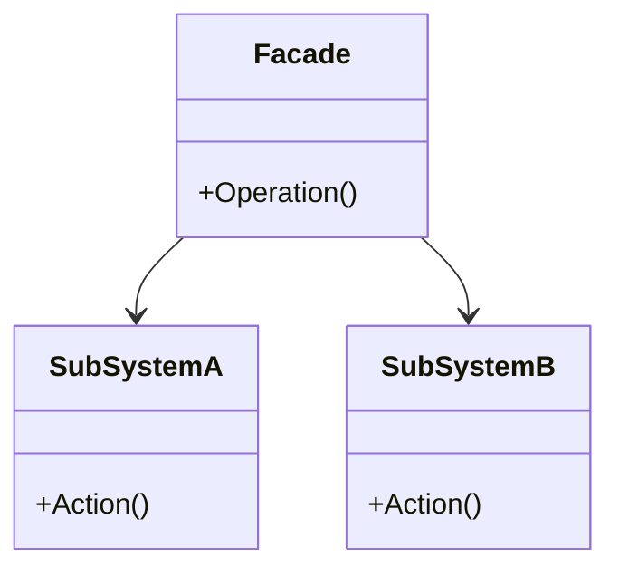
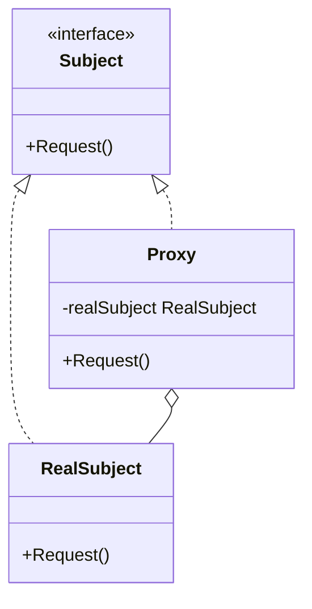
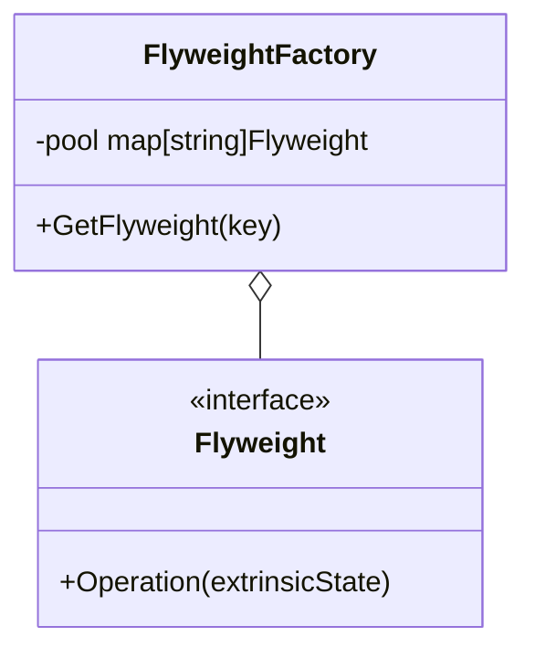

# Day 3: Hiding Complexity & Control (Structural Patterns Part 2)

We've reached the halfway point, Day 3!
Today, as the second half of "Structural" patterns, we will learn three patterns that increase in importance as systems become large-scale and complex.
How to make a cumbersome backside look simple, how to optimize resources, and how to control access.
That is today's theme.

Today, we will learn the following three patterns:

1.  **Facade**: The "front of the building" that hides the complex backside
2.  **Proxy**: A representative controls access
3.  **Flyweight**: Lighten and mass-produce

---

## 4. Facade

### 📖 Story: The Hotel Concierge

Suppose you stay at a luxury hotel.
Making a restaurant reservation, arranging a taxi, buying theater tickets... it's a lot of work to call each business yourself.
If there's a concierge (Facade), you just say, "Please do this and this," and they arrange everything behind the scenes.
The guest (Client) doesn't need to know the complex systems (subsystems) in the back.

### 💡 Concept

Provides a simple and unified interface (window) to a complex subsystem.

### 🐹 The Essence of Go Implementation

In Go, package design itself is close to the idea of a Facade.
By making complex structs and functions within a package unexported (private) and only exposing easy-to-use exported (public) functions and interfaces, you create a design that is friendly to package users.

### 🧪 Hands-on

Let's look at `facade-example`.
Observe how `SmartHomeFacade` hides subsystems like `Lighting`, `Audio`, and `Projector`,
providing only a simple `WatchMovie` method.

### ❓ Quiz

**Q1. Does using the Facade pattern mean you can no longer access the subsystem directly?**
A. Yes, it is completely prohibited.
B. No, you can still access it directly if necessary.
C. The subsystem disappears.

Answer

**B**. A Facade just provides a "convenient window" and does not prohibit direct access (unless restricted by language features).

---

## 5. Proxy

### 📖 Story: The Credit Card

Carrying cash (RealSubject) is heavy and dangerous.
If you use a credit card (Proxy), it can fulfill the function of payment, and it can also perform "limit checks (access control)" and "transaction logging."
Only when money is actually needed is it withdrawn from the bank account (the actual entity).

### 💡 Concept

Provides a surrogate or placeholder for another object to control access to it.

### 🐹 The Essence of Go Implementation

You define a `Subject` interface, and both `RealSubject` and `Proxy` implement it.
The `Proxy` holds a `RealSubject` internally, but it is also possible to create it only when a method is called (lazy initialization).
Reverse proxies like Nginx can also be considered the Proxy pattern at an architectural level.

### 🧪 Hands-on

In `proxy-example`, try implementing a Proxy with access restriction features like Nginx.
Add logic to only allow access to specific URLs and deny others.

### ❓ Quiz

**Q2. Which of the following is NOT an appropriate use for the Proxy pattern?**
A. Lazy initialization of a heavy object (Virtual Proxy).
B. Checking access permissions (Protection Proxy).
C. Separating the creation steps of an object (Builder).

Answer

**C**. That is the role of the Builder pattern.

---

## 6. Flyweight

### 📖 Story: Trees in a Forest

Suppose you are rendering a vast forest in a game. There are 1 million trees.
If each individual tree had "leaf textures" and "trunk model data," memory would crash.
If you share one "tree model data" and the 1 million trees only hold "coordinates," you can save memory dramatically.
This is "Flyweight" (flyweight class = lightweight).

### 💡 Concept

To handle many fine-grained objects efficiently, share the part that can be shared (Intrinsic State) to reduce memory usage.

### 🐹 The Essence of Go Implementation

Prepare a cache (Factory) using a `map`. If an already created object exists, return it; otherwise, create and register it.
In Go's concurrent environment, don't forget to protect access to this map with something like `sync.RWMutex`.

### 🧪 Hands-on

In `flyweight-example`, confirm that objects of the same type are being reused by displaying their addresses (pointers).

### ❓ Quiz

**Q3. What information should be shared in the Flyweight pattern?**
A. Information that differs for each object (coordinates, color, etc.).
B. Common, immutable information for all objects (textures, shape data, etc.).
C. Database connection information.

Answer

**B**. You share information that does not change (Intrinsic State).

---

That's it for Day 3!
Designing with "efficiency" and "control" in mind forms the foundation for supporting large-scale systems.
From tomorrow, we will dive deep into the world of "Behavioral" patterns between objects. Stay tuned!