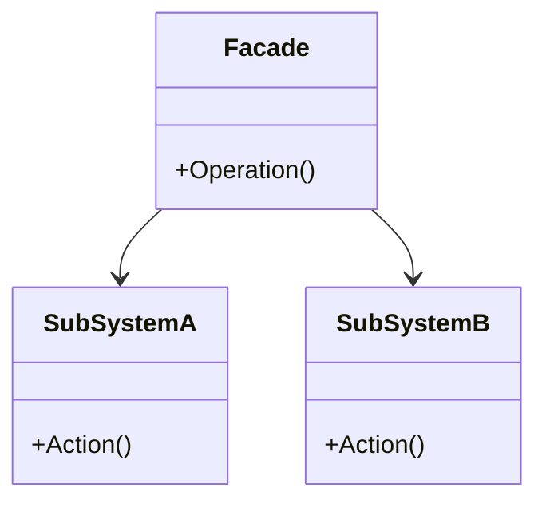
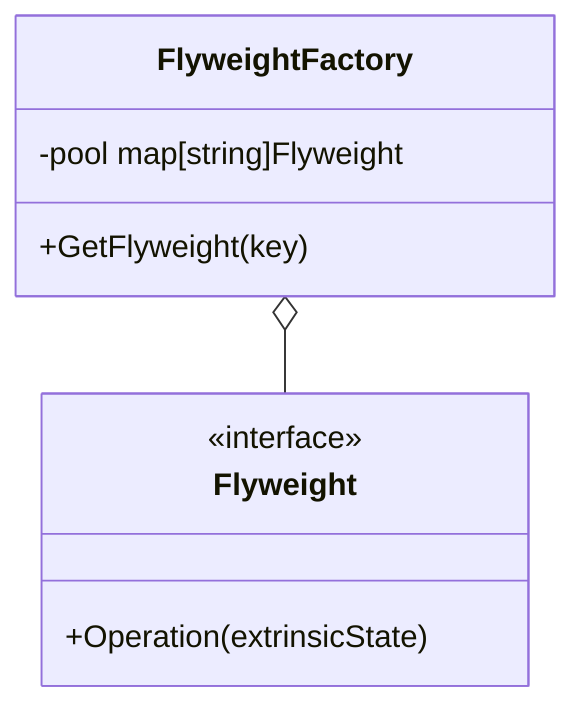
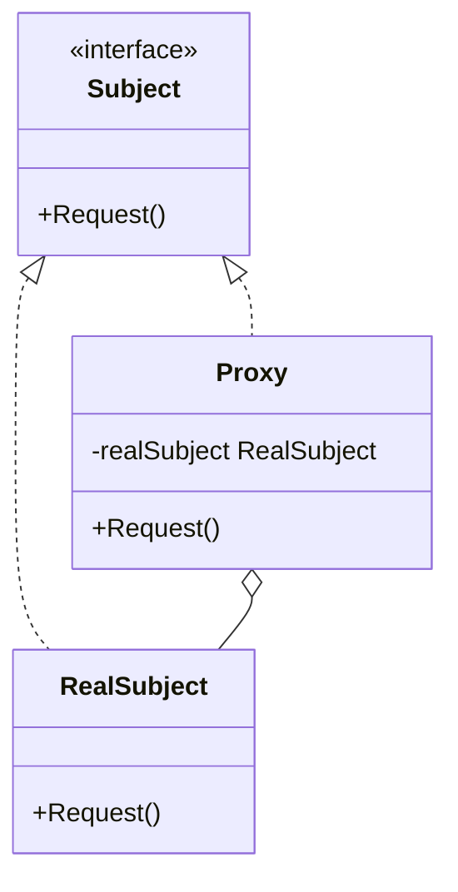
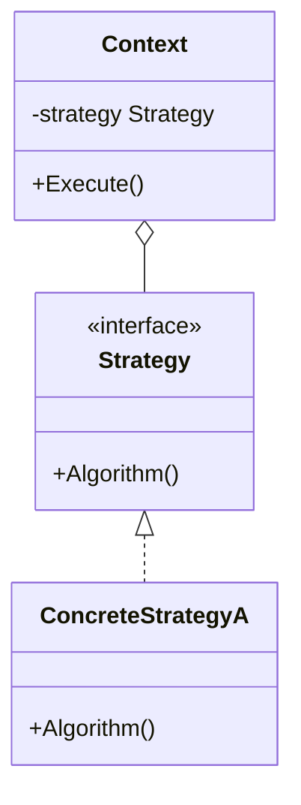

# Day 3: 効率化とインターフェース (Structural Part 2 & Behavioral Intro)

折り返し地点の Day 3 です！
今日は「構造」パターンの残りと、いよいよ「振る舞い」に関するパターンに入ります。
システムが複雑になるにつれて、クラス間の連携も複雑になります。
それをどうシンプルに見せるか、どう効率化するか、そしてどう柔軟に切り替えるか。
それが今日のテーマです。

本日は以下の 4 つのパターンを学びます。

1.  **Facade**: 複雑な裏側を隠す「建物の正面」
2.  **Flyweight**: 軽量化して大量生産
3.  **Proxy**: 代理人がアクセスを制御
4.  **Strategy**: アルゴリズムをカセットのように交換

---

## 10. Facade (ファサード)

### 📖 ストーリー：ホテルのコンシェルジュ

高級ホテルに泊まったとしましょう。
レストランの予約、タクシーの手配、演劇のチケット購入…これら全てを自分で各業者に電話するのは大変です。
コンシェルジュ（Facade）がいれば、「これとこれをお願い」と言うだけで、裏ですべて手配してくれます。
客（Client）は、裏側の複雑なシステム（サブシステム）を知る必要がありません。

### 💡 コンセプト

複雑なサブシステムに対するシンプルで統一されたインターフェース（窓口）を提供します。



### 🐹 Go 実装の極意

Go では、パッケージ設計そのものが Facade の考え方に近いです。
パッケージ内の複雑な構造体や関数は小文字（private）にして隠蔽し、
使いやすい大文字（public）の関数やインターフェースだけを公開することで、パッケージ利用者に優しい設計になります。

### 🧪 ハンズオン

`facade-example` を見てみましょう。
`WalletFacade` が、内部の `Account`, `SecurityCode`, `Notification` などのサブシステムを隠蔽し、
`addMoneyToWallet` というシンプルなメソッドだけを提供している様子を確認してください。

### ❓ クイズ

**Q1. Facade パターンを使うと、サブシステムに直接アクセスできなくなる？**
A. はい、完全に禁止されます。
B. いいえ、必要であれば直接アクセスすることも可能です。
C. サブシステムが消滅します。

<details>
<summary>正解</summary>
**B**. Facadeはあくまで「便利な窓口」を提供するだけで、直接アクセスを禁止するものではありません（言語機能で制限しない限り）。
</details>

---

## 11. Flyweight (フライウェイト)

### 📖 ストーリー：森の木々

ゲームで広大な森を描画するとします。木が 100 万本あります。
1 本 1 本の木が「葉のテクスチャ」「幹のモデルデータ」を持っていたら、メモリがパンクしてしまいます。
「木のモデルデータ」は 1 つだけ共有し、100 万本の木は「座標」だけを持つようにすれば、メモリは劇的に節約できます。
これが「Flyweight（フライ級＝軽量級）」です。

### 💡 コンセプト

多数の細かいオブジェクトを効率よく扱うために、共有できる部分（Intrinsic State）を共有し、メモリ使用量を削減します。



### 🐹 Go 実装の極意

`map` を使ったキャッシュ（Factory）を用意し、すでに作成済みのオブジェクトがあればそれを返し、なければ作って登録します。
Go の並行処理環境では、このマップへのアクセスを `sync.RWMutex` などで保護することを忘れないでください。

### 🧪 ハンズオン

`flyweight-example` で、同じ種類のオブジェクトが再利用されていることを、アドレス（ポインタ）を表示して確認してみましょう。

### ❓ クイズ

**Q2. Flyweight パターンで共有すべき情報は？**
A. オブジェクトごとに異なる情報（座標、色など）
B. 全てのオブジェクトで共通の不変な情報（テクスチャ、形状データなど）
C. データベースの接続情報

<details>
<summary>正解</summary>
**B**. 変化しない情報（Intrinsic State）を共有します。
</details>

---

## 12. Proxy (プロキシ)

### 📖 ストーリー：クレジットカード

現金（RealSubject）を持ち歩くのは重いし危険です。
クレジットカード（Proxy）を使えば、支払いの機能は果たせますし、
「限度額チェック（アクセス制御）」や「明細記録（ロギング）」もできます。
本当にお金が必要になった時だけ、銀行口座（実体）から引き落とされます。

### 💡 コンセプト

あるオブジェクトへのアクセスを制御するための代理オブジェクトを提供します。



### 🐹 Go 実装の極意

`Subject` インターフェースを定義し、`RealSubject` と `Proxy` がそれを実装します。
`Proxy` は内部に `RealSubject` を持ちますが、メソッドが呼ばれた時に初めて生成する（遅延初期化）ことも可能です。
Nginx などのリバースプロキシも、アーキテクチャレベルでの Proxy パターンと言えます。

### 🧪 ハンズオン

`proxy-example` で、Nginx のようなアクセス制限機能を持つ Proxy を実装してみましょう。
特定の URL へのアクセスだけを許可し、それ以外は拒否するロジックを追加してみてください。

### ❓ クイズ

**Q3. Proxy パターンの用途として適切でないものは？**
A. 重いオブジェクトの遅延初期化 (Virtual Proxy)
B. アクセス権限のチェック (Protection Proxy)
C. オブジェクトの生成手順の分離 (Builder)

<details>
<summary>正解</summary>
**C**. それは Builder パターンの役割です。
</details>

---

## 13. Strategy (ストラテジー)

### 📖 ストーリー：RPG の武器

勇者はモンスターと戦います。
「剣」を装備すれば「斬る」攻撃、「弓」を装備すれば「射る」攻撃になります。
勇者（Context）自体を作り変えることなく、装備（Strategy）を持ち替えるだけで、攻撃方法（アルゴリズム）を切り替えられます。

### 💡 コンセプト

アルゴリズムをカプセル化し、実行時に交換可能にします。



### 🐹 Go 実装の極意

Go のインターフェースの最も基本的かつ強力な使い方がこれです。
関数型（`type StrategyFunc func()`）として定義し、関数そのものを渡す実装も Go らしくてシンプルです。
`sort.Slice` で比較関数を渡すのも Strategy パターンの一種です。

```go
type Strategy interface {
    Evict(c *Cache)
}

type Lru struct {}
func (l *Lru) Evict(c *Cache) { ... }

type Fifo struct {}
func (f *Fifo) Evict(c *Cache) { ... }
```

### 🧪 ハンズオン

`strategy-example` (キャッシュの例) で、新しい削除アルゴリズム（例: Random Eviction）を追加し、実行時に切り替えて動作が変わることを確認しましょう。

### ❓ クイズ

**Q4. Strategy パターンを使うと何が避けられる？**
A. 巨大な `if-else` や `switch` 文
B. インターフェースの定義
C. 構造体の使用

<details>
<summary>正解</summary>
**A**. アルゴリズムの分岐をクラス（または関数）の切り替えで表現できるため、条件分岐の嵐を避けられます。
</details>

---

Day 3 はここまで！
Strategy パターンは Go でコードを書く上で息をするように使うパターンです。
明日からは、オブジェクト同士がどう協力し合うか、より深い「振る舞い」の世界に飛び込みます。
