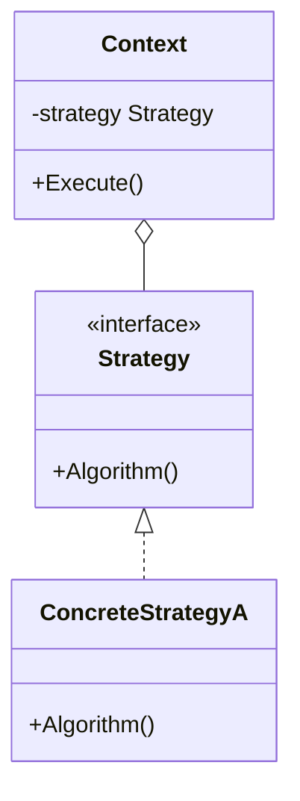
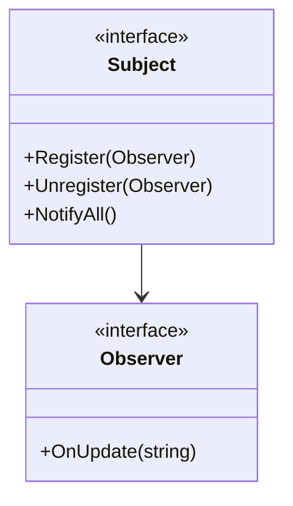
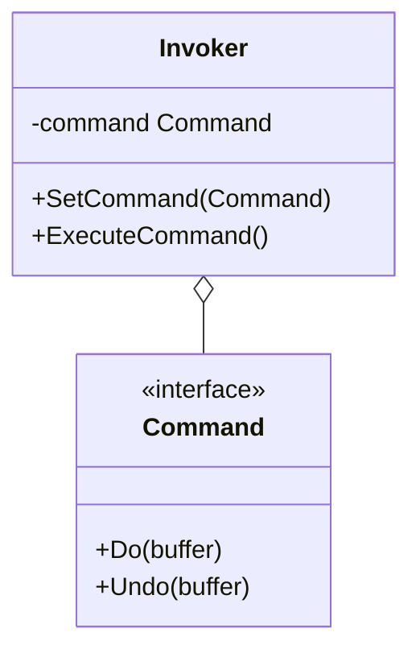

# Day 4: アルゴリズムと通知 (Behavioral Patterns Part 1)

Day 4 へようこそ！
昨日は複雑な構造をシンプルに見せる方法を学びました。
今日からは「振る舞い」、つまりオブジェクト同士がどう協力し合い、どう動的に変化するかを学びます。
これらを使いこなせば、あなたのコードは柔軟にアルゴリズムを切り替えたり、状態変化を自動で伝えたりできるようになります。

本日は以下の 3 つのパターンを学びます。

1.  **Strategy**: アルゴリズムをカセットのように交換
2.  **Observer**: 「更新されたら教えてね！」
3.  **Command**: 命令を箱詰めにする

---

## 7. Strategy (ストラテジー)

### 📖 ストーリー：RPG の武器

勇者はモンスターと戦います。
「剣」を装備すれば「斬る」攻撃、「弓」を装備すれば「射る」攻撃になります。
勇者（Context）自体を作り変えることなく、装備（Strategy）を持ち替えるだけで、攻撃方法（アルゴリズム）を切り替えられます。

### 💡 コンセプト

アルゴリズムをカプセル化し、実行時に交換可能にします。



### 🐹 Go 実装の極意

Go のインターフェースの最も基本的かつ強力な使い方がこれです。
関数型（`type StrategyFunc func()`）として定義し、関数そのものを渡す実装も Go らしくてシンプルです。
`sort.Slice` で比較関数を渡すのも Strategy パターンの一種です。

```go
type PaymentMethod interface {
    Pay(amount float64) error
}

type CreditCard struct {}
func (c *CreditCard) Pay(amount float64) error { ... }

type PayPal struct {}
func (p *PayPal) Pay(amount float64) error { ... }
```

### 🧪 ハンズオン

`strategy-example` (決済と配送の例) で、新しい支払い方法（例: `BankTransfer`）を追加し、実行時に切り替えて動作が変わることを確認しましょう。

### ❓ クイズ

**Q1. Strategy パターンを使うと何が避けられる？**
A. 巨大な `if-else` や `switch` 文
B. インターフェースの定義
C. 構造体の使用

<details>
<summary>正解</summary>
**A**. アルゴリズムの分岐をクラス（または関数）の切り替えで表現できるため、条件分岐の嵐を避けられます。
</details>

---

## 8. Observer (オブザーバー)

### 📖 ストーリー：株価アラート

あなたは特定の株価をチェックしています。
株価（Subject）が変動すると、その株をウォッチしている投資家（Observer）全員に通知が届きます。
株価システムは、誰がウォッチしているか詳しく知る必要はありません。「通知リスト」に更新を送るだけです。
もしウォッチを止めれば、もう通知は来ません。

### 💡 コンセプト

あるオブジェクトの状態変化を、依存する他のオブジェクトに自動的に通知します。



### 🐹 Go 実装の極意

Go ではインターフェースを使って実装するのが基本ですが、
**Go Channels** を使うと、より Go らしい非同期なイベント通知システムが作れます。
ただし、メモリリークを防ぐために、不要になった Observer を適切に解除（Unregister）する仕組みが重要です。

### 🧪 ハンズオン

`observer-example` を見てみましょう。
新しい種類の Observer（例: `MobileAppListener`）を作成し、Subject に登録して通知を受け取れるようにしてみてください。

### ❓ クイズ

**Q2. Observer パターンはどのようなアーキテクチャの基礎となる？**
A. MVC (Model-View-Controller)
B. REST API
C. バッチ処理

<details>
<summary>正解</summary>
**A**. Model（データ）の変更を View（表示）に通知する仕組みとして、MVCの核心部分で使われています。
</details>

---

## 9. Command (コマンド)

### 📖 ストーリー：テキストエディタの操作

あなたがテキストエディタで「文字を入力」したり「削除」したりするとします。
それぞれの操作を「コマンド（Command）」としてオブジェクト化します。
コマンドという「モノ」になっているので、それをスタックに積み上げておくことで、「Undo（元に戻す）」が簡単に実装できます。

### 💡 コンセプト

要求をオブジェクトとしてカプセル化し、パラメータ化や履歴管理、キューイング、Undo/Redo を可能にします。



### 🐹 Go 実装の極意

構造体に `Do()` メソッドを持たせるのが基本です。
CLI ツールを作る際、サブコマンド（`git commit`, `git push`など）をそれぞれ Command パターンで実装すると綺麗に整理できます。

### 🧪 ハンズオン

`command-example` はテキストエディタの例です。
新しいコマンド（例: `InsertTextCommand`）を作成し、`Do` と `Undo` を実装して、バッファの状態が変化することを確認しましょう。

### ❓ クイズ

**Q3. Command パターンの利点は？**
A. 処理の実行タイミングを遅らせたり、履歴を残したりできる
B. クラスの継承階層を深くできる
C. データベースの速度が上がる

<details>
<summary>正解</summary>
**A**. 要求を「オブジェクト」として扱えるため、保存や受け渡しが自由自在になります。
</details>

---

Day 4 お疲れ様でした！
「アルゴリズムの交換」や「通知」といった、動的な振る舞いを制御するパターンを学びました。
明日は最終日。状態の管理や責任の連鎖など、より高度なパターンを学びます。
ラストスパート、頑張りましょう！