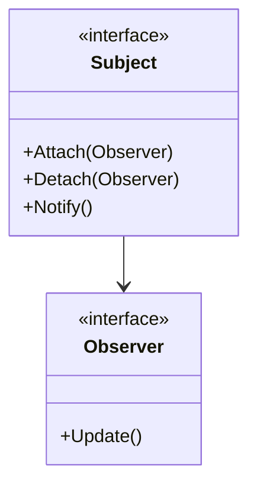
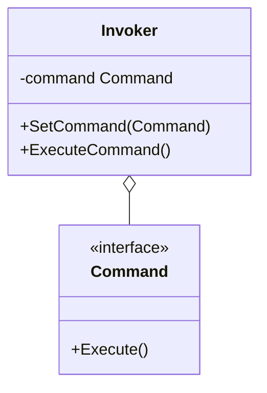
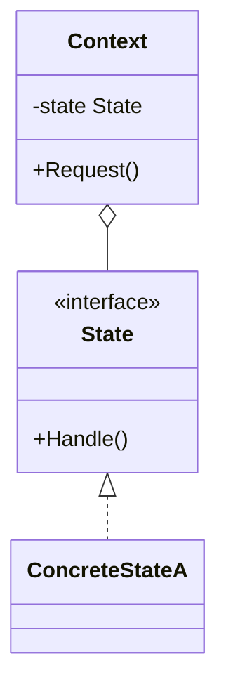
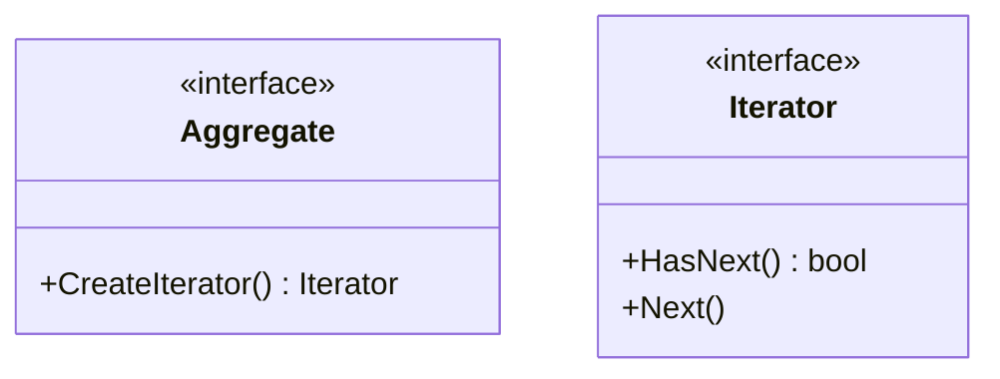

# Day 4: Separating Behavior and Notification (Behavioral Patterns Part 1)

Welcome to Day 4!
Yesterday, with the Strategy pattern, you learned the joy of switching algorithms.
Today, we'll learn about patterns where objects chat with each other (notification) or change their personality based on their state.
Mastering these will make your code behave as dynamically as a living creature.

Today, we will learn the following five patterns:

1. **Observer**: "Let me know when you're updated!"
2. **Command**: Boxing up a command
3. **State**: The moody object
4. **Template Method**: Creating a process with a fill-in-the-blanks problem
5. **Iterator**: Sequentially, without knowing the contents

---

## 14. Observer

### 📖 Story: YouTuber and Channel Subscriptions

You subscribe to your favorite YouTuber's channel.
When the YouTuber (Subject) uploads a new video, all subscribers (Observers) get a notification.
The YouTuber doesn't need to know the details of who is subscribed. They just send a notification to the "subscriber list."
If you unsubscribe, you won't get notifications anymore.

### 💡 Concept

Automatically notifies dependent objects of any state change in an object.



### 🐹 Go Implementation Tips

While the basic implementation uses interfaces, using **Go Channels** can create a more idiomatic, asynchronous event notification system.
However, to prevent memory leaks, it's crucial to have a mechanism to properly unregister (Detach) observers that are no longer needed.

### 🧪 Hands-on

Let's look at `observer-example`.
Create a new type of Observer (e.g., `EmailListener`), register it with the Subject, and make it receive notifications.

### ❓ Quiz

**Q1. The Observer pattern is the foundation of which architecture?**
A. MVC (Model-View-Controller)
B. REST API
C. Batch processing

<details>
<summary>Correct Answer</summary>
**A**. It is used at the core of MVC as the mechanism for notifying the View (display) of changes in the Model (data).
</details>

---

## 15. Command

### 📖 Story: Restaurant Order Ticket

A customer orders, "I'd like a hamburger."
The waiter writes it down on an "order ticket (Command)."
That order ticket is placed in the kitchen, and the chef (Receiver) cooks the dish when they have a free moment.
Because the order is an "object," you can reorder them or later say, "Actually, cancel that."

### 💡 Concept

Encapsulates a request as an object, thereby letting you parameterize clients with different requests, queue or log requests, and support undoable operations.



### 🐹 Go Implementation Tips

The basic approach is to have a struct with an `Execute()` method.
When creating a CLI tool, implementing subcommands (`git commit`, `git push`, etc.) with the Command pattern results in a clean organization.

### 🧪 Hands-on

`command-example` is an example of a TV remote control.
Let's try adding an "Undo" feature here (to cancel the last operation).
You will need to add an `Undo()` method to the Command interface.

### ❓ Quiz

**Q2. What is a benefit of the Command pattern?**
A. It allows delaying the execution of a process or keeping a history of it.
B. It allows for deep class inheritance hierarchies.
C. It improves database speed.

<details>
<summary>Correct Answer</summary>
**A**. Because the request can be treated as an "object," it can be stored and passed around freely.
</details>

---

## 16. State

### 📖 Story: Smartphone Button

Consider the action when you press the "power button" on a smartphone.
When the screen is OFF -> the screen turns ON.
When the screen is ON -> the screen turns OFF.
The same action of "pressing the button" results in different outcomes depending on the smartphone's "state."
If you write this as `if state == ON { ... } else { ... }`, it will become spaghetti code as more states are added.

### 💡 Concept

Allows an object to alter its behavior when its internal state changes. The object will appear to change its class.



### 🐹 Go Implementation Tips

Create a struct for each state and implement a common interface.
The Context (smartphone) holds the current state (State interface), and when the button is pressed, it calls `state.PressButton()`.
Who manages the state transition (switching to the next state) — the Context or the State — is a design choice.

### 🧪 Hands-on

Let's look at `state-example` (vending machine example).
Try adding a new state (e.g., "Under Maintenance") and make it transition to that state with a specific operation.

### ❓ Quiz

**Q3. What is the difference between the State pattern and the Strategy pattern?**
A. They are exactly the same.
B. Strategy focuses on "how to process (algorithm)," while State focuses on "what to do (behavior based on state)," and State often switches itself.
C. State uses inheritance, while Strategy does not.

<details>
<summary>Correct Answer</summary>
**B**. Although their structures are similar, their purposes and "who does the switching (State often transitions internally)" are different.
</details>

---

## 17. Template Method

### 📖 Story: Cooking Recipe

Whether it's "vegetable stir-fry" or "meat and vegetable stir-fry," the steps are roughly the same.

1. Heat the oil
2. Stir-fry the ingredients (this part is different!)
3. Season with salt and pepper
4. Plate it

Everything except "2. Stir-fry the ingredients" can be standardized.
It's efficient to create a common framework (template) and define only the different parts individually.

### 💡 Concept

Defines the skeleton of an algorithm in a superclass, deferring some steps to subclasses.

### 🐹 Go Implementation Tips

**Warning!** Go does not have "inheritance."
You can't do something like Java's `abstract class`.
In Go, this is achieved by combining "Embedding" and interfaces,
but honestly, **using the Strategy pattern often results in more idiomatic Go code**.
It is implemented by having a "parent struct" hold a "child interface" and delegating part of the processing to that interface.

```go
type Worker interface {
    Work()
}

type Person struct {
    Worker // Embed the interface
}

func (p *Person) DailyRoutine() {
    p.GetUp()
    p.Work() // Delegate only this part to the concrete implementation
    p.Sleep()
}
```

### 🧪 Hands-on

Let's look at `template-method-example` (OTP example).
Try adding a new struct for sending via SMS.

### ❓ Quiz

**Q4. What is a point of caution when implementing the Template Method pattern in Go?**
A. Since there is no inheritance, you need to be creative with delegation and embedding.
B. Interfaces cannot be used.
C. It will result in a compile error.

<details>
<summary>Correct Answer</summary>
**A**. Since this pattern relies on inheritance from object-oriented languages, it requires some ingenuity in Go.
</details>

---

## 18. Iterator

### 📖 Story: Organizing a Bookshelf

Books are lined up on a bookshelf.
"Read from right to left," "Read from left to right," "Read randomly."
Without knowing the structure of the bookshelf (collection) — whether it's an array, a list, or a tree —
it would be easy for the reader if there was a mechanism to just say, "Give me the next book," and a book would appear.

### 💡 Concept

Provides a way to access the elements of an aggregate object sequentially without exposing its underlying representation.



### 🐹 Go Implementation Tips

Since Go has a powerful `range` loop and slices, the Iterator pattern is unnecessary for simple arrays.
However, it is very effective for complex tree structures or database cursors where not all elements can be loaded into memory at once.
Go's standard library `bufio.Scanner` is also a type of Iterator pattern.

### 🧪 Hands-on

In `iterator-example`, try implementing a `ReverseIterator` that traverses a collection of users in reverse order.

### ❓ Quiz

**Q5. When is the Iterator pattern useful in Go?**
A. For a simple `[]int` loop.
B. For traversing complex graph structures or for stream processing that requires lazy evaluation.
C. For string concatenation.

<details>
<summary>Correct Answer</summary>
**B**. A simple `for range` is sufficient for simple loops. Use it when you want to hide complexity.
</details>

---

Well done on Day 4!
You've learned patterns for controlling dynamic behaviors like "state" and "notification."
Tomorrow is the final day. More complex, slightly niche, but powerful patterns await.
Let's push through the final stretch!
