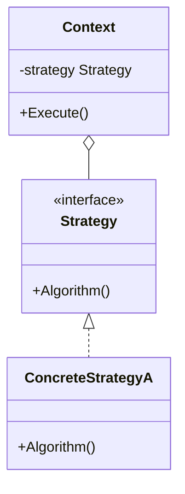
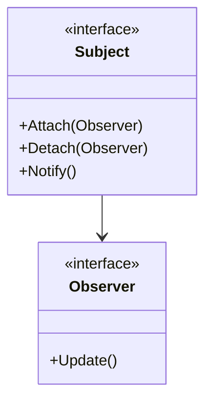
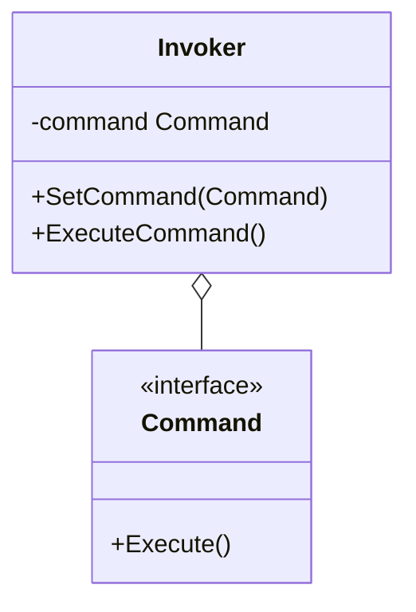

# Day 4: Algorithms & Notification (Behavioral Patterns Part 1)

Welcome to Day 4!
Yesterday, we learned how to make complex structures look simple.
From today, we move to "Behavior," meaning how objects cooperate with each other and change dynamically.
By mastering these, your code will be able to flexibly swap algorithms and automatically communicate state changes.

Today, we will learn the following three patterns:

1.  **Strategy**: Swapping algorithms like cassettes
2.  **Observer**: "Let me know when it's updated!"
3.  **Command**: Boxing up a command

---

## 7. Strategy

### 📖 Story: Weapons in an RPG

A hero fights monsters.
If they equip a "sword," it's a "slashing" attack; if they equip a "bow," it's a "shooting" attack.
Without changing the hero (Context) themselves, you can switch the attack method (algorithm) just by changing the equipment (Strategy).

### 💡 Concept

Encapsulates algorithms and makes them interchangeable at runtime.



### 🐹 The Essence of Go Implementation

This is one of the most basic and powerful ways to use interfaces in Go.
Implementing it as a function type (`type StrategyFunc func()`) and passing the function itself is also simple and very "Go-like."
Passing a comparison function to `sort.Slice` is also a type of Strategy pattern.

```go
type Strategy interface {
    Evict(c *Cache)
}

type Lru struct {}
func (l *Lru) Evict(c *Cache) { ... }

type Fifo struct {}
func (f *Fifo) Evict(c *Cache) { ... }
```

### 🧪 Hands-on

In `strategy-example` (cache example), try adding a new eviction algorithm (e.g., Random Eviction) and confirm that switching it at runtime changes the behavior.

### ❓ Quiz

**Q1. What can be avoided by using the Strategy pattern?**
A. Giant `if-else` or `switch` statements.
B. Defining interfaces.
C. Using structs.

<details>
<summary>Answer</summary>
**A**. Since algorithm branching can be expressed by switching classes (or functions), you can avoid a storm of conditional branching.
</details>

---

## 8. Observer

### 📖 Story: YouTubers and Channel Subscriptions

You have subscribed to your favorite YouTuber.
When the YouTuber (Subject) uploads a new video, a notification is sent to all subscribers (Observers).
The YouTuber doesn't need to know who is subscribed in detail. They just send a notification to the "subscription list."
If you unsubscribe, you won't receive notifications anymore.

### 💡 Concept

Automatically notifies other dependent objects when an object's state changes.



### 🐹 The Essence of Go Implementation

While implementing it using interfaces is standard in Go, using **Go Channels** allows you to create a more Go-like asynchronous event notification system.
However, it's important to have a mechanism to properly unregister (Detach) Observers when they are no longer needed to prevent memory leaks.

### 🧪 Hands-on

Let's look at `observer-example`.
Try creating a new type of Observer (e.g., `EmailListener`) and registering it with the Subject to receive notifications.

### ❓ Quiz

**Q2. The Observer pattern is the foundation for which architecture?**
A. MVC (Model-View-Controller).
B. REST API.
C. Batch processing.

<details>
<summary>Answer</summary>
**A**. It is used in the heart of MVC as a mechanism to notify the View (display) of changes in the Model (data).
</details>

---

## 9. Command

### 📖 Story: The Restaurant Order Slip

A customer tells the waiter, "I'll have a hamburger."
The waiter writes it on an "order slip (Command)."
That order slip is placed in the kitchen, and the chef (Receiver) looks at it and cooks when they are free.
Because it's an "object" called an order slip, you can rearrange the order or "cancel" it later.

### 💡 Concept

Encapsulates a request as an object, thereby letting you parameterize clients with different requests, queue or log requests, and support undoable operations.



### 🐹 The Essence of Go Implementation

The basic idea is to have a struct with an `Execute()` method.
When building CLI tools, implementing each sub-command (`git commit`, `git push`, etc.) using the Command pattern keeps things neatly organized.

### 🧪 Hands-on

`command-example` is an example of a TV remote control.
Try adding an "Undo" feature to this.
You will need to add an `Undo()` method to the `Command` interface.

### ❓ Quiz

**Q3. What is the advantage of the Command pattern?**
A. You can delay the timing of processing or keep a history.
B. You can make the class inheritance hierarchy deep.
C. It increases database speed.

<details>
<summary>Answer</summary>
**A**. Because requests can be treated as "objects," they can be saved or passed around freely.
</details>

---

Great job on Day 4!
You've learned patterns to control dynamic behavior, such as "swapping algorithms" and "notification."
Tomorrow is the final day. We will learn more advanced patterns like managing state and chains of responsibility.
Keep up the good work for the final sprint!