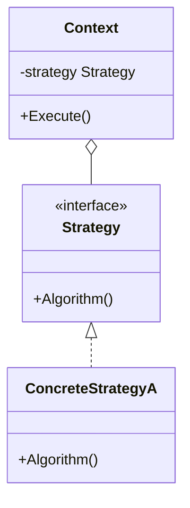
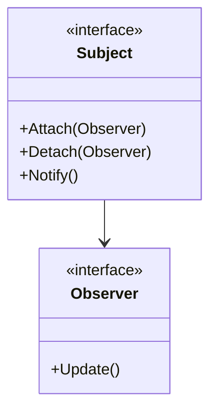
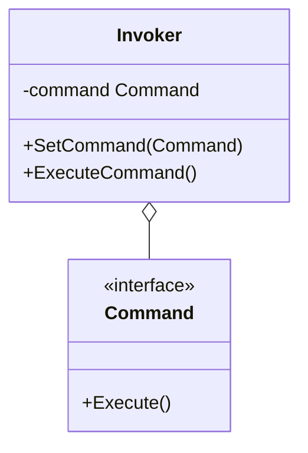

# Day 4: アルゴリズムと通知 (Behavioral Patterns Part 1)

Day 4 へようこそ！
昨日は複雑な構造をシンプルに見せる方法を学びました。
今日からは「振る舞い」、つまりオブジェクト同士がどう協力し合い、どう動的に変化するかを学びます。
これらを使いこなせば、あなたのコードは柔軟にアルゴリズムを切り替えたり、状態変化を自動で伝えたりできるようになります。

本日は以下の 3 つのパターンを学びます。

1.  **Strategy**: アルゴリズムをカセットのように交換
2.  **Observer**: 「更新されたら教えてね！」
3.  **Command**: 命令を箱詰めにする

---

## 7. Strategy (ストラテジー)

### 📖 ストーリー：RPG の武器

勇者はモンスターと戦います。
「剣」を装備すれば「斬る」攻撃、「弓」を装備すれば「射る」攻撃になります。
勇者（Context）自体を作り変えることなく、装備（Strategy）を持ち替えるだけで、攻撃方法（アルゴリズム）を切り替えられます。

### 💡 コンセプト

アルゴリズムをカプセル化し、実行時に交換可能にします。



### 🐹 Go 実装の極意

Go のインターフェースの最も基本的かつ強力な使い方がこれです。
関数型（`type StrategyFunc func()`）として定義し、関数そのものを渡す実装も Go らしくてシンプルです。
`sort.Slice` で比較関数を渡すのも Strategy パターンの一種です。

```go
type Strategy interface {
    Evict(c *Cache)
}

type Lru struct {}
func (l *Lru) Evict(c *Cache) { ... }

type Fifo struct {}
func (f *Fifo) Evict(c *Cache) { ... }
```

### 🧪 ハンズオン

`strategy-example` (キャッシュの例) で、新しい削除アルゴリズム（例: Random Eviction）を追加し、実行時に切り替えて動作が変わることを確認しましょう。

### ❓ クイズ

**Q1. Strategy パターンを使うと何が避けられる？**
A. 巨大な `if-else` や `switch` 文
B. インターフェースの定義
C. 構造体の使用

<details>
<summary>正解</summary>
**A**. アルゴリズムの分岐をクラス（または関数）の切り替えで表現できるため、条件分岐の嵐を避けられます。
</details>

---

## 8. Observer (オブザーバー)

### 📖 ストーリー：YouTuber とチャンネル登録

あなたは好きな YouTuber をチャンネル登録しています。
YouTuber（Subject）が新しい動画をアップロードすると、登録者（Observer）全員に通知が届きます。
YouTuber は、誰が登録しているか詳しく知る必要はありません。「登録リスト」に通知を送るだけです。
もし登録解除すれば、もう通知は来ません。

### 💡 コンセプト

あるオブジェクトの状態変化を、依存する他のオブジェクトに自動的に通知します。



### 🐹 Go 実装の極意

Go ではインターフェースを使って実装するのが基本ですが、
**Go Channels** を使うと、より Go らしい非同期なイベント通知システムが作れます。
ただし、メモリリークを防ぐために、不要になった Observer を適切に解除（Detach）する仕組みが重要です。

### 🧪 ハンズオン

`observer-example` を見てみましょう。
新しい種類の Observer（例: `EmailListener`）を作成し、Subject に登録して通知を受け取れるようにしてみてください。

### ❓ クイズ

**Q2. Observer パターンはどのようなアーキテクチャの基礎となる？**
A. MVC (Model-View-Controller)
B. REST API
C. バッチ処理

<details>
<summary>正解</summary>
**A**. Model（データ）の変更を View（表示）に通知する仕組みとして、MVCの核心部分で使われています。
</details>

---

## 9. Command (コマンド)

### 📖 ストーリー：レストランの注文票

客がウェイターに「ハンバーガーください」と注文します。
ウェイターはそれを「注文票（Command）」に書きます。
その注文票は厨房に置かれ、シェフ（Receiver）が手隙の時にそれを見て料理を作ります。
注文票という「モノ」になっているので、順番を入れ替えたり、後で「やっぱりキャンセル」したりできます。

### 💡 コンセプト

要求をオブジェクトとしてカプセル化し、パラメータ化や履歴管理、キューイング、Undo/Redo を可能にします。



### 🐹 Go 実装の極意

構造体に `Execute()` メソッドを持たせるのが基本です。
CLI ツールを作る際、サブコマンド（`git commit`, `git push`など）をそれぞれ Command パターンで実装すると綺麗に整理できます。

### 🧪 ハンズオン

`command-example` はテレビのリモコンの例です。
ここに「Undo（直前の操作を取り消す）」機能を追加してみましょう。
Command インターフェースに `Undo()` メソッドを追加する必要があります。

### ❓ クイズ

**Q3. Command パターンの利点は？**
A. 処理の実行タイミングを遅らせたり、履歴を残したりできる
B. クラスの継承階層を深くできる
C. データベースの速度が上がる

<details>
<summary>正解</summary>
**A**. 要求を「オブジェクト」として扱えるため、保存や受け渡しが自由自在になります。
</details>

---

Day 4 お疲れ様でした！
「アルゴリズムの交換」や「通知」といった、動的な振る舞いを制御するパターンを学びました。
明日は最終日。状態の管理や責任の連鎖など、より高度なパターンを学びます。
ラストスパート、頑張りましょう！