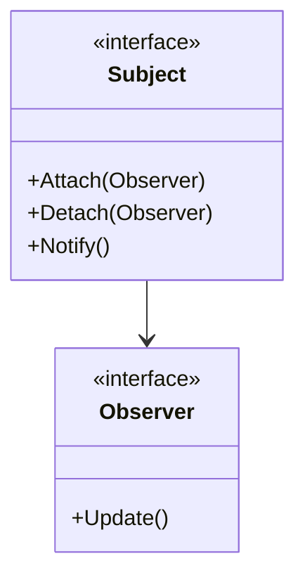
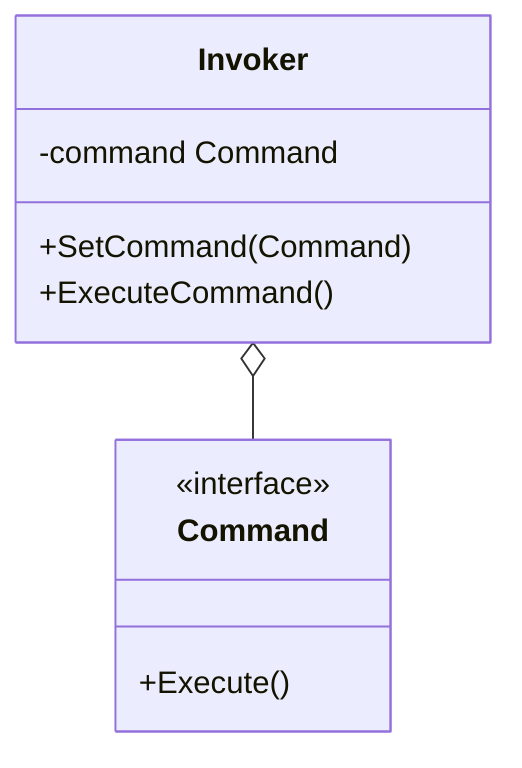
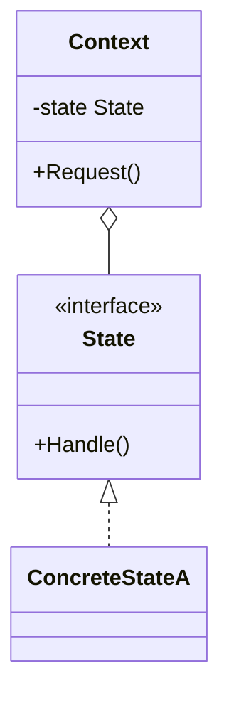
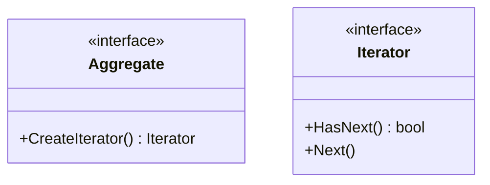

# Day 4: 振る舞いの分離と通知 (Behavioral Patterns Part 1)

Day 4 へようこそ！
昨日の Strategy パターンで、アルゴリズムを切り替える楽しさを知りましたね。
今日は、オブジェクト同士がおしゃべりしたり（通知）、状態によって性格が変わったりするパターンを学びます。
これらを使いこなせば、あなたのコードはまるで生き物のように動的に振る舞うようになります。

本日は以下の 5 つのパターンを学びます。

1.  **Observer**: 「更新されたら教えてね！」
2.  **Command**: 命令を箱詰めにする
3.  **State**: 気分屋なオブジェクト
4.  **Template Method**: 穴埋め問題で処理を作る
5.  **Iterator**: 中身を知らずに順番に

---

## 14. Observer (オブザーバー)

### 📖 ストーリー：YouTuber とチャンネル登録

あなたは好きな YouTuber をチャンネル登録しています。
YouTuber（Subject）が新しい動画をアップロードすると、登録者（Observer）全員に通知が届きます。
YouTuber は、誰が登録しているか詳しく知る必要はありません。「登録リスト」に通知を送るだけです。
もし登録解除すれば、もう通知は来ません。

### 💡 コンセプト

あるオブジェクトの状態変化を、依存する他のオブジェクトに自動的に通知します。



### 🐹 Go 実装の極意

Go ではインターフェースを使って実装するのが基本ですが、
**Go Channels** を使うと、より Go らしい非同期なイベント通知システムが作れます。
ただし、メモリリークを防ぐために、不要になった Observer を適切に解除（Detach）する仕組みが重要です。

### 🧪 ハンズオン

`observer-example` を見てみましょう。
新しい種類の Observer（例: `EmailListener`）を作成し、Subject に登録して通知を受け取れるようにしてみてください。

### ❓ クイズ

**Q1. Observer パターンはどのようなアーキテクチャの基礎となる？**
A. MVC (Model-View-Controller)
B. REST API
C. バッチ処理

<details>
<summary>正解</summary>
**A**. Model（データ）の変更を View（表示）に通知する仕組みとして、MVCの核心部分で使われています。
</details>

---

## 15. Command (コマンド)

### 📖 ストーリー：レストランの注文票

客がウェイターに「ハンバーガーください」と注文します。
ウェイターはそれを「注文票（Command）」に書きます。
その注文票は厨房に置かれ、シェフ（Receiver）が手隙の時にそれを見て料理を作ります。
注文票という「モノ」になっているので、順番を入れ替えたり、後で「やっぱりキャンセル」したりできます。

### 💡 コンセプト

要求をオブジェクトとしてカプセル化し、パラメータ化や履歴管理、キューイング、Undo/Redo を可能にします。



### 🐹 Go 実装の極意

構造体に `Execute()` メソッドを持たせるのが基本です。
CLI ツールを作る際、サブコマンド（`git commit`, `git push`など）をそれぞれ Command パターンで実装すると綺麗に整理できます。

### 🧪 ハンズオン

`command-example` はテレビのリモコンの例です。
ここに「Undo（直前の操作を取り消す）」機能を追加してみましょう。
Command インターフェースに `Undo()` メソッドを追加する必要があります。

### ❓ クイズ

**Q2. Command パターンの利点は？**
A. 処理の実行タイミングを遅らせたり、履歴を残したりできる
B. クラスの継承階層を深くできる
C. データベースの速度が上がる

<details>
<summary>正解</summary>
**A**. 要求を「オブジェクト」として扱えるため、保存や受け渡しが自由自在になります。
</details>

---

## 16. State (ステート)

### 📖 ストーリー：スマホのボタン

スマホの「電源ボタン」を押した時の動作を考えてみましょう。
画面が OFF の時 → 画面が ON になる。
画面が ON の時 → 画面が OFF になる。
同じ「ボタンを押す」という動作でも、スマホの「状態」によって結果が変わります。
これを `if state == ON { ... } else { ... }` と書くと、状態が増えた時にスパゲッティコードになります。

### 💡 コンセプト

オブジェクトの内部状態が変化したときに、振る舞いを変えるようにします。状態をクラスとして表現します。



### 🐹 Go 実装の極意

状態ごとに構造体を作り、共通のインターフェースを実装します。
Context（スマホ）は現在の状態（State インターフェース）を保持し、ボタンが押されたら `state.PressButton()` を呼び出します。
状態遷移（次の状態への切り替え）を誰が管理するか（Context か State か）は設計次第です。

### 🧪 ハンズオン

`state-example`（自動販売機の例）を見てみましょう。
新しい状態（例: 「メンテナンス中」）を追加し、特定の操作でその状態に遷移するようにしてみてください。

### ❓ クイズ

**Q3. State パターンと Strategy パターンの違いは？**
A. 全く同じものである
B. Strategy は「どう処理するか（アルゴリズム）」、State は「何をするか（状態による振る舞い）」に焦点があり、State は自ら切り替わることが多い
C. State は継承を使い、Strategy は使わない

<details>
<summary>正解</summary>
**B**. 構造は似ていますが、目的と「誰が切り替えるか（Stateは内部で遷移することが多い）」が異なります。
</details>

---

## 17. Template Method (テンプレートメソッド)

### 📖 ストーリー：料理のレシピ

「野菜炒め」も「肉野菜炒め」も、手順はだいたい同じです。

1. 油を引く
2. 具材を炒める（ここが違う！）
3. 塩胡椒を振る
4. 盛り付ける
   「2. 具材を炒める」以外は共通化できます。
   共通の枠組み（テンプレート）を作っておき、違う部分だけを個別に定義すれば効率的です。

### 💡 コンセプト

処理の枠組み（スケルトン）を親クラスで定義し、具体的な手順をサブクラスで実装します。

### 🐹 Go 実装の極意

**要注意！** Go には「継承」がありません。
Java の `abstract class` のようなことはできません。
Go では、「埋め込み（Embedding）」とインターフェースを組み合わせて実現しますが、
正直なところ、**Strategy パターンを使った方が Go らしい**コードになることが多いです。
「親構造体」が「子インターフェース」を持ち、処理の一部をそのインターフェースに委譲する形で実装します。

```go
type Worker interface {
    Work()
}

type Person struct {
    Worker // インターフェースを埋め込む
}

func (p *Person) DailyRoutine() {
    p.GetUp()
    p.Work() // ここだけ具体的な実装に任せる
    p.Sleep()
}
```

### 🧪 ハンズオン

`template-method-example` (OTP の例) を見てみましょう。
SMS で送信する新しい構造体を追加してみてください。

### ❓ クイズ

**Q4. Go で Template Method パターンを実装する際の注意点は？**
A. 継承がないため、委譲や埋め込みを工夫する必要がある
B. インターフェースが使えない
C. コンパイルエラーになる

<details>
<summary>正解</summary>
**A**. オブジェクト指向言語の継承に依存したパターンなので、Goでは少し工夫が必要です。
</details>

---

## 18. Iterator (イテレータ)

### 📖 ストーリー：本棚の整理

本棚に本が並んでいます。
「右から順に読む」「左から順に読む」「ランダムに読む」。
本棚（コレクション）の構造（配列なのか、リストなのか、ツリーなのか）を知らなくても、
「次の本ちょうだい」と言えば本が出てくる仕組みがあれば、読む人は楽です。

### 💡 コンセプト

集合体の内部構造を露出させずに、要素に順次アクセスする方法を提供します。



### 🐹 Go 実装の極意

Go には強力な `range` ループやスライスがあるため、単純な配列なら Iterator パターンは不要です。
しかし、複雑なツリー構造や、データベースのカーソルなど、全要素をメモリに乗せられない場合には非常に有効です。
Go の標準ライブラリ `bufio.Scanner` も Iterator パターンの一種です。

### 🧪 ハンズオン

`iterator-example` で、ユーザーのコレクションを逆順に走査する `ReverseIterator` を実装してみましょう。

### ❓ クイズ

**Q5. Go で Iterator パターンが役立つのは？**
A. 単純な []int のループ
B. 複雑なグラフ構造の探索や、遅延評価が必要なストリーム処理
C. 文字列の連結

<details>
<summary>正解</summary>
**B**. 単純なループは `for range` で十分です。複雑さを隠蔽したい時に使いましょう。
</details>

---

Day 4 お疲れ様でした！
「状態」や「通知」といった、動的な振る舞いを制御するパターンを学びました。
明日は最終日。より複雑で、少しマニアックだけど強力なパターンたちが待っています。
ラストスパート、頑張りましょう！
