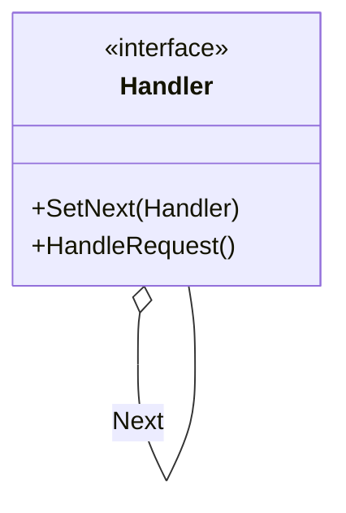
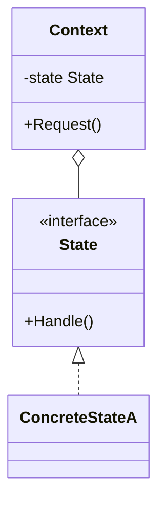
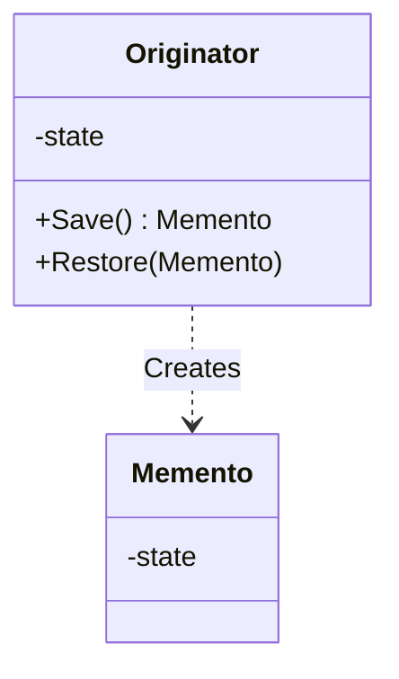

# Day 5: 状態と責任の管理 (Behavioral Patterns Part 2)

ついに最終日、Day 5 です！
今日は、システムの流れを制御したり、過去の状態を保存したり、オブジェクトの「状態」そのものを管理する高度なパターンを学びます。
これらを理解すれば、複雑な業務フローや、Undo/Redo 機能、複雑な状態遷移をスマートに実装できるようになります。

本日は以下の 3 つのパターンを学びます。

1.  **Chain of Responsibility**: たらい回しの美学
2.  **State**: 気分屋なオブジェクト
3.  **Memento**: 時を戻そう

---

## 10. Chain of Responsibility (責任の連鎖)

### 📖 ストーリー：コールセンター

お客様からクレームの電話がかかってきました。

1.  まずは「オペレーター」が出ます。解決できればそこで終了。
2.  無理なら「リーダー」に代わります。解決できれば終了。
3.  それでも無理なら「マネージャー」が出てきます。
    問題を解決できる人が見つかるまで、責任を次へと「たらい回し（連鎖）」していきます。

### 💡 コンセプト

要求を処理できるオブジェクトが見つかるまで、チェーン状に繋がれたオブジェクトを順に渡していきます。

### 🐹 Go 実装の極意

Web フレームワークの「ミドルウェア」がまさにこれです。
認証 → ログ出力 → リクエスト解析 → … と処理を連鎖させます。
Go では、構造体に `next` フィールドを持たせてリンクリストを作るか、スライスにハンドラを並べて順次実行する方法があります。

### 🧪 ハンズオン

`chain-of-responsibility-example`（病院の受付の例）を見てみましょう。
新しいハンドラ（例: `InsuranceCheckHandler`）をチェーンの途中に追加し、処理の流れが変わることを確認してください。

### ❓ クイズ

**Q1. Chain of Responsibility を使うと何が良い？**
A. リクエストを送る側が、誰が処理するかを知らなくて済む
B. 処理速度が最速になる
C. データベースの容量が減る

正解

**A**. 送信側と受信側（処理側）の結合度を下げることができます。

---

## 11. State (ステート)

### 📖 ストーリー：スマホのボタン

スマホの「電源ボタン」を押した時の動作を考えてみましょう。
画面が OFF の時 → 画面が ON になる。
画面が ON の時 → 画面が OFF になる。
同じ「ボタンを押す」という動作でも、スマホの「状態」によって結果が変わります。
これを `if state == ON { ... } else { ... }` と書くと、状態が増えた時にスパゲッティコードになります。

### 💡 コンセプト

オブジェクトの内部状態が変化したときに、振る舞いを変えるようにします。状態をクラスとして表現します。

### 🐹 Go 実装の極意

状態ごとに構造体を作り、共通のインターフェースを実装します。
Context（スマホ）は現在の状態（State インターフェース）を保持し、ボタンが押されたら `state.PressButton()` を呼び出します。
状態遷移（次の状態への切り替え）を誰が管理するか（Context か State か）は設計次第です。

### 🧪 ハンズオン

`state-example`（ドアの開閉システムの例）を見てみましょう。
新しい状態（例: 「メンテナンス中」）を追加し、特定の操作でその状態に遷移するようにしてみてください。

### ❓ クイズ

**Q2. State パターンと Strategy パターンの違いは？**
A. 全く同じものである
B. Strategy は「どう処理するか（アルゴリズム）」、State は「何をするか（状態による振る舞い）」に焦点があり、State は自ら切り替わることが多い
C. State は継承を使い、Strategy は使わない

正解

**B**. 構造は似ていますが、目的と「誰が切り替えるか（Stateは内部で遷移することが多い）」が異なります。

---

## 12. Memento (メメント)

### 📖 ストーリー：ゲームのセーブポイント

RPG でボス戦の前に「セーブ」しますよね。
もし負けたら、セーブした時点の状態に戻ります。
ゲームの内部データ（HP、MP、位置など）を「セーブデータ（Memento）」として保存しておき、必要な時に読み込んで復元します。
この時、セーブデータの中身を勝手に書き換えられないようにカプセル化を守ることが重要です。

### 💡 コンセプト

オブジェクトのカプセル化を破壊せずに、その内部状態を保存・復元します。

### 🐹 Go 実装の極意

Go では、`Memento` 構造体のフィールドを小文字（private）にして、パッケージ外から変更できないようにすることでカプセル化を守ります。
`Originator` だけがその中身を読み書きできるように設計します。

### 🧪 ハンズオン

`memento-example` で、テキストエディタの Undo 機能を試してみましょう。
複数回変更を行い、複数回 Undo して過去の状態に戻れるか確認してください。

### ❓ クイズ

**Q3. Memento パターンで保存する「状態」はどこに置く？**
A. グローバル変数
B. Memento オブジェクトの中
C. データベースの中だけ

正解

**B**. Mementoオブジェクトの中に状態を閉じ込めて、Caretaker（管理者）に渡します。

---

# 🎉 卒業おめでとうございます！

これで、Go において真に重要なデザインパターンの学習が完了しました！
あなたは今、強力な武器を手に入れました。
しかし、武器は使い所が肝心です。
「パターンを使いたいから使う」のではなく、
「目の前の問題を解決するために、このパターンが最適だから使う」
というエンジニアになってください。

**Happy Coding with Go!**