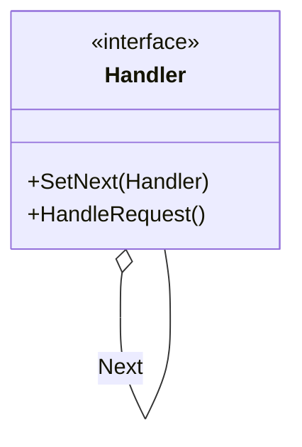
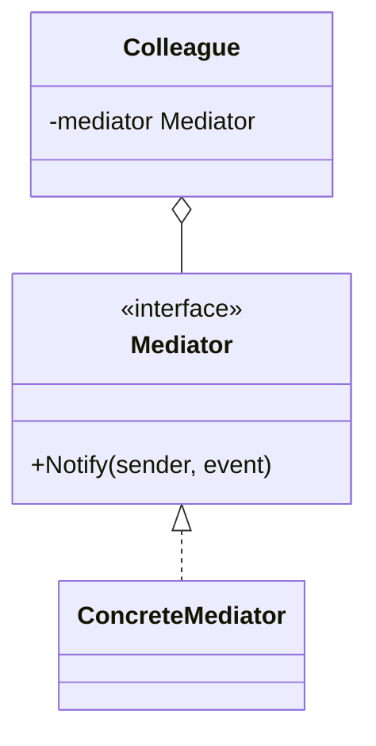
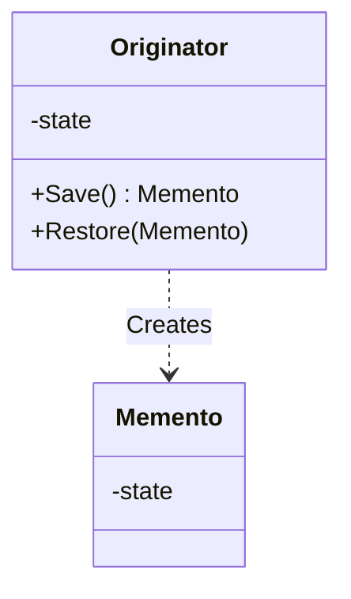
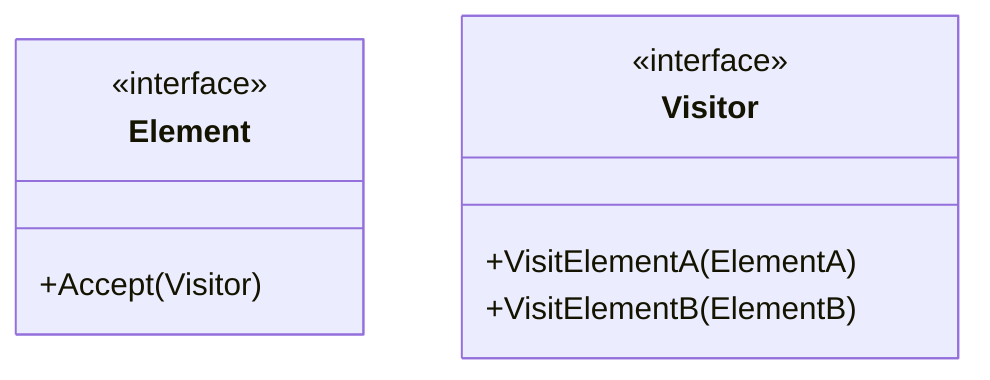
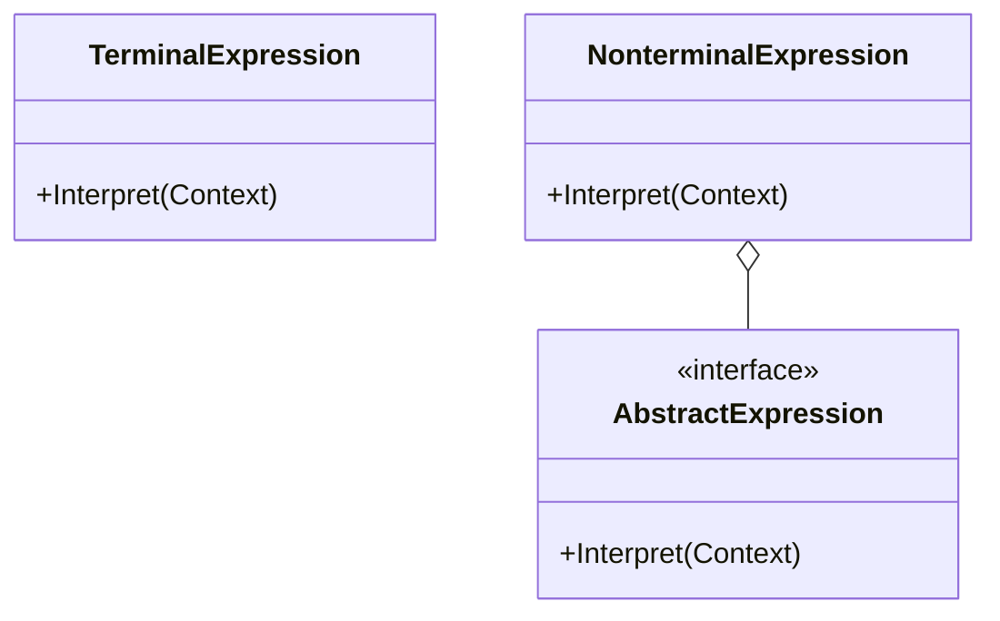

# Day 5: Complex Flows and Responsibilities (Behavioral Patterns Part 2)

Finally, it's the last day, Day 5!
So far, we've learned 18 patterns.
Today, we'll cover patterns that are a bit more complex but truly shine when building large-scale systems and frameworks—patterns for the "connoisseur."
If you understand these, you're no longer a "design pattern beginner."

Today, we will learn the following 5 patterns:

1. **Chain of Responsibility**: The art of passing the buck
2. **Mediator**: The traffic cop
3. **Memento**: Turning back time
4. **Visitor**: Adding functionality without changing structure
5. **Interpreter**: Creating a language

---

## 19. Chain of Responsibility

### 📖 Story: Call Center

A customer calls with a complaint.

1. First, an "operator" answers. If they can resolve it, the call ends there.
2. If not, it's escalated to a "leader." If they can resolve it, it ends.
3. If still unresolved, a "manager" steps in.
    The responsibility is "passed along (chained)" to the next person until someone who can resolve the issue is found.

### 💡 Concept

Requests are passed sequentially through a chain of objects until an object that can handle the request is found.

### 🐹 Go Implementation Tips

Web framework "middleware" is a prime example of this.
Authentication → Logging → Request parsing → ... processes are chained.
In Go, you can implement this by having a `next` field in a struct to form a linked list, or by arranging handlers in a slice and executing them sequentially.

### 🧪 Hands-on

Let's look at `chain-of-responsibility-example` (hospital reception example).
Add a new handler (e.g., `InsuranceCheckHandler`) in the middle of the chain and observe how the processing flow changes.

### ❓ Quiz

**Q1. What is the benefit of using Chain of Responsibility?**
A. The sender of the request doesn't need to know who will process it.
B. Processing speed becomes the fastest.
C. Database capacity is reduced.

Correct Answer

**A**. It reduces the coupling between the sender and the receiver (processor).

---

## 20. Mediator

### 📖 Story: Airport Control Tower

If airplanes communicated directly with each other, like "Hey, I'm landing now," "Understood, I'll wait," it would be chaos.
All airplanes communicate only with the "control tower (Mediator)."
"Requesting landing clearance," "Cleared to land."
The control tower aggregates all information and issues instructions, ensuring air safety.

### 💡 Concept

Complex communication between objects is centralized in a Mediator, reducing the coupling between objects.

### 🐹 Go Implementation Tips

This pattern is used for GUI application form control or as an orchestrator between microservices.
Each component (Colleague) only knows the Mediator's interface and is unaware of other specific components.
When dependencies become a spaghetti mess (many-to-many), introduce a Mediator to organize them into a "star shape (one-to-many)."

### 🧪 Hands-on

Let's look at `mediator-example` (train and station example).
Verify that adding a new type of train (e.g., `ExpressTrain`) does not require changing other train classes.

### ❓ Quiz

**Q2. What is a drawback of the Mediator pattern?**
A. The Mediator class itself tends to become huge and complex (God Object).
B. Communication between objects becomes impossible.
C. No particular drawbacks.

Correct Answer

**A**. Since all logic is concentrated in the Mediator, there is a risk that the Mediator itself becomes bloated and difficult to maintain.

---

## 21. Memento

### 📖 Story: Game Save Point

In an RPG, you "save" before a boss battle, right?
If you lose, you return to the state at the time of saving.
The game's internal data (HP, MP, position, etc.) is saved as "save data (Memento)," and can be loaded and restored when needed.
At this time, it's important to protect encapsulation so that the contents of the save data cannot be arbitrarily modified.

### 💡 Concept

Saves and restores the internal state of an object without violating its encapsulation.

### 🐹 Go Implementation Tips

In Go, encapsulation is protected by making the fields of the `Memento` struct lowercase (private), preventing modification from outside the package.
Only the `Originator` is designed to read and write its contents.

### 🧪 Hands-on

In `memento-example`, try the Undo function of a text editor.
Make multiple changes and then Undo multiple times to see if you can revert to past states.

### ❓ Quiz

**Q3. Where should the "state" saved by the Memento pattern be placed?**
A. Global variable
B. Inside the Memento object
C. Only in the database

Correct Answer

**B**. The state is encapsulated within the Memento object and passed to the Caretaker (manager).

---

## 22. Visitor

### 📖 Story: Inspection Company

A house has a kitchen, bathroom, living room, etc.
When a "plumbing inspector (Visitor A)" comes, they check the water systems in the kitchen and bathroom.
When an "electrical inspector (Visitor B)" comes, they check the outlets in each room.
Without changing the structure of the house (rooms), new operations like "inspection" can be added simply by adding new inspectors (Visitors).

### 💡 Concept

Separates a data structure from the operations (processing) performed on it. New operations can be added without modifying the data structure.

### 🐹 Go Implementation Tips

This uses a technique called "double dispatch."
`Element.Accept(v)` calls `v.Visit(self)`, which selects the appropriate processing method at runtime.
This is very powerful when adding processing to data with complex nested structures, such as AST (Abstract Syntax Tree) analysis or Kubernetes manifest validation.

### 🧪 Hands-on

Let's look at `visitor-example` (shape area calculator example).
Create a new Visitor (e.g., `PerimeterCalculator`) and add a new operation without modifying the existing shape structs.

### ❓ Quiz

**Q4. When should the Visitor pattern NOT be used?**
A. When the data structure (types of Elements) changes frequently.
B. When new operations need to be added frequently.
C. When the data structure is stable.

Correct Answer

**A**. If the number of Elements increases, the Visitor interface methods must also be increased, requiring modification of all Visitor implementations, which can be difficult.

---

## 23. Interpreter

### 📖 Story: Custom Language

Suppose you want to calculate expressions like "1 + 2" or "A and (B or C)."
To interpret this programmatically, you need to define a "grammar" and a mechanism to parse it.
By representing each grammatical rule (addition, variables, AND, etc.) as a class and combining them to form a tree structure, you can evaluate (execute) the expression.

### 💡 Concept

Represents the grammar rules of a language as classes and interprets/executes sentences written in that language.

### 🐹 Go Implementation Tips

Go's `text/template` package and SQL parsers are examples of this pattern's application.
It's used when you want to create your own DSL (Domain Specific Language) or represent complex search conditions (combinations of AND/OR/NOT) as objects.

### 🧪 Hands-on

In `interpreter-example`, run an interpreter that interprets simple arithmetic expressions (addition, subtraction).
Try adding a new operator (e.g., multiplication).

### ❓ Quiz

**Q5. In what cases is the Interpreter pattern suitable?**
A. Reading simple configuration files.
B. Interpreting languages with simple grammar that do not change frequently.
C. Programming languages that require fast compilation.

Correct Answer

**B**. It is not suitable for overly complex languages, but it is suitable for creating small, domain-specific languages (DSLs).

---

# 🎉 Congratulations on Graduating

You have now completed learning all 23 design patterns!
You now possess powerful tools.
However, knowing when and where to use these tools is crucial.
Instead of "using a pattern just because you want to,"
strive to be an engineer who "uses this pattern because it's the best solution for the problem at hand."

**Happy Coding with Go!**
