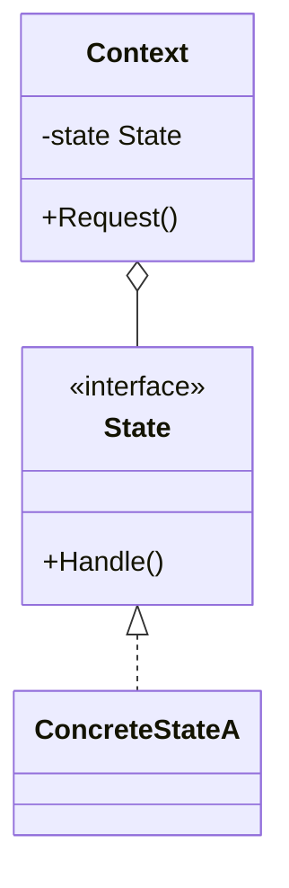

# Day 5: Managing State & Responsibility (Behavioral Patterns Part 2)

Finally, it's the last day, Day 5!
Today, we will learn advanced patterns for controlling the flow of a system, saving past states, and managing the "state" of objects itself.
Understanding these will allow you to smartly implement complex business flows, Undo/Redo features, and complex state transitions.

Today, we will learn the following three patterns:

1.  **Chain of Responsibility**: The aesthetics of passing the buck
2.  **State**: Moody objects
3.  **Memento**: Let's turn back time

---

## 10. Chain of Responsibility

### 📖 Story: The Call Center

A customer calls with a complaint.

1.  First, the "operator" answers. If it can be solved there, it ends.
2.  If not, it's passed to the "leader." If solved, it ends.
3.  If still not, the "manager" comes out.
    The responsibility is "passed along (chained)" until someone who can solve the problem is found.

### 💡 Concept

Passes requests along a chain of handlers. Upon receiving a request, each handler decides either to process the request or to pass it to the next handler in the chain.

### 🐹 The Essence of Go Implementation

Web framework "middleware" is exactly this.
Processing is chained: Authentication → Logging → Request Analysis → ...
In Go, it's implemented by having a `next` field in a struct to create a linked list, or by lining up handlers in a slice and executing them sequentially.

### 🧪 Hands-on

Let's look at `chain-of-responsibility-example` (the hospital reception example).
Try adding a new handler (e.g., `InsuranceCheckHandler`) in the middle of the chain and confirm that the flow of processing changes.

### ❓ Quiz

**Q1. What is the benefit of using Chain of Responsibility?**
A. The sender of the request doesn't need to know who will process it.
B. Processing speed becomes the fastest.
C. Database capacity is reduced.

Answer

**A**. You can reduce the coupling between the sender and the receiver (the processing side).

---

## 11. State

### 📖 Story: The Smartphone Button

Think about the behavior when you press the "power button" on a smartphone.
When the screen is OFF → the screen turns ON.
When the screen is ON → the screen turns OFF.
Even with the same action of "pressing a button," the result changes depending on the "state" of the smartphone.
If you write this as `if state == ON { ... } else { ... }`, it becomes spaghetti code when the number of states increases.

### 💡 Concept

Allows an object to alter its behavior when its internal state changes. The object will appear to change its class.

### 🐹 The Essence of Go Implementation

Create a struct for each state and implement a common interface.
The Context (smartphone) holds the current state (State interface) and calls `state.PressButton()` when the button is pressed.
Who manages the state transition (switching to the next state), the Context or the State, depends on the design.

### 🧪 Hands-on

Let's look at `state-example` (door opening/closing system example).
Try adding a new state (e.g., "Maintenance") and make it transition to that state with a specific operation.

### ❓ Quiz

**Q2. What is the difference between the State pattern and the Strategy pattern?**
A. They are exactly the same.
B. Strategy focuses on "how to process (algorithm)," while State focuses on "what to do (behavior based on state)," and State often switches itself.
C. State uses inheritance, while Strategy does not.

Answer

**B**. While the structure is similar, the purpose and "who switches (State often transitions internally)" differ.

---

## 12. Memento

### 📖 Story: Game Save Points

You "save" before a boss battle in an RPG, right?
If you lose, you return to the state at the time you saved.
By saving internal game data (HP, MP, position, etc.) as "save data (Memento)" and loading it when needed, you can restore it.
It's important to protect encapsulation so that the save data can't be modified arbitrarily.

### 💡 Concept

Allows capturing and externalizing an object's internal state so that the object can be restored to this state later, without violating encapsulation.

### 🐹 The Essence of Go Implementation

In Go, you protect encapsulation by making the fields of the `Memento` struct unexported (private) so they cannot be changed from outside the package.
Design it so that only the `Originator` can read and write its contents.

### 🧪 Hands-on

Try the Undo feature of the text editor in `memento-example`.
Make multiple changes and see if you can return to past states by performing multiple Undo operations.

### ❓ Quiz

**Q3. Where is the "state" saved in the Memento pattern placed?**
A. In a global variable.
B. Inside the Memento object.
C. Only in the database.

Answer

**B**. You encapsulate the state inside the Memento object and pass it to the Caretaker (manager).

---

# 🎉 Congratulations on your Graduation!

You have now completed learning about the design patterns that are truly important in Go!
You have now acquired powerful weapons.
But the key to weapons is where to use them.
Don't be an engineer who "uses a pattern because I want to use it."
Be an engineer who "uses a pattern because it is the best solution to the problem in front of me."

**Happy Coding with Go!**