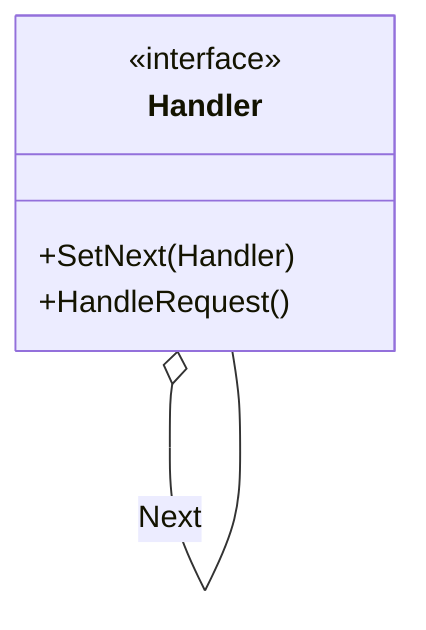
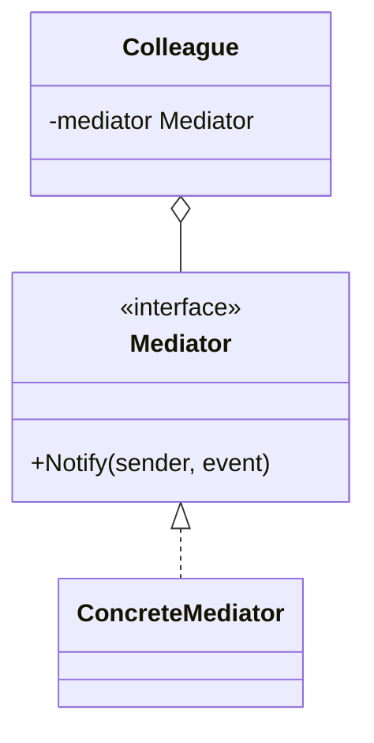
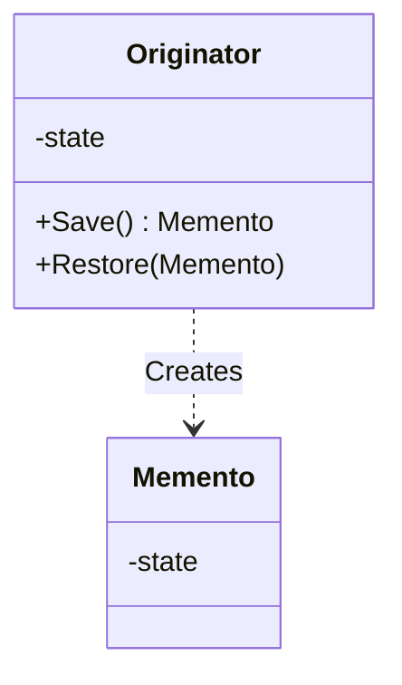
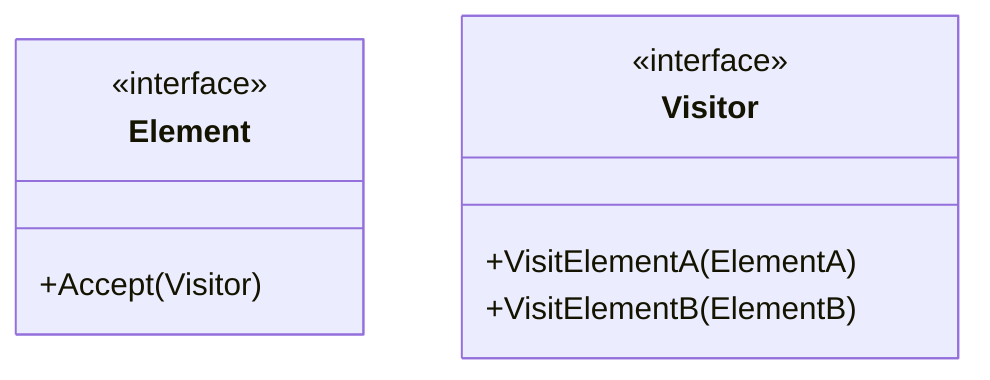
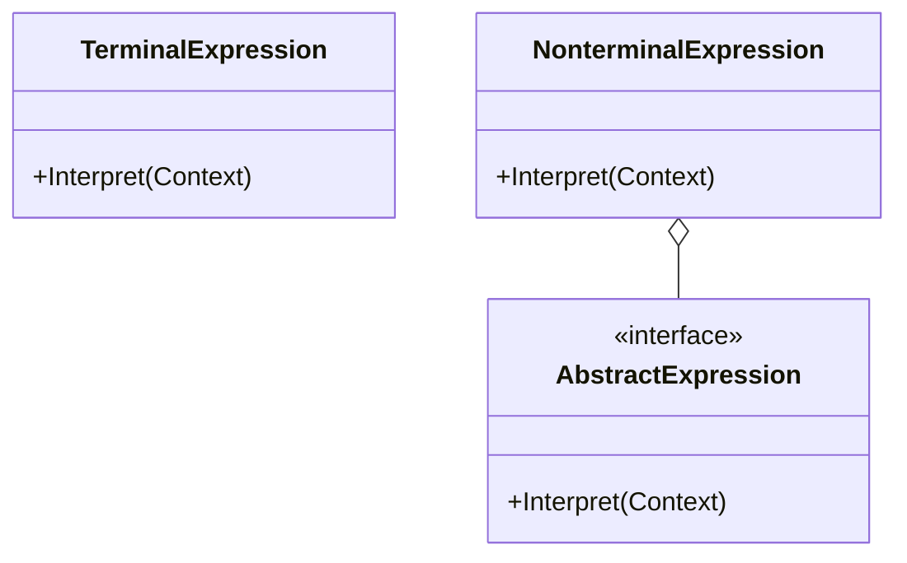

# Day 5: 複雑なフローと責任 (Behavioral Patterns Part 2)

ついに最終日、Day 5 です！
ここまで 18 個のパターンを学んできました。
今日は、少し複雑ですが、大規模なシステムやフレームワークを作る際に真価を発揮する「玄人好み」のパターンたちです。
これらを理解すれば、あなたはもう「デザインパターン初心者」ではありません。

本日は以下の 5 つのパターンを学びます。

1.  **Chain of Responsibility**: たらい回しの美学
2.  **Mediator**: 交通整理のお巡りさん
3.  **Memento**: 時を戻そう
4.  **Visitor**: 構造を変えずに機能を追加
5.  **Interpreter**: 言語を作る

---

## 19. Chain of Responsibility (責任の連鎖)

### 📖 ストーリー：コールセンター

お客様からクレームの電話がかかってきました。

1.  まずは「オペレーター」が出ます。解決できればそこで終了。
2.  無理なら「リーダー」に代わります。解決できれば終了。
3.  それでも無理なら「マネージャー」が出てきます。
    問題を解決できる人が見つかるまで、責任を次へと「たらい回し（連鎖）」していきます。

### 💡 コンセプト

要求を処理できるオブジェクトが見つかるまで、チェーン状に繋がれたオブジェクトを順に渡していきます。

### 🐹 Go 実装の極意

Web フレームワークの「ミドルウェア」がまさにこれです。
認証 → ログ出力 → リクエスト解析 → … と処理を連鎖させます。
Go では、構造体に `next` フィールドを持たせてリンクリストを作るか、スライスにハンドラを並べて順次実行する方法があります。

### 🧪 ハンズオン

`chain-of-responsibility-example`（病院の受付の例）を見てみましょう。
新しいハンドラ（例: `InsuranceCheckHandler`）をチェーンの途中に追加し、処理の流れが変わることを確認してください。

### ❓ クイズ

**Q1. Chain of Responsibility を使うと何が良い？**
A. リクエストを送る側が、誰が処理するかを知らなくて済む
B. 処理速度が最速になる
C. データベースの容量が減る

正解

**A**. 送信側と受信側（処理側）の結合度を下げることができます。

---

## 20. Mediator (メディエーター)

### 📖 ストーリー：空港の管制塔

飛行機同士が直接「おい、俺は今から着陸するぞ」「了解、俺は待機する」と通信し合ったら大混乱です。
全ての飛行機は「管制塔（Mediator）」とだけ通信します。
「着陸許可を願う」「許可する」。
管制塔が全ての情報を集約し、指示を出すことで、空の安全が守られます。

### 💡 コンセプト

オブジェクト間の複雑な通信を仲介者（Mediator）に集約し、オブジェクト同士の結合度を下げます。

### 🐹 Go 実装の極意

GUI アプリのフォーム制御や、マイクロサービス間のオーケストレーターとして使われます。
各コンポーネント（Colleague）は Mediator のインターフェースだけを知っており、具体的な他のコンポーネントを知りません。
依存関係がスパゲッティ状態（多対多）になった時、Mediator を導入して「スター型（1 対多）」に整理しましょう。

### 🧪 ハンズオン

`mediator-example`（電車とステーションの例）を見てみましょう。
新しい種類の電車（例: `ExpressTrain`）を追加しても、他の電車クラスを変更する必要がないことを確認してください。

### ❓ クイズ

**Q2. Mediator パターンの欠点は？**
A. Mediator クラス自体が巨大で複雑になりがち（God Object）
B. オブジェクト間の通信ができなくなる
C. 特になし

正解

**A**. 全てのロジックがMediatorに集中するため、Mediator自体が肥大化し、保守しにくくなるリスクがあります。

---

## 21. Memento (メメント)

### 📖 ストーリー：ゲームのセーブポイント

RPG でボス戦の前に「セーブ」しますよね。
もし負けたら、セーブした時点の状態に戻ります。
ゲームの内部データ（HP、MP、位置など）を「セーブデータ（Memento）」として保存しておき、必要な時に読み込んで復元します。
この時、セーブデータの中身を勝手に書き換えられないようにカプセル化を守ることが重要です。

### 💡 コンセプト

オブジェクトのカプセル化を破壊せずに、その内部状態を保存・復元します。

### 🐹 Go 実装の極意

Go では、`Memento` 構造体のフィールドを小文字（private）にして、パッケージ外から変更できないようにすることでカプセル化を守ります。
`Originator` だけがその中身を読み書きできるように設計します。

### 🧪 ハンズオン

`memento-example` で、テキストエディタの Undo 機能を試してみましょう。
複数回変更を行い、複数回 Undo して過去の状態に戻れるか確認してください。

### ❓ クイズ

**Q3. Memento パターンで保存する「状態」はどこに置く？**
A. グローバル変数
B. Memento オブジェクトの中
C. データベースの中だけ

正解

**B**. Mementoオブジェクトの中に状態を閉じ込めて、Caretaker（管理者）に渡します。

---

## 22. Visitor (ビジター)

### 📖 ストーリー：点検業者

家には、キッチン、お風呂、リビングなどがあります。
「水道点検業者（Visitor A）」が来ると、キッチンとお風呂の水回りをチェックします。
「電気点検業者（Visitor B）」が来ると、各部屋のコンセントをチェックします。
家の構造（部屋）を変えることなく、「点検」という新しい操作を、業者（Visitor）を追加するだけで増やせます。

### 💡 コンセプト

データ構造と、それに対する処理（操作）を分離します。データ構造を変更せずに新しい操作を追加できます。

### 🐹 Go 実装の極意

「ダブルディスパッチ」というテクニックを使います。
`Element.Accept(v)` が `v.Visit(self)` を呼ぶことで、実行時に適切な処理メソッドが選ばれます。
AST（抽象構文木）の解析や、Kubernetes のマニフェスト検証など、複雑なネスト構造を持つデータに対する処理を追加する際に非常に強力です。

### 🧪 ハンズオン

`visitor-example`（動物園の例）を見てみましょう。
新しい Visitor（例: `FeedVisitor` - 餌やり）を作成し、既存の動物クラスを変更せずに機能追加できるか試してください。

### ❓ クイズ

**Q4. Visitor パターンを使うべきでない時は？**
A. データ構造（Element の種類）が頻繁に変更される場合
B. 新しい操作を頻繁に追加したい場合
C. データ構造が安定している場合

正解

**A**. Elementが増えると、Visitorインターフェースのメソッドも増やさなければならず、全てのVisitor実装の修正が必要になるため大変です。

---

## 23. Interpreter (インタープリタ)

### 📖 ストーリー：独自の言語

「1 + 2」や「A and (B or C)」のような式を計算したいとします。
これをプログラムで解釈するには、「文法」を定義し、それを解析する仕組みが必要です。
文法規則の一つ一つ（足し算、変数、AND など）をクラスとして表現し、それらを組み合わせて木構造を作ることで、式を評価（実行）できます。

### 💡 コンセプト

言語の文法規則をクラスで表現し、その言語で書かれた文を解釈・実行します。

### 🐹 Go 実装の極意

Go の `text/template` パッケージや、SQL パーサーなどがこのパターンの応用例です。
自分で DSL（ドメイン固有言語）を作りたい場合や、複雑な検索条件（AND/OR/NOT の組み合わせ）をオブジェクトで表現したい場合に使います。

### 🧪 ハンズオン

`interpreter-example` で、簡単な計算式（足し算、引き算）を解釈するインタプリタを動かしてみましょう。
新しい演算子（例: 掛け算）を追加してみてください。

### ❓ クイズ

**Q5. Interpreter パターンはどのような場合に適している？**
A. 単純な設定ファイルの読み込み
B. 文法が単純で、頻繁に変更されない言語の解釈
C. 高速なコンパイルが必要なプログラミング言語

正解

**B**. 複雑すぎる言語には向きませんが、特定の領域に特化した小さな言語（DSL）を作るのに適しています。

---

# 🎉 卒業おめでとうございます！

これで、23 個すべてのデザインパターンの学習が完了しました！
あなたは今、強力な武器を手に入れました。
しかし、武器は使い所が肝心です。
「パターンを使いたいから使う」のではなく、
「目の前の問題を解決するために、このパターンが最適だから使う」
というエンジニアになってください。

**Happy Coding with Go!**
