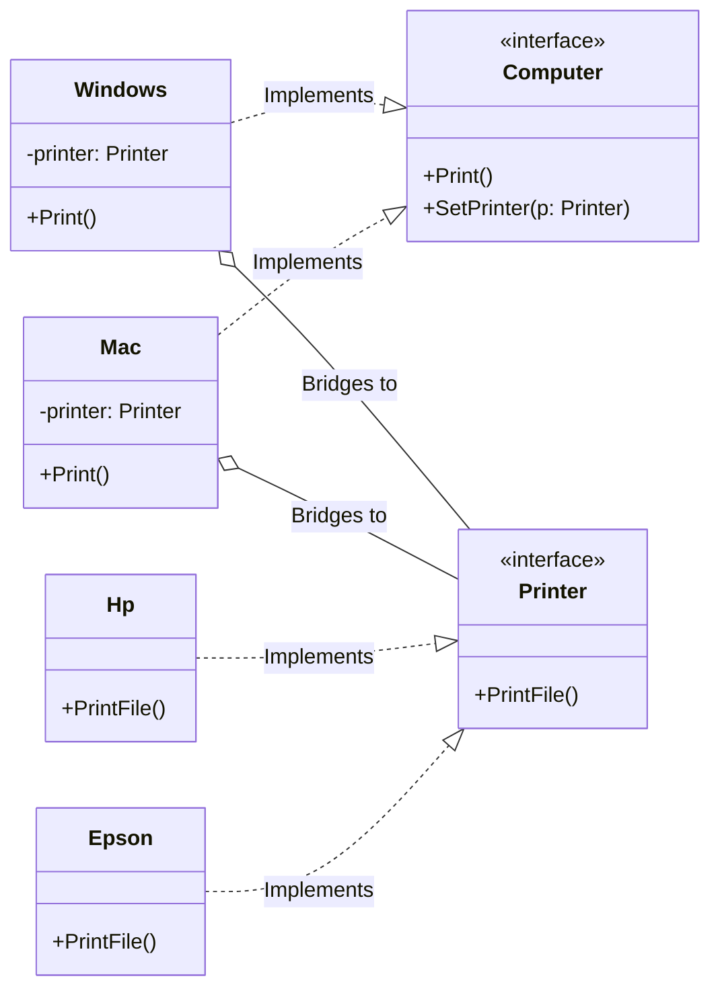

# Go Bridge Pattern Example (Clean Architecture)

This project is an educational sample code that implements the **Bridge Pattern** using the **Go** language. You will learn how to separate the "functional class hierarchy" from the "implementation class hierarchy," allowing each to be extended independently.

## What This Example Shows

- Decoupling “abstraction” (computers) from “implementation” (printers)
- Adding new computers or printers independently without class explosion
- Switching printer implementations at runtime via `SetPrinter`

## Quick Start

In the `bridge-example` directory:

```bash
go run main.go
```

## 🖨 Scenario: Computers and Printers

We have computers like "Mac" and "Windows" (the functional/abstraction part) and printers like "Epson" and "HP" (the implementation part).
If we were to implement this without the Bridge pattern, we would need a class for every combination (`MacEpson`, `MacHP`, `WinEpson`, `WinHP`...).
By using the Bridge pattern, the computer holds a reference to a printer interface (the "bridge"), reducing the number of classes from $2 \times 2 = 4$ to $2 + 2 = 4$ and avoiding a class explosion.

### Key Roles

1. **Abstraction (`domain.Computer`)**: The highest level of the functional hierarchy. It holds a reference to the implementation part (`Printer`).
2. **Refined Abstraction (`adapter.Mac`, `adapter.Windows`)**: Extensions of the functional hierarchy.
3. **Implementor (`domain.Printer`)**: The top-level interface for the implementation hierarchy.
4. **Concrete Implementor (`adapter.Epson`, `adapter.Hp`)**: The concrete implementations of the devices.

## 🏗 Architecture



### Role of Each Layer

1. **Domain (`/domain`)**:
    * Defines the interfaces for `Computer` (Abstraction) and `Printer` (Implementor). The key is that these two are loosely coupled.
2. **Adapter (`/adapter`)**:
    * `Mac`/`Windows`: Implementations of computers. Inside the `Print()` method, they call the `PrintFile()` method of the `Printer` they hold.
    * `Epson`/`Hp`: Implementations of printers. They perform the actual printing process.

## 💡 Architectural Design Notes (Q&A)

### Q1. What's the difference from the Strategy pattern?

**A. The structure is similar, but the intent is different.**

* **Strategy**: The main focus is on switching "algorithms."
* **Bridge**: The main focus is on decoupling "abstraction" and "implementation" to allow **both to be extended independently**.
  * For example, adding a new OS (`Linux`) does not affect the printer-side code.
  * Adding a new printer (`Canon`) does not affect the OS-side code.
  * The strength of the Bridge pattern lies in organizing this "many-to-many" combination.

## 🚀 How to Run

```bash
go run main.go
```
