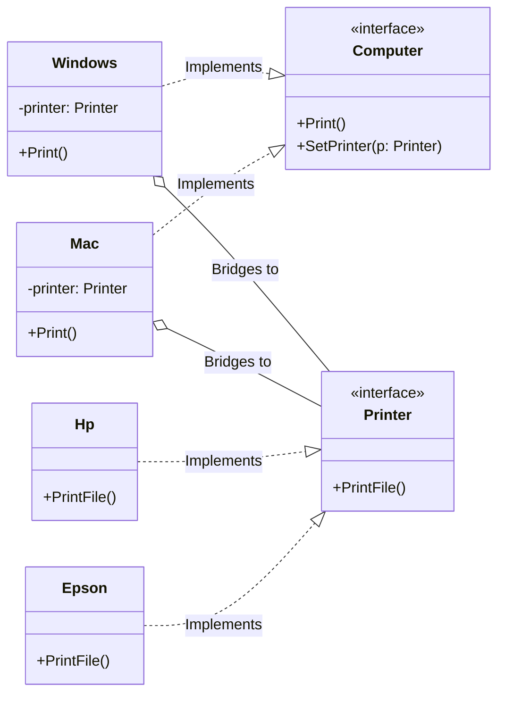

# Go Bridge Pattern Example (Clean Architecture)

このプロジェクトは、**Go**言語を用いて**Bridge Pattern（ブリッジパターン）**を実装した教育用のサンプルコードです。「機能のクラス階層」と「実装のクラス階層」を分離し、それぞれを独立して拡張できるようにする方法を学びます。

## この例で学べること

- 「抽象（コンピュータ）」と「実装（プリンタ）」を分離して疎結合にする考え方
- どちら側も独立に拡張でき、組み合わせ爆発を防げること
- `SetPrinter` により実行時に実装を差し替えられる流れ

## すぐ試す

`bridge-example` ディレクトリで実行します。

```bash
go run main.go
```

## 🖨 シナリオ: コンピュータとプリンタ

「Mac」や「Windows」といったコンピュータ（機能/抽象部分）と、「Epson」や「HP」といったプリンタ（実装部分）があります。
もしBridgeパターンを使わずに実装すると、組み合わせの数だけクラスが必要になってしまいます（`MacEpson`, `MacHP`, `WinEpson`, `WinHP`...）。
Bridgeパターンを使って、コンピュータがプリンタのインターフェースを持つ（Bridgeする）ことで、$2 \times 2 = 4$ クラスではなく、$2 + 2 = 4$ クラス（クラス爆発の回避）で済むようにします。

### 登場人物
1.  **Abstraction (`domain.Computer`)**: 機能の最上位。実装部分（`Printer`）への参照を持ちます。
2.  **Refined Abstraction (`adapter.Mac`, `adapter.Windows`)**: 機能の拡張。
3.  **Implementor (`domain.Printer`)**: 実装の最上位インターフェース。
4.  **Concrete Implementor (`adapter.Epson`, `adapter.Hp`)**: 具体的なデバイスの実装。

## 🏗 アーキテクチャ構成



### 各レイヤーの役割

1.  **Domain (`/domain`)**:
    *   `Computer` (Abstraction) と `Printer` (Implementor) のインターフェース定義。この2つが疎結合であることが鍵です。
2.  **Adapter (`/adapter`)**:
    *   `Mac`/`Windows`: コンピュータの実装。`Print()` メソッド内で、保持している `Printer` の `PrintFile()` を呼び出します。
    *   `Epson`/`Hp`: プリンタの実装。実際に印刷処理を行います。

## 💡 アーキテクチャ設計ノート (Q&A)

### Q1. Strategyパターンと何が違いますか？

**A. 構造は似ていますが、目的が異なります。**

*   **Strategy**: 「アルゴリズム」を切り替えることが主眼です。
*   **Bridge**: 「抽象」と「実装」を切り離して、**両方を独立して拡張可能にする**ことが主眼です。
    *   例えば、新しいOS（`Linux`）を追加しても、プリンタ側のコードには影響しません。
    *   新しいプリンタ（`Canon`）を追加しても、OS側のコードには影響しません。
    *   この「多対多」の組み合わせを整理するのがBridgeの強みです。

## 🚀 実行方法

```bash
go run main.go
```
