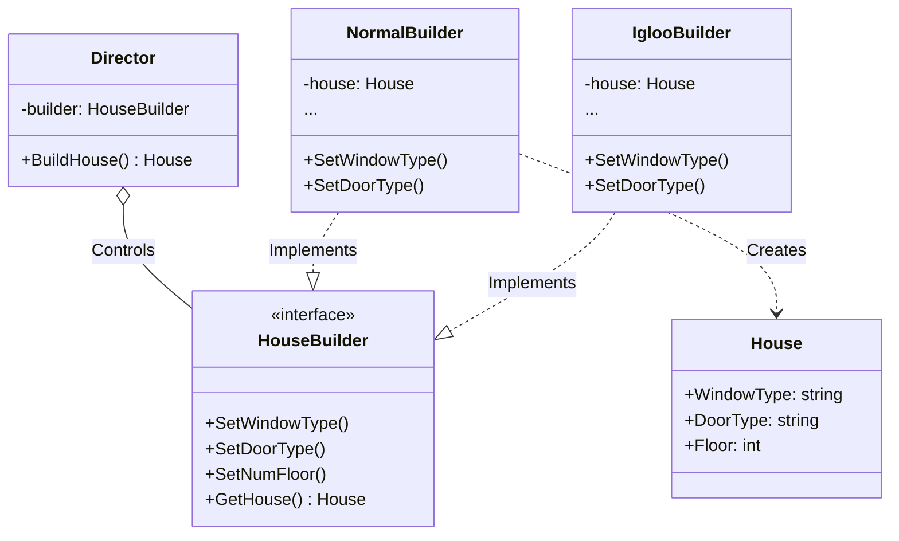

# Go Builder Pattern Example (Clean Architecture)

This project is an educational sample code that implements the **Builder Pattern** using the **Go** language. You will learn how to hide the complex object construction process and create different representations (e.g., a normal house, an igloo) using the same construction steps.

## 🏠 Scenario: House Construction

Building a house requires many steps, such as "installing windows," "installing a door," "building floors," and so on.
If all these were passed as arguments to a constructor (`NewHouse(...)`), the parameter list would become huge and unmanageable (the telescoping constructor problem).
The Builder pattern allows you to execute the construction process step-by-step and retrieve the final product at the end.

### Key Roles

1. **Product (`domain.House`)**: The complex object that will be created.
2. **Builder (`domain.HouseBuilder`)**: An interface that defines the API for each step of building a house.
3. **Director (`usecase.Director`)**: The foreman. It uses a Builder to direct "in what order and how to assemble" the parts. It doesn't know the specific type of house being built.
4. **Concrete Builder (`adapter.NormalBuilder`, `adapter.IglooBuilder`)**: The carpenters who perform the actual construction work.

## 🏗 Architecture



### Role of Each Layer

1. **Domain (`/domain`)**:
    * `HouseBuilder`: The contract stating "these are the steps required to build a house."
    * `House`: The data structure of the final product.
2. **Usecase (`/usecase`)**:
    * `Director`: Oversees the construction process. It knows the order ("windows -> door -> floor") but doesn't care if the windows are made of wood or ice.
3. **Adapter (`/adapter`)**:
    * `NormalBuilder`: The concrete implementation for building a "normal house."
    * `IglooBuilder`: The concrete implementation for building an "igloo (ice house)."

## 💡 Architectural Design Notes (Q&A)

### Q1. How does this differ from the Functional Options pattern?

**A. The decision depends on whether a specific "order" of operations or a "Director" is needed.**

* **Functional Options**: A common pattern in Go. It's ideal for setting arbitrary optional parameters. The "order" is generally not important.
* **Builder Pattern**: Suitable when the construction process is complex, requires a specific order (sequence of steps), or when you want to **reuse the construction logic** via a Director. It's powerful in cases like this example, where a "normal house" and an "ice house" have completely different parts but the same construction process.

### Q2. Is the Director mandatory?

**A. It's not mandatory, but it's useful.**

The client code (`main.go`) could call the Builder's methods sequentially itself. However, having a Director allows you to encapsulate and reuse the "standard assembly procedure."

## 🚀 How to Run

```bash
go run main.go
```
