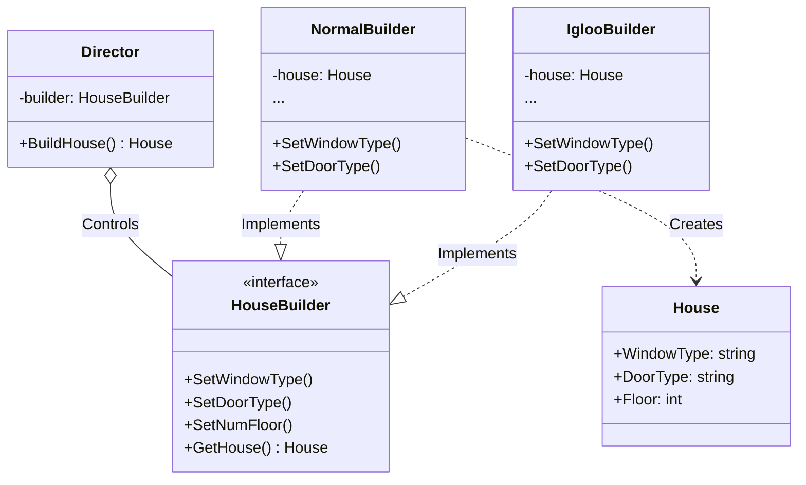

# Go Builder Pattern Example (Clean Architecture)

このプロジェクトは、**Go**言語を用いて**Builder Pattern（ビルダーパターン）**を実装した教育用のサンプルコードです。複雑なオブジェクトの生成過程（建築手順）を隠蔽し、同じ手順で異なる表現形式（普通の家、イグルーなど）を作成する方法を学びます。

## 🏠 シナリオ: 家の建築 (House Construction)

家を建てるには「窓を取り付け」「ドアを取り付け」「床を作り」...といった多くの手順が必要です。
これらを全てコンストラクタ（`NewHouse(...)`）の引数にすると、パラメータが膨大になり管理不能になります（テレスコピック・コンストラクタ問題）。
Builderパターンを使って、構築手順をステップバイステップで実行し、最後に完成品を取得します。

### 登場人物
1.  **Product (`domain.House`)**: 完成する複雑なオブジェクト。
2.  **Builder (`domain.HouseBuilder`)**: 家を作るための各工程（API）を定めたインターフェース。
3.  **Director (`usecase.Director`)**: 現場監督。Builderを使って「どの順序でどう組み立てるか」を指示します。具体的な家の種類は知りません。
4.  **Concrete Builder (`adapter.NormalBuilder`, `adapter.IglooBuilder`)**: 実際の建築作業を行う大工さん。

## 🏗 アーキテクチャ構成



### 各レイヤーの役割

1.  **Domain (`/domain`)**:
    *   `HouseBuilder`: 「家を作るにはこれだけの工程が必要」という契約書。
    *   `House`: 成果物のデータ構造。
2.  **Usecase (`/usecase`)**:
    *   `Director`: 建築プロセスを統括します。「窓→ドア→床」という順序を知っていますが、窓が木製か氷製かは気にしません。
3.  **Adapter (`/adapter`)**:
    *   `NormalBuilder`: 「普通の家」を作るための具体的な実装。
    *   `IglooBuilder`: 「イグルー（氷の家）」を作るための具体的な実装。

## 💡 アーキテクチャ設計ノート (Q&A)

### Q1. Functional Optionsパターンとの使い分けは？

**A. 生成プロセスの「順序」や「監督（Director）」が必要かどうかで判断します。**

*   **Functional Options**: Goでよく使われるパターン。任意のオプションパラメータを設定するのに最適です。「順序」はあまり関係ありません。
*   **Builder Pattern**: 構築プロセスが複雑で、特定の順序（手順）が必要な場合や、Directorを介して**構築ロジックを再利用したい**場合に適しています。今回の例のように「普通の家」と「氷の家」で全く部材が違うが、工程は同じ、といったケースに強力です。

### Q2. Directorは必須ですか？

**A. 必須ではありませんが、あると便利です。**

クライアントコード（`main.go`）が直接Builderのメソッドを順に呼んでも構いません。しかし、Directorを用意することで「標準的な組み立て手順」をカプセル化・再利用できます。

## 🚀 実行方法

```bash
go run main.go
```