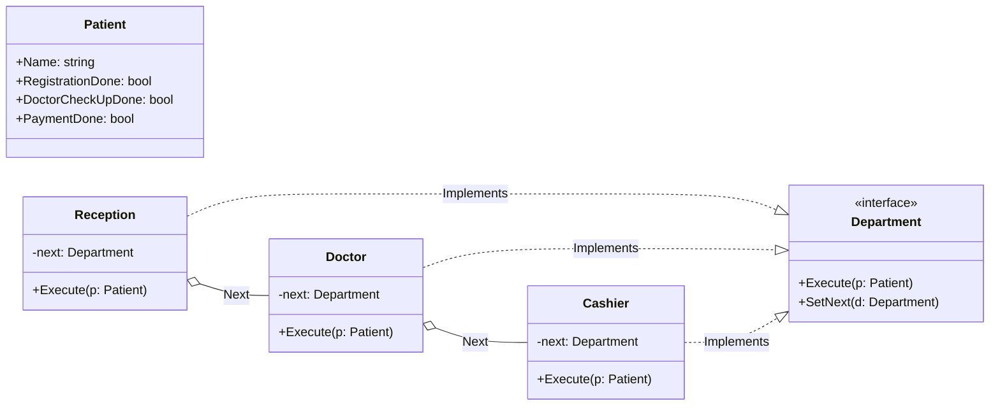

# Go Chain of Responsibility Pattern Example (Clean Architecture)

This project is an educational sample code that implements the **Chain of Responsibility Pattern** using the **Go** language. You will learn how to pass a request along a chain of objects until a handler that can process it is found.

## 🏥 Scenario: Hospital Reception Flow

Consider the flow when a patient arrives at a hospital:
1.  **Reception**: Checks if the patient is registered and registers them.
2.  **Doctor**: Checks if the patient has been examined and conducts an examination.
3.  **Cashier**: Handles the payment.

Instead of putting all this logic into one giant function (a block of `if else` statements), we will make each department an independent object and link them together like a chain. The patient (request) will proceed along this chain in order.

### Characters
1.  **Handler (`domain.Department`)**: The common interface. It has `Execute(*Patient)` and `SetNext(Department)`.
2.  **Concrete Handler (`adapter.Reception`, `adapter.Doctor`, `adapter.Cashier`)**: The specific processing. After finishing its own work (or if it cannot handle the request), it passes the request to the `next` handler.
3.  **Request (`domain.Patient`)**: The data to be processed.

## 🏗 Architecture



### Role of Each Layer

1.  **Domain (`/domain`)**:
    *   `Department`: The interface for the processing departments.
    *   `Patient`: The data passed along the chain. Flags (like `RegistrationDone`) are updated by each department.
2.  **Adapter (`/adapter`)**:
    *   This is the implementation of each Handler. It performs its own processing within the `Execute` method and then calls the next Handler, like `r.next.Execute(p)`.
    *   This allows the caller (Client) to complete the entire process just by calling the first object in the chain (Reception).

## 💡 Architectural Design Notes (Q&A)

### Q1. What is an application example in web development?

**A. Middleware is a prime example.**

The middleware in Go's `net/http` or frameworks like Gin/Echo is a perfect illustration of this pattern.
A request is passed through a chain like `Logger` -> `Auth` -> `Compression` -> `Handler`, being processed and validated at each step.

### Q2. Can the processing be stopped midway?

**A. Yes, it can.**

For example, if there's an error at reception (e.g., the patient has no insurance card), you can simply return from the function without calling `next.Execute()`. This breaks the chain, and subsequent processing (like the doctor's examination) will not occur.

## 🚀 How to Run

```bash
go run main.go
```
