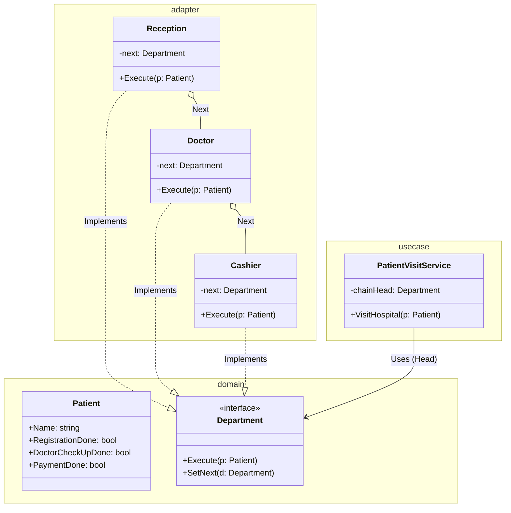

# Go Chain of Responsibility Pattern Example (Clean Architecture)

このプロジェクトは、**Go**言語を用いて**Chain of Responsibility Pattern（責任の連鎖パターン）**を実装した教育用のサンプルコードです。リクエストを処理できるハンドラが見つかるまで、チェーン状に繋がれたオブジェクト間を順次渡していく方法を学びます。

## この例で学べること

- このパターンの意図を Go の小さな例で確認する
- `usecase` 層は具象実装（`adapter`）に依存せず、どの実装を使うかは `main.go` の DI で切り替える

## すぐ試す

`chain-of-responsibility-example` ディレクトリで実行します。

```bash
go run main.go
```

## 🏥 シナリオ: 病院の受付フロー

患者が病院に来た時のフローを考えます。
1.  **受付 (Reception)**: 登録済みかチェックし、登録します。
2.  **診察 (Doctor)**: 診察済みかチェックし、診察します。
3.  **会計 (Cashier)**: 支払いを済ませます。

これらの処理を一つの巨大な関数（`if else` の塊）にするのではなく、それぞれの部署を独立したオブジェクトとし、鎖のように繋ぎます。患者（リクエスト）はこの鎖を順に進んでいきます。

### 登場人物
1.  **Handler (`domain.Department`)**: 共通インターフェース。`Execute(*Patient)` と `SetNext(Department)` を持ちます。
2.  **Concrete Handler (`adapter.Reception`, `adapter.Doctor`, `adapter.Cashier`)**: 具体的な処理。自分の仕事が終わったら（あるいは自分が処理できなければ）、`next` にリクエストを回します。
3.  **Request (`domain.Patient`)**: 処理される対象データ。
4.  **UseCase (`usecase.PatientVisitService`)**: 病院を訪れる患者のビジネスロジックをカプセル化し、チェーンの先頭ハンドラへの参照を保持します。

## 🏗 アーキテクチャ構成



### 各レイヤーの役割

1.  **Domain (`/domain`)**:
    *   `Department`: 処理を行う部門のインターフェース。
    *   `Patient`: バケツリレーされるデータ。各部門でフラグ(`RegistrationDone`など)が更新されていきます。
2.  **UseCase (`/usecase`)**:
    *   `PatientVisitService`: チェーン・オブ・レスポンシビリティの仕組みを起動し、患者の訪問フローを調整します。チェーンの具体的な実装は知らず、`Department` インターフェースのみを知っています。
3.  **Adapter (`/adapter`)**:
    *   各Handlerの実装です。`Execute` メソッド内で自分の処理を行い、`r.next.Execute(p)` のように次のHandlerを呼び出します。
    *   これにより、呼び出し元（Client）はチェーンの最初のオブジェクト（Reception）を呼ぶだけで、全工程が完了します。

## 💡 アーキテクチャ設計ノート (Q&A)

### Q1. Web開発での応用例は？

**A. ミドルウェア（Middleware）が代表例です。**

Goの `net/http` や、Gin/Echoといったフレームワークのミドルウェアは、まさにこのパターンです。
`Logger` -> `Auth` -> `Compression` -> `Handler` のように、リクエストが次々と加工・検証されながら渡っていきます。

### Q2. 途中で処理を止めることはできますか？

**A. 可能です。**

例えば「受付で保険証がない（エラー）」となった場合、`next.Execute()` を呼ばずにそこでリターンすれば、チェーンはそこで断ち切られ、後続の処理（診察など）は行われません。

## 🚀 実行方法

```bash
go run main.go
```
