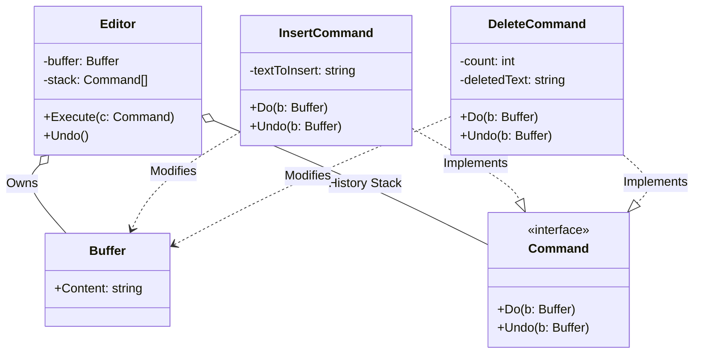

# Go Command Pattern Example (Clean Architecture)

This project is an educational sample code that implements the **Command Pattern** using the **Go** language. Taking the "input" and "Undo" functions of a text editor as an example, you will learn how to separate the invocation of a process (Invoker) from its execution details (Command/Receiver).

## 📝 Scenario: Text Editor with Undo Functionality

Instead of simple string concatenation, all operations are encapsulated as "command objects," making it easy to manage the operation history (stack) and perform Undo operations.

### Characters

1. **Receiver (`domain.Buffer`)**: The buffer that actually holds the characters. It knows basic operations like "add characters" and "delete characters."
2. **Command (`domain.Command`)**: An interface representing "what to do." It has `Do` and `Undo` methods.
3. **Invoker (`usecase.Editor`)**: Responsible for receiving, executing, and pushing commands onto the history `stack`.
4. **Concrete Command (`adapter.InsertCommand` etc)**: Specific operations. They hold the parameters necessary for execution (e.g., the string to insert).

## 🏗 Architecture Diagram



### Role of Each Layer

1. **Domain (`/domain`)**:
    * `Buffer`: The application state (text data) itself.
    * `Command`: Interface definition.
2. **Usecase (`/usecase`)**:
    * `Editor`: The entry point for user input (Invoker).
    * `Execute(c Command)`: Executes a command and pushes it onto the stack.
    * `Undo()`: Pops a command from the stack and executes its `Undo` method to revert the state.
3. **Adapter (`/adapter`)**:
    * `InsertCommand`: Objectification of the "insert" action.
    * `DeleteCommand`: Objectification of the "delete" action. Note that it is **stateful**. When `Do` is executed, it stores the "deleted characters" internally, and `Undo` uses them to restore the state.

## 💡 Architecture Design Notes (Q&A)

### Q1. Why encapsulate commands as objects?

**A. To treat "operations" as data.**

If you simply call a function, the process "executes and finishes" and is not recorded in history.
By making the process an object (`struct`), the following become possible:

1. **History Management**: Can be stored in an array (`slice`).
2. **Undo/Redo**: By defining "reverse operations," you can rewind time.
3. **Deferred Execution/Queuing**: Create the command and execute it later (e.g., job queue).

### Q2. What is `deletedText` in `DeleteCommand`?

**A. It's a "snapshot (state)" necessary for Undo.**

When executing a command to "delete 3 characters," simply "restoring 3 characters" doesn't tell you **what was written**.
Therefore, the Command itself remembers the "deleted data" at the time of execution. This can also be referred to as a **Memento**-like role.

## 🚀 How to Run

```bash
go run main.go
```

### Example Output

```text
=== Command Pattern Editor Demo ===
Initial Buffer: ""

[CMD] Inserted: 'Hello'
Current Buffer: "Hello"
[CMD] Inserted: ' World'
Current Buffer: "Hello World"
[CMD] Inserted: '!!!'
Current Buffer: "Hello World!!!"

--- Oops, too excited. Deleting '!!!' ---
[CMD] Deleted last 3 chars: '!!!'
Current Buffer: "Hello World"

--- Wait, I wanted them back! (Undo) ---
[CMD] Undid Delete: Restored '!!!'
Current Buffer: "Hello World!!!"

--- Undo again (Remove '!!!') ---
[CMD] Undid Insert: Removed '!!!'
Current Buffer: "Hello World"
```

```
```diff
