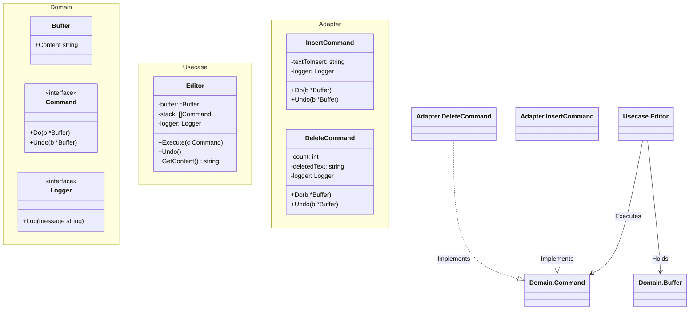

# Go Command Pattern Example (Clean Architecture)

This project is an educational sample code that implements the **Command Pattern** using the **Go** language. It demonstrates how to encapsulate a request as an object, thereby letting you parameterize clients with different requests, queue or log requests, and support undoable operations.

## What This Example Shows

- **Encapsulation**: Requests (Insert, Delete) are objects (`InsertCommand`, `DeleteCommand`).
- **Undo/Redo**: Commands support `Undo`, allowing the Editor to reverse operations.
- **Invoker/Receiver Separation**: The `Editor` (Invoker) doesn't know *how* to modify the text; it just tells the `Command` to do it. The `Command` acts on the `Buffer` (Receiver).

## 📝 Scenario: Text Editor

You are building a text editor.
- You want to support **Undo**.
- If the user types "Hello", adds " World", then deletes 3 characters, they should be able to Ctrl+Z back to "Hello World".
- The **Command Pattern** stores these actions in a stack, making Undo trivial (just pop and call `cmd.Undo()`).

## 🏗 Architecture



### Role of Each Layer

1. **Domain (`/domain`)**:
    * `Buffer`: The Receiver. It holds the actual data (text).
    * `Command`: The interface for operations.
2. **Usecase (`/usecase`)**:
    * `Editor`: The Invoker. It manages the command history (stack) and executes commands.
3. **Adapter (`/adapter`)**:
    * `InsertCommand`, `DeleteCommand`: Concrete Commands. They hold the parameters (what text to insert, how many chars to delete) and the logic to `Do` and `Undo`.

## 💡 Architectural Design Notes (Q&A)

### Q1. Why is `Undo` logic inside the Command?

**A. Because the Command knows what it did.**
Only `InsertCommand` knows *what* text was inserted. Only `DeleteCommand` knows *what* text was deleted (it saves it in `Do` to restore it in `Undo`). This is "Stateful Command".

### Q2. Can I implement Redo?

**A. Yes.**
You would need a second stack (`redoStack`). When you `Undo`, you push the command onto `redoStack`. When you `Redo`, you pop from `redoStack`, call `Do`, and push back to `historyStack`.

## 🚀 How to Run

```bash
go run main.go
```