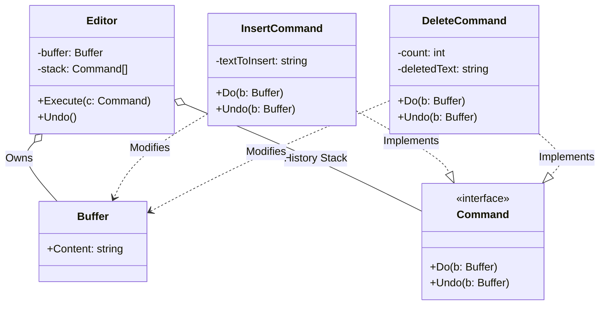

# Go Command Pattern Example (Clean Architecture)

このプロジェクトは、**Go**言語を用いて**Command Pattern（コマンドパターン）**を実装した教育用のサンプルコードです。テキストエディタの「入力」と「Undo（元に戻す）」機能を例に、処理の呼び出し(Invoker)と実行内容(Command/Receiver)を分離する方法を学びます。

## この例で学べること

- このパターンの意図を Go の小さな例で確認する
- `usecase` 層は具象実装（`adapter`）に依存せず、どの実装を使うかは `main.go` の DI で切り替える

## すぐ試す

`command-example` ディレクトリで実行します。

```bash
go run main.go
```

## 📝 シナリオ: Undo機能付きテキストエディタ

単純な文字列連結ではなく、全ての操作を「コマンドオブジェクト」としてカプセル化することで、操作履歴の管理（スタック）とUndoの実行を容易にします。

### 登場人物
1.  **Receiver (`domain.Buffer`)**: 実際に文字を保持しているバッファ。「文字を追加する」「削除する」といった基本操作を知っています。
2.  **Command (`domain.Command`)**: 「何をしたいか」を表すインターフェース。`Do`と`Undo`を持ちます。
3.  **Invoker (`usecase.Editor`)**: コマンドを受け取り、実行し、履歴(`stack`)に積む役割です。
4.  **Concrete Command (`adapter.InsertCommand` etc)**: 具体的な操作。実行に必要なパラメータ（追加する文字列など）を保持します。

## 🏗 アーキテクチャ構成



### 各レイヤーの役割

1.  **Domain (`/domain`)**:
    *   `Buffer`: アプリケーションの状態（テキストデータ）そのものです。
    *   `Command`: インターフェース定義。
2.  **Usecase (`/usecase`)**:
    *   `Editor`: ユーザー入力を受け付ける窓口（Invoker）。
    *   `Execute(c Command)`: コマンドを実行し、スタックに積みます。
    *   `Undo()`: スタックからコマンドを取り出し、`Undo` メソッドを実行して状態を巻き戻します。
3.  **Adapter (`/adapter`)**:
    *   `InsertCommand`: 「追加」という行為のオブジェクト化。
    *   `DeleteCommand`: 「削除」という行為のオブジェクト化。**ステートフル**である点に注目してください。`Do`を実行した際に「消された文字」を内部に保存し、`Undo`でそれを使って復元します。

## 💡 アーキテクチャ設計ノート (Q&A)

### Q1. なぜわざわざコマンドをオブジェクトにするのですか？

**A. 「操作」をデータとして扱えるようにするためです。**

単に関数を呼び出すだけだと、その処理は「実行して終わり」で履歴に残りません。
処理をオブジェクト(`struct`)にすることで、以下が可能になります。
1.  **履歴管理**: 配列(`slice`)に入れて保存できる。
2.  **Undo/Redo**: 「逆の操作」を定義しておくことで、時間を巻き戻せる。
3.  **遅延実行/キューイング**: 作成だけして、後で実行する（ジョブキューなど）。

### Q2. `DeleteCommand` の `deletedText` は何ですか？

**A. Undoのために必要な「スナップショット（状態）」です。**

「3文字消す」というコマンドを実行したとき、単に「3文字戻す」だけでは**何が書かれていたか**分かりません。
そのため、Command自体が実行時に「消されたデータ」を記憶しておきます。これを**Memento（メメント）**的な役割と呼ぶこともあります。

## 🚀 実行方法

```bash
go run main.go
```

### 実行結果の例

```text
=== Command Pattern Editor Demo ===
Initial Buffer: ""

[CMD] Inserted: 'Hello'
Current Buffer: "Hello"
[CMD] Inserted: ' World'
Current Buffer: "Hello World"
[CMD] Inserted: '!!!'
Current Buffer: "Hello World!!!"

--- Oops, too excited. Deleting '!!!' ---
[CMD] Deleted last 3 chars: '!!!'
Current Buffer: "Hello World"

--- Wait, I wanted them back! (Undo) ---
[CMD] Undid Delete: Restored '!!!'
Current Buffer: "Hello World!!!"

--- Undo again (Remove '!!!') ---
[CMD] Undid Insert: Removed '!!!'
Current Buffer: "Hello World"
```
