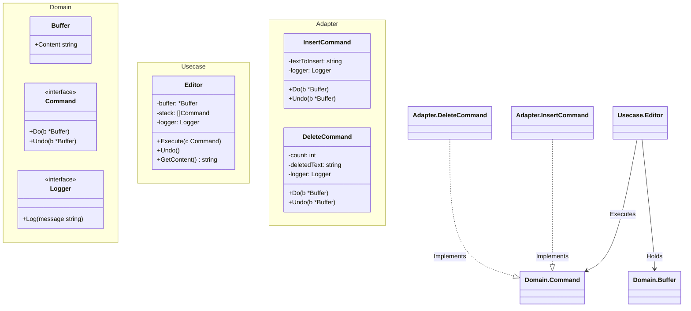

# Go Command Pattern Example (Clean Architecture)

このプロジェクトは、**Go**言語を用いて**Command Pattern（コマンドパターン）**を実装した教育用のサンプルコードです。要求をオブジェクトとしてカプセル化することで、パラメータ化、履歴管理、Undo/Redo（取り消し）などを可能にする方法を学びます。

## この例で学べること

- **カプセル化**: 挿入や削除といった操作をオブジェクト（`InsertCommand`, `DeleteCommand`）として扱います。
- **Undo/Redo**: コマンドが `Undo` メソッドを持つことで、エディタは操作を逆順に実行して元に戻すことができます。
- **Invoker/Receiverの分離**: `Editor` (Invoker) はテキストの操作方法を知らず、`Command` に指示するだけです。`Command` は `Buffer` (Receiver) に対して操作を行います。

## 📝 シナリオ：テキストエディタ

テキストエディタを作っています。
- **Undo（元に戻す）** 機能をサポートしたい。
- ユーザーが "Hello" と打ち、" World" を追加し、3文字削除したとします。Ctrl+Z を押すと "Hello World" に戻るべきです。
- **Command Pattern** はこれらの操作をスタックに保存するため、Undoは非常に簡単になります（スタックから取り出して `cmd.Undo()` を呼ぶだけ）。

## 🏗 アーキテクチャ構成



### 各レイヤーの役割

1. **Domain (`/domain`)**:
    * `Buffer`: Receiver（受信者）。実際のデータ（テキスト）を保持します。
    * `Command`: 操作のインターフェース。
2. **Usecase (`/usecase`)**:
    * `Editor`: Invoker（起動者）。コマンドの履歴（スタック）を管理し、コマンドを実行します。
3. **Adapter (`/adapter`)**:
    * `InsertCommand`, `DeleteCommand`: Concrete Command（具体的なコマンド）。パラメータ（挿入するテキスト、削除する文字数）と、`Do` / `Undo` のロジックを持ちます。

## 💡 アーキテクチャ設計ノート (Q&A)

### Q1. なぜ `Undo` ロジックが Command の中にあるのですか？

**A. 何をしたかを知っているのは Command だけだからです。**
`InsertCommand` だけが「何のテキストを挿入したか」を知っています。`DeleteCommand` だけが「何が削除されたか」を知っています（`Do` の実行時に削除されたテキストを保存し、`Undo` で復元します）。これを "Stateful Command" と呼びます。

### Q2. Redo（やり直し）も実装できますか？

**A. はい。**
もう一つのスタック（`redoStack`）を用意します。`Undo` するときにそのコマンドを `redoStack` に積み、`Redo` するときは `redoStack` から取り出して `Do` を呼び、再びヒストリースタックに戻します。

## 🚀 実行方法

```bash
go run main.go
```