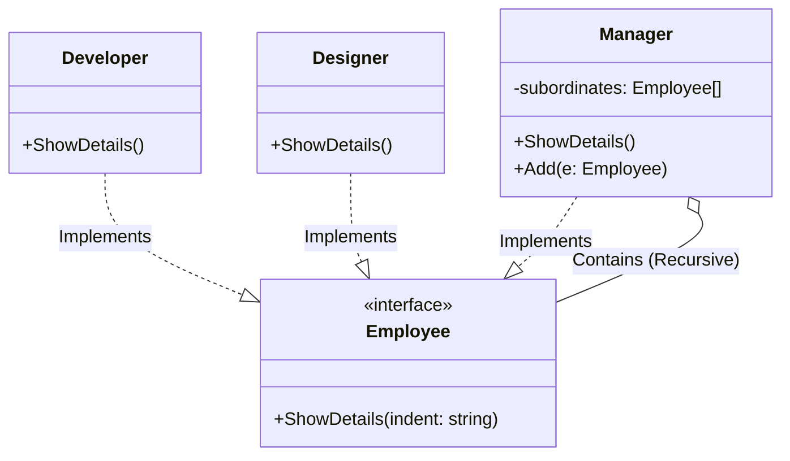

# Go Composite Pattern Example (Clean Architecture)

This project is an educational sample code that implements the **Composite Pattern** using the **Go** language. You will learn how to treat parts and wholes uniformly to handle recursive structures (tree structures).

## 🏢 Scenario: Organization Chart

In a company's organization chart, employees include "regular employees (Developer, Designer)" and "managers (Manager)."
Managers have subordinates, and those subordinates may also be managers.
The goal is to perform an operation like "displaying information for an employee (or manager)" without needing to know if the target is a single employee or a manager with subordinates.

### Characters

1. **Component (`domain.Employee`)**: The interface common to all elements.
2. **Leaf (`adapter.Developer`, `adapter.Designer`)**: Terminal elements. They do not have subordinates.
3. **Composite (`adapter.Manager`)**: Branch elements. They have subordinates (`[]Employee`) and delegate processing to their children.

## 🏗 Architecture Diagram



### Role of Each Layer

1. **Domain (`/domain`)**:
    * `Employee`: The common interface that constitutes the organization.
2. **Adapter (`/adapter`)**:
    * `Developer`, `Designer` (Leaf): Simply display their own details.
    * `Manager` (Composite): After displaying its own details, it recursively calls `ShowDetails` for all subordinates in its list.

## 💡 Architecture Design Notes (Q&A)

### Q1. When is this useful?

**A. When dealing with tree structures like "file systems" or "GUI components."**

A directory can contain both files and other directories. A window can contain both buttons and panels.
This pattern is very powerful when you want to process commands like "draw (`Draw`)" or "calculate size (`GetSize`)" recursively and uniformly, without distinguishing between these different types of elements.

### Q2. Is there a limit to the recursion depth?

**A. There is no design limit, but be careful of stack overflow.**

The Composite pattern itself allows for infinite depth, but actual computer resources (stack space) are limited. If you are processing an extremely deep tree, you may need to rewrite recursive calls to use iterative processing instead.

## 🚀 How to Run

```bash
go run main.go
```

```
```diff
