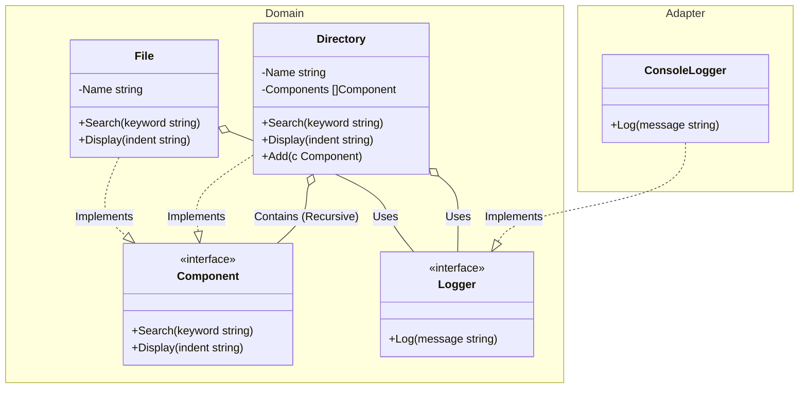

# Go Composite Pattern Example

This project is an educational sample code that implements the **Composite Pattern** using the **Go** language. It demonstrates how to treat individual objects and compositions of objects uniformly through a common interface.

## What This Example Shows

- **Uniformity**: Both `File` (Leaf) and `Directory` (Composite) implement the `Component` interface.
- **Recursion**: Operations like `Search` and `Display` are naturally recursive when called on a `Directory`.
- **Safety**: Addition of components (`Add`) is defined only on the `Directory` type, preventing invalid operations on files at compile-time.

## Quick Start

In the `composite-example` directory:

```bash
go run main.go
```

## 📂 Scenario: File System

Consider a file system structure:
- **File**: A simple leaf element that has a name.
- **Directory**: A composite element that can contain both files and other directories.

By using the Composite pattern, you can call `Search("keyword")` or `Display("")` on any element (whether it's a file or a root directory) and it will work appropriately.

## 🏗 Architecture



### Role of Each Layer

1. **Domain (`/domain`)**:
    * `Component`: The common interface for all elements in the tree.
    * `File`: The leaf node that performs actions directly.
    * `Directory`: The composite node that delegates actions to its children.
2. **Adapter (`/`)**:
    * `main.go`: Acts as the composition root. It builds the file system tree and executes operations through the `Component` interface.

## 💡 Architectural Design Notes (Q&A)

### Q1. When should I use the Composite pattern?

**A. When you have a tree structure and want clients to ignore the difference between individual objects and groups.**
Common examples include UI widget trees, file systems, organizational charts, and XML/HTML document structures.

### Q2. How is this different from a simple Linked List or Tree?

**A. The key is "Transparency" through a shared interface.**
In a simple tree, you might have separate logic for handling nodes vs leaves. In Composite, the client doesn't need to check `if it is a directory`. It just calls `Search()` and the pattern handles the rest.

## 🚀 How to Run

```bash
go run main.go
```
