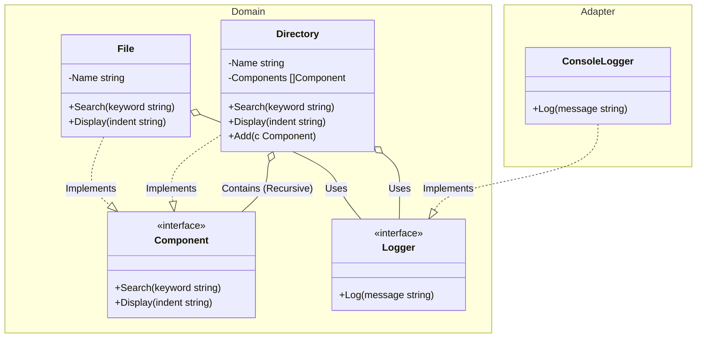

# Go Composite Pattern Example

このプロジェクトは、**Go**言語を用いて**Composite Pattern（コンポジットパターン）**を実装した教育用のサンプルコードです。単一のオブジェクトと、それらを組み合わせた集合オブジェクトを、共通のインターフェースを通じて一貫して扱う方法を学びます。

## この例で学べること

- **一貫性（透過性）**: `File`（末端）と `Directory`（集合）の両方が `Component` インターフェースを実装します。
- **再帰処理**: `Directory` に対して `Search` や `Display` を呼び出すと、内部で保持している要素に対して再帰的に処理が行われます。
- **安全性**: 要素の追加（`Add`）を `Directory` 型のみに定義することで、ファイルに対して要素を追加しようとする不正な操作をコンパイル時に防ぎます。

## すぐ試す

`composite-example` ディレクトリで実行します。

```bash
go run main.go
```

## 📂 シナリオ：ファイルシステム

ファイルシステムの構造を考えます：
- **ファイル (File)**: 名前を持つシンプルな末端要素。
- **ディレクトリ (Directory)**: ファイルや他のディレクトリを含むことができる集合要素。

Composite パターンを使うことで、対象がファイルかディレクトリか（あるいはルートディレクトリか）を意識することなく、`Search("キーワード")` や `Display("")` を呼び出すだけで、構造全体に対して適切に処理が行われます。

## 🏗 アーキテクチャ構成



### 各レイヤーの役割

1. **Domain (`/domain`)**:
    * `Component`: 木構造の全要素が共通で持つインターフェース。
    * `File`: 直接アクションを実行する末端（Leaf）ノード。
    * `Directory`: 子要素に処理を委譲する集合（Composite）ノード。
2. **Adapter (`/`)**:
    * `main.go`: 構造の組み立てと、`Component` インターフェースを通じた操作の呼び出しを担当します。

## 💡 アーキテクチャ設計ノート (Q&A)

### Q1. どんな時に使うべき？

**A. 木構造のデータを扱い、クライアントが「個別のモノ」と「集まり」を区別せずに操作したい時です。**
GUI のウィジェットツリー、ファイルシステム、組織図、XML/HTML ドキュメント構造などが代表的な例です。

### Q2. 単なるツリー構造との違いは？

**A. 共通インターフェースによる「透過性」が鍵です。**
単純なツリーでは、ノードとリーフで処理を分けるロジックが必要になりますが、Composite パターンではクライアントは「それがディレクトリかどうか」をチェックする必要がありません。単に `Search()` を呼べば、パターンが再帰を処理します。

## 🚀 実行方法

```bash
go run main.go
```
