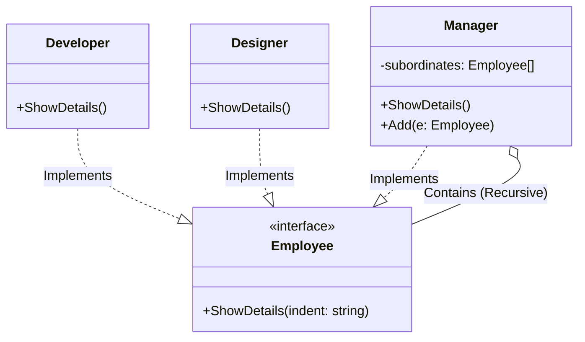

# Go Composite Pattern Example (Clean Architecture)

このプロジェクトは、**Go**言語を用いて**Composite Pattern（コンポジットパターン）**を実装した教育用のサンプルコードです。部分と全体を同一視して、再帰的な構造（ツリー構造）を扱う方法を学びます。

## 🏢 シナリオ: 組織図 (Organization Chart)

会社の組織図において、従業員には「一般社員（Developer, Designer）」と「管理者（Manager）」がいます。
管理者は部下を持ちますが、その部下がまた管理者である可能性もあります。
「ある社員（または管理者）の情報を表示する」という操作を、相手が単一の社員なのか、部下を持つ管理者なのかを気にせずに実行できるようにします。

### 登場人物
1.  **Component (`domain.Employee`)**: 全ての要素が共通して持つインターフェース。
2.  **Leaf (`adapter.Developer`, `adapter.Designer`)**: 末端の要素。部下を持ちません。
3.  **Composite (`adapter.Manager`)**: 枝の要素。部下（`[]Employee`）を持ち、処理を子供たちに委譲します。

## 🏗 アーキテクチャ構成



### 各レイヤーの役割

1.  **Domain (`/domain`)**:
    *   `Employee`: 組織を構成する共通のインターフェース。
2.  **Adapter (`/adapter`)**:
    *   `Developer`, `Designer` (Leaf): 自分自身の詳細を表示するだけです。
    *   `Manager` (Composite): 自分自身の詳細を表示した後、リストに含まれる全ての部下の `ShowDetails` を再帰的に呼び出します。

## 💡 アーキテクチャ設計ノート (Q&A)

### Q1. どのような時に役に立ちますか？

**A. 「ファイルシステム」や「GUIのコンポーネント」のようなツリー構造を扱うときです。**

ディレクトリの中にはファイルもあればディレクトリもある。ウィンドウの中にはボタンもあればパネルもある。
これらを区別せずに「描画せよ(`Draw`)」「サイズを計算せよ(`GetSize`)」といった命令を一括で再帰的に処理させたい場合に非常に強力です。

### Q2. 再帰の深さに制限はありますか？

**A. 設計上はありませんが、スタックオーバーフローには注意が必要です。**

Compositeパターン自体は無限の深さを許容しますが、実際のコンピュータのリソース（スタック領域）には限りがあります。極端に深い階層を持つツリーを処理する場合は、再帰呼び出しではなくループ処理への書き換えが必要になることもあります。

## 🚀 実行方法

```bash
go run main.go
```