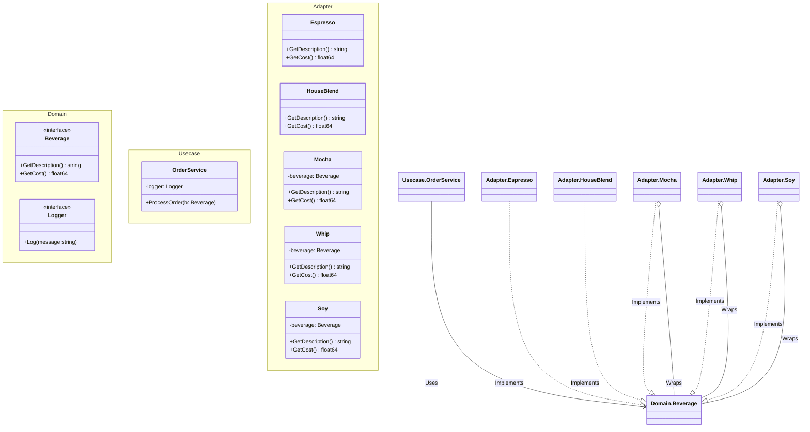

# Go Decorator Pattern Example (Clean Architecture)

This project is an educational sample code that implements the **Decorator Pattern** using the **Go** language. It demonstrates how to dynamically add responsibilities (features) to objects without using inheritance.

## What This Example Shows

- **Dynamic Behavior Extension**: Wrapping a base object (Coffee) with decorators (Mocha, Whip) to add cost and description.
- **Composition over Inheritance**: Using struct embedding or interface composition to achieve the "is-a" relationship behaviorally.
- **Recursive Processing**: How the `GetCost` call chains through all wrappers.

## Quick Start

In the `decorator-example` directory:

```bash
go run main.go
```

## ☕️ Scenario: Starbuzz Coffee

You are building an ordering system for a coffee shop.
- **Beverages**: Espresso, House Blend, etc.
- **Condiments (Decorators)**: Mocha, Soy, Whip.
- Pricing is calculated by summing the cost of the base beverage and all added condiments.

Since the combinations are endless (Espresso + Mocha + Whip + Soy...), creating a class for every combination (`EspressoWithMochaAndWhip`) causes a **class explosion**.
Instead, we define condiments as **wrappers** that "decorate" the beverage.

## 🏗 Architecture



### Role of Each Layer

1. **Domain (`/domain`)**:
    * `Beverage`: The common interface for both base components (Coffee) and decorators (Condiments).
2. **Usecase (`/usecase`)**:
    * `OrderService`: Handles the order processing. It treats any `Beverage` (wrapped or not) uniformly.
3. **Adapter (`/adapter`)**:
    * **Concrete Components**: `Espresso`, `HouseBlend`. They return the base cost/description.
    * **Decorators**: `Mocha`, `Whip`, `Soy`. They hold a reference to a `Beverage` and add their own cost/description to the result of the wrapped object.

## 💡 Architectural Design Notes (Q&A)

### Q1. How does Go implement Decorators without inheritance?

**A. By using Interfaces and Composition.**

In Java, a Decorator often extends the Component class. In Go, the Decorator struct implements the Component interface (`Beverage`) and also holds a field of that same interface type.
`type Mocha struct { beverage Beverage }`

### Q2. Why is this better than adding fields like `hasMocha bool` to Beverage?

**A. It adheres to the Open/Closed Principle.**

If you use boolean fields, adding a new condiment (e.g., "Caramel") requires modifying the `Beverage` struct and its cost calculation logic (violating OCP).
With Decorators, you just create a new `Caramel` struct (New Code) without touching existing code.

## 🚀 How to Run

```bash
go run main.go
```