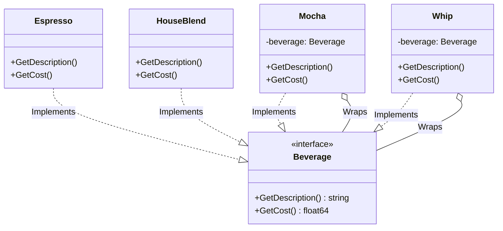

# Go Decorator Pattern Example (Clean Architecture)

This project is an educational sample code that implements the **Decorator Pattern** using the **Go** language. You will learn a technique to dynamically add functionality (behavior) to an existing object without modifying it.

## What This Example Shows

- Demonstrates the core intent of the pattern in a small Go example
- Keeps the `usecase` layer independent of concrete implementations (`adapter`); selection/wiring happens in `main.go`

## Quick Start

In the `decorator-example` directory:

```bash
go run main.go
```

## ☕ Scenario: Coffee Ordering System

This is a system where you can add various toppings (Mocha, Whip, Soy) to a base coffee (Espresso, HouseBlend).
Since there are infinite combinations of toppings, it is impractical to create a class for every combination (e.g., `EspressoWithMochaAndWhip`).
Using the Decorator pattern, toppings are implemented as "thin wrappers" that can be freely layered during ordering.

## 🏗 Architecture Diagram



### Role of Each Layer

1. **Domain (`/domain`)**:
    * `Beverage`: The common interface for components. Both base coffees and toppings (Decorators) behave as this type.
2. **Adapter (`/adapter`)**:
    * **Concrete Components**: Base beverages like `Espresso`, `HouseBlend`.
    * **Decorators**: Toppings like `Mocha`, `Whip`. These internally hold a `Beverage` and, when a method is called, perform "their own processing (adding price or name)" after (or before) executing the "processing of the held Beverage."
3. **Usecase (`/usecase`)**:
    * `OrderService`: Receives a `Beverage` interface and handles the billing process. It doesn't care if the content is "just an espresso" or "mocha whip espresso" (transparent).

## 💡 Architecture Design Notes

### Q1. What are the benefits of using Delegation instead of Inheritance?

**A. It prevents combinatorial explosion and allows for runtime configuration changes.**

If implemented with inheritance, the number of classes would increase exponentially, e.g., `HouseBlendWithMocha`, `HouseBlendWithWhip`, `HouseBlendWithMochaAndWhip`...
The Decorator pattern achieves infinite combinations without increasing the number of classes by adopting a structure where objects are placed inside (wrapped by) other objects.

### Q2. What are the key points for implementation in Go?

**A. Polymorphism through interfaces.**

Go does not have class inheritance, but by having the Decorator struct also implement the `Beverage` interface and hold a `Beverage` interface as a field (Embedding or Aggregation), it can be achieved in the same way as in other languages.

```go
type Mocha struct {
    beverage domain.Beverage // Object to be decorated
}

// Interface implementation
func (m *Mocha) GetCost() float64 {
    return m.beverage.GetCost() + 0.20 // Parent's price + own price
}
```

## 🚀 How to Run

```bash
go run main.go
```
