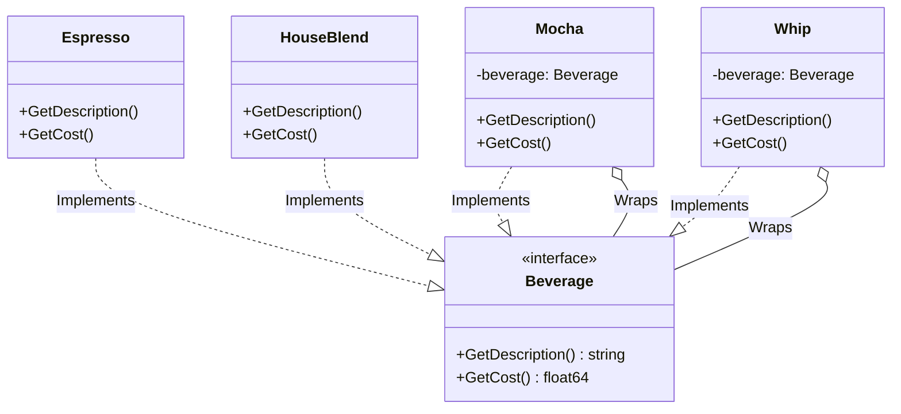

# Go Decorator Pattern Example (Clean Architecture)

このプロジェクトは、**Go**言語を用いて**Decorator Pattern（デコレーターパターン）**を実装した教育用のサンプルコードです。既存のオブジェクトを変更することなく、動的に機能（振る舞い）を追加する手法を学びます。

## ☕ シナリオ: コーヒー注文システム

コーヒー（Espresso, HouseBlend）をベースに、様々なトッピング（Mocha, Whip, Soy）を追加できるシステムです。
トッピングの組み合わせは無限にあるため、全ての組み合わせ（例: `EspressoWithMochaAndWhip`）をクラスとして作るのは非現実的です。
Decoratorパターンを使って、トッピングを「薄いラッパー」として実装し、注文時に自由に重ね合わせられるようにします。

## 🏗 アーキテクチャ構成



### 各レイヤーの役割

1.  **Domain (`/domain`)**:
    *   `Beverage`: コンポーネントの共通インターフェース。ベースのコーヒーも、トッピング（Decorator）も、全てこの型として振る舞います。
2.  **Adapter (`/adapter`)**:
    *   **Concrete Components**: `Espresso`, `HouseBlend` などのベースとなる飲み物。
    *   **Decorators**: `Mocha`, `Whip` などのトッピング。これらは内部に `Beverage` を保持し、メソッドが呼ばれると「保持しているBeverageの処理」を実行した後（または前）に、「自分の処理（価格の上乗せや名前の追加）」を行います。
3.  **Usecase (`/usecase`)**:
    *   `OrderService`: `Beverage` インターフェースを受け取って会計処理を行います。中身が「ただのエスプレッソ」なのか「モカ・ホイップ・エスプレッソ」なのかは気にしません（透過的）。

## 💡 アーキテクチャ設計ノート

### Q1. 継承（Inheritance）の代わりに移譲（Delegation）を使うメリットは？

**A. 組み合わせ爆発を防ぎ、実行時に構成を変更できる点です。**

もし継承で実装しようとすると、`HouseBlendWithMocha`, `HouseBlendWithWhip`, `HouseBlendWithMochaAndWhip`... とクラス数が指数関数的に増えてしまいます。
Decoratorパターンでは、オブジェクトの中にオブジェクトを入れる（包む）構造をとることで、クラスを増やさずに無限の組み合わせを実現できます。

### Q2. Goにおける実装のポイントは？

**A. インターフェースによる多態性（Polymorphism）です。**

Goにはクラスの継承がありませんが、Decorator構造体にも `Beverage` インターフェースを実装させ、フィールドとして `Beverage` インターフェースを持たせる（EmbeddingまたはAggregation）ことで、他言語と同じように実現できます。

```go
type Mocha struct {
    beverage domain.Beverage // 飾り付け対象
}

// インターフェースの実装
func (m *Mocha) GetCost() float64 {
    return m.beverage.GetCost() + 0.20 // 親の価格 + 自分の価格
}
```

## 🚀 実行方法

```bash
go run main.go
```
