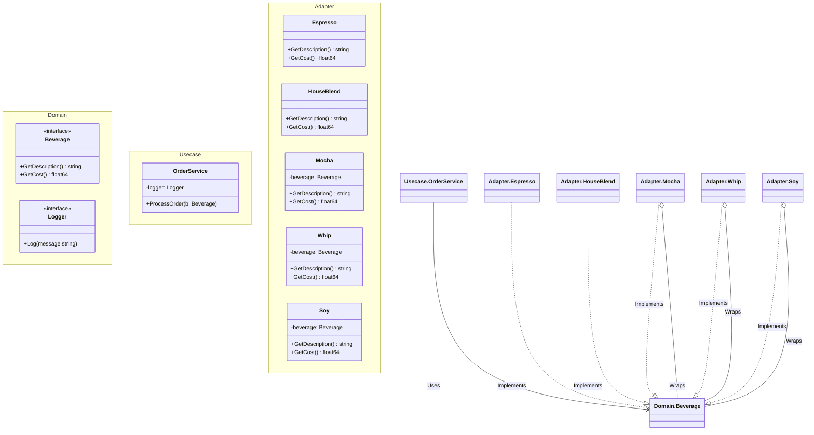

# Go Decorator Pattern Example (Clean Architecture)

このプロジェクトは、**Go**言語を用いて**Decorator Pattern（デコレーターパターン）**を実装した教育用のサンプルコードです。継承を使わずに、オブジェクトに動的に機能（責任）を追加する方法を学びます。

## この例で学べること

- **動的な振る舞いの拡張**: ベースとなるオブジェクト（コーヒー）をデコレーター（モカ、ホイップ）でラップし、価格や説明を追加する
- **継承よりコンポジション**: 構造体の埋め込みやインターフェースの保持によって "is-a" の関係を振る舞いとして実現する
- **再帰的な処理**: `GetCost` などの呼び出しがラッパーを連鎖して処理される仕組み

## すぐ試す

`decorator-example` ディレクトリで実行します。

```bash
go run main.go
```

## ☕️ シナリオ：スターバズコーヒー

コーヒーショップの注文システムを作っています。
- **飲み物**: エスプレッソ、ハウスブレンドなど
- **トッピング（デコレーター）**: モカ、豆乳、ホイップ
- 価格は、ベースの飲み物と追加したトッピングの合計金額です。

組み合わせは無限（エスプレッソ + モカ + ホイップ + 豆乳...）にあるため、全ての組み合わせに対してクラス（`EspressoWithMochaAndWhip`）を作ると**クラス爆発**が起きます。
代わりに、トッピングを「飲み物を包むラッパー」として定義します。

## 🏗 アーキテクチャ構成



### 各レイヤーの役割

1. **Domain (`/domain`)**:
    * `Beverage`: ベースコンポーネント（コーヒー）とデコレーター（トッピング）共通のインターフェース。
2. **Usecase (`/usecase`)**:
    * `OrderService`: 注文処理を行います。中身がラップされたオブジェクトであっても、単なる `Beverage` として等しく扱います。
3. **Adapter (`/adapter`)**:
    * **Concrete Components**: `Espresso`, `HouseBlend`。ベースとなる価格と説明を返します。
    * **Decorators**: `Mocha`, `Whip`, `Soy`。`Beverage` への参照を保持し、ラップした対象の結果に自分の価格・説明を上乗せします。

## 💡 アーキテクチャ設計ノート (Q&A)

### Q1. 継承のないGoでどうやってDecoratorを実現していますか？

**A. インターフェースとコンポジションを使います。**

JavaではDecoratorクラスがComponentクラスを継承することが多いですが、GoではDecorator構造体がComponentインターフェース（`Beverage`）を実装し、かつ同じインターフェース型のフィールドを持ちます。
`type Mocha struct { beverage Beverage }`

### Q2. `Beverage` 構造体に `hasMocha bool` のようなフラグを持たせるより良い理由は？

**A. 開放/閉鎖の原則 (OCP) に従うためです。**

フラグで管理しようとすると、新しいトッピング（例：「キャラメル」）を追加するたびに `Beverage` 構造体と価格計算ロジックを修正する必要があります（既存コードの変更）。
Decoratorパターンなら、新しい `Caramel` 構造体を作るだけ（新規コードの追加）で済み、既存コードに触れる必要がありません。

## 🚀 実行方法

```bash
go run main.go
```