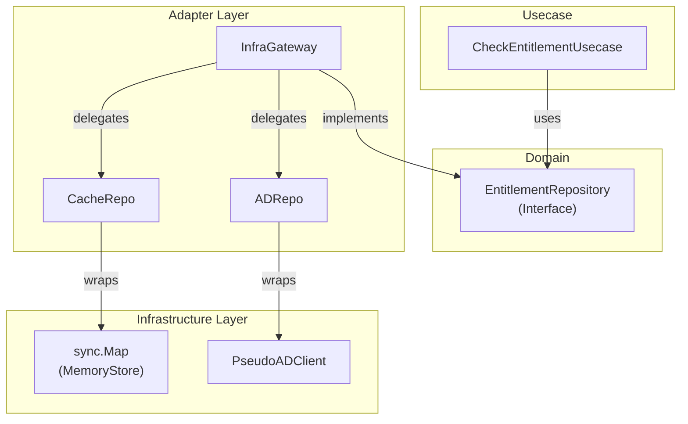

# Entitlement Example (Clean Architecture + Gateway Pattern)

This project demonstrates the relationship between "Adapter and Infrastructure" in Clean Architecture, specifically an implementation example of the **Gateway Pattern** (an Adapter that conceals multiple data sources).

## 🏗 Architecture Diagram

The dependencies are organized as follows:



### Role of Each Component

1. **Domain (`/domain`)**:
    * `EntitlementRepository`: Interface definition required by the Usecase.
2. **Usecase (`/usecase`)**:
    * `CheckEntitlementUsecase`: Business logic. Simply asks "Is the user in the group?". It doesn't know about the underlying mechanisms (cache, AD).
3. **Adapter (`/adapter`)**:
    * **`InfraGateway`**: **This is the key point.** It's the implementation class for the Domain interface. Internally, it uses `CacheRepo` and `ADRepo` to implement a caching strategy (Read-Through / Look-Aside).
    * `CacheRepo`: A component that makes `sync.Map` easier to handle.
    * `ADRepo`: A component that makes the AD client easier to handle.
4. **Infrastructure (`/infrastructure`)**:
    * `MemoryStore`: A wrapper around `sync.Map` (the actual implementation).
    * `PseudoADClient`: A stub that mimics communication with AD.

## 💡 Architecture Design Notes (Q&A)

For engineers learning Clean Architecture, this section explains the important intentions behind this design.

### Q1. Why don't `CacheRepo` and `ADRepo` implement the Domain Interface?

**A. Because their "roles" and "circumstances" are different.**

* **Role of Domain Interface (`IsMember`)**:
  * To be in a "user-friendly" format for the Usecase (caller).
  * It's an abstract contract that only wants to know "result (bool) and error."
* **Role of CacheRepo (`Get`)**:
  * To handle the technical characteristics of caching.
  * For caching, information like "was data found (Hit/Miss)" is essential before "True/False." Therefore, it uses a `(bool, found)` signature.
* **Role of ADRepo (`FetchMembership`)**:
  * To "fetch" data from an external system.

**Conclusion**:
The job of the Gateway (`InfraGateway`) is to bundle these "disparate components (Cache/AD)" and convert/adapt them into the "clean form (Interface)" desired by the Domain. Therefore, components like `CacheRepo` do not necessarily need to conform to the Domain Interface.

### Q2. What is a "Gateway"? How is it different from a Repository?

**A. They are essentially the same, but "Gateway" has a stronger nuance of being an "entry point to multiple resources."**

* If you're just reading and writing to a DB, a name like `UserRepositoryImpl` is common.
* In cases like this, where you "check the Cache, if not found, check AD, and write the result to Cache," which involves **orchestration**, it emphasizes the role of a "gate (Gateway)" to the infrastructure layer rather than just a "storage location (Repository)."
* By using this pattern, the Usecase doesn't need to know anything about the "caching strategy" or "the existence of AD," achieving **separation of concerns**.

### Q3. Where is the boundary between Infrastructure and Adapter?

**A. It's distinguished by whether it's "external code/mechanism" or "something that converts it for your own code."**

| Component | Layer | Reason |
| :--- | :--- | :--- |
| **Active Directory (server)** | Infrastructure | The external system itself |
| **go-ldap (library)** | Infrastructure | Driver for communicating with external systems |
| **ADRepo (struct)** | **Adapter** | A "converter" that uses the library to provide easy-to-use Go functions |
| **Redis (server)** | Infrastructure | External data store |
| **CacheRepo (struct)** | **Adapter** | A "converter" that uses the Redis client to provide Get/Set |

It's easy to understand if you think of "external libraries you `import`" as Infrastructure, and "your own code that wraps and uses them" as Adapter.

## 🚀 How to Run

```bash
go run main.go
```

### Example Output

```text
=== Entitlement System Started ===

--- Checking Access: User[alice] -> Group[admin] ---
  [Adapter:Gateway] Cache MISS
  [Infra:AD] Connecting to ldap://dc01.corp.local checking if 'alice' is in 'admin'...
Result: ALLOWED (User is a member)

--- Checking Access: User[alice] -> Group[admin] ---
  [Adapter:Gateway] Cache HIT
Result: ALLOWED (User is a member)
```

You can confirm that for subsequent accesses, the `[Infra:AD]` connection log does not appear, and `Cache HIT` is shown.

```
```diff
