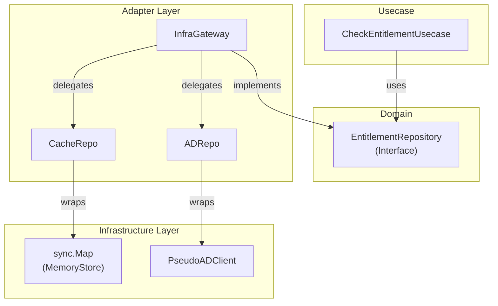

# Entitlement Example (Clean Architecture + Gateway Pattern)

このプロジェクトは、Clean Architectureにおける「AdapterとInfrastructure」の関係、特に**Gateway Pattern**（複数のデータソースを隠蔽するAdapter）の実装例を示しています。

## 🏗 アーキテクチャ構成

依存関係は以下の通り整理されています。



### 各コンポーネントの役割

1.  **Domain (`/domain`)**:
    *   `EntitlementRepository`: Usecaseが必要とするインターフェース定義。
2.  **Usecase (`/usecase`)**:
    *   `CheckEntitlementUsecase`: ビジネスロジック。「ユーザーがグループにいるか？」を問うだけ。裏側の仕組み（キャッシュ、AD）は知りません。
3.  **Adapter (`/adapter`)**:
    *   **`InfraGateway`**: **ここがポイントです。** Domainインターフェースの実装クラスです。内部で `CacheRepo` と `ADRepo` を使い分け、キャッシュ戦略（Read-Through / Look-Aside）を実現します。
    *   `CacheRepo`: `sync.Map` を扱いやすい形にする部品。
    *   `ADRepo`: ADクライアントを扱いやすい形にする部品。
4.  **Infrastructure (`/infrastructure`)**:
    *   `MemoryStore`: `sync.Map` のラッパー（実体）。
    *   `PseudoADClient`: ADへの通信を模倣するスタブ。

## 💡 アーキテクチャ設計ノート (Q&A)

Clean Architectureを学ぶエンジニア向けに、この設計の背後にある重要な意図を解説します。

### Q1. なぜ `CacheRepo` や `ADRepo` は Domain Interface を実装しないのですか？

**A. それぞれの「役割」と「都合」が違うからです。**

*   **Domain Interface (`IsMember`) の役割**:
    *   Usecase（呼び出し元）にとって「使いやすい」形式であること。
    *   「結果(bool)とエラー」だけを知りたいという抽象的な契約です。
*   **CacheRepo (`Get`) の役割**:
    *   キャッシュという技術特性を扱うこと。
    *   キャッシュには「True/False」以前に、「データが存在したか(Hit/Miss)」という情報が必須です。そのため、`(bool, found)` というシグネチャにしています。
*   **ADRepo (`FetchMembership`) の役割**:
    *   外部システムからデータを「取得(Fetch)」してくること。

**結論**:
Gateway (`InfraGateway`) の仕事は、これら「不揃いな部品（Cache/AD）」を束ねて、Domainが望む「きれいな形（Interface）」に変換・適合（Adapt）させることです。したがって、部品である `CacheRepo` などが無理に Domain Interface に合わせる必要はありません。

### Q2. 「Gateway」とは何ですか？ Repositoryと何が違いますか？

**A. 実質的には同じものですが、より「複数のリソースへの入り口」というニュアンスが強い名前です。**

*   単にDBを読み書きするだけなら `UserRepositoryImpl` のような名前が一般的です。
*   今回のように「Cacheを見て、ダメならADを見て、結果をCacheに書く」という**オーケストレーション（指揮）**を行う場合、単なる「保管場所（Repository）」というよりは、インフラ層への「門（Gateway）」としての役割が強調されます。
*   このパターンを使うことで、Usecaseは「キャッシュ戦略」や「ADの存在」を一切知る必要がなくなり、**関心の分離**が達成されます。

### Q3. Infrastructure と Adapter の境界線はどこですか？

**A. 「外部のコード/仕組み」か「それを自分のコード用に変換するもの」かで区別します。**

| コンポーネント | レイヤー | 理由 |
| :--- | :--- | :--- |
| **Active Directory (サーバー)** | Infrastructure | 外部システムそのもの |
| **go-ldap (ライブラリ)** | Infrastructure | 外部システムと話すためのドライバ |
| **ADRepo (struct)** | **Adapter** | ライブラリを使って、Goの扱いやすい関数を提供する「変換機」 |
| **Redis (サーバー)** | Infrastructure | 外部データストア |
| **CacheRepo (struct)** | **Adapter** | Redisクライアントを使って、Get/Setを提供する「変換機」 |

「`import` する外部ライブラリ」はInfrastructure、「それをラップして使っている自分のコード」はAdapterと考えると分かりやすいでしょう。

## 🚀 実行方法

```bash
go run main.go
```

### 実行結果の例

```text
=== Entitlement System Started ===

--- Checking Access: User[alice] -> Group[admin] ---
  [Adapter:Gateway] Cache MISS
  [Infra:AD] Connecting to ldap://dc01.corp.local checking if 'alice' is in 'admin'...
Result: ALLOWED (User is a member)

--- Checking Access: User[alice] -> Group[admin] ---
  [Adapter:Gateway] Cache HIT
Result: ALLOWED (User is a member)
```

2回目以降のアクセスで `[Infra:AD]` への接続ログが出ず、`Cache HIT` になっていることが確認できます。

```