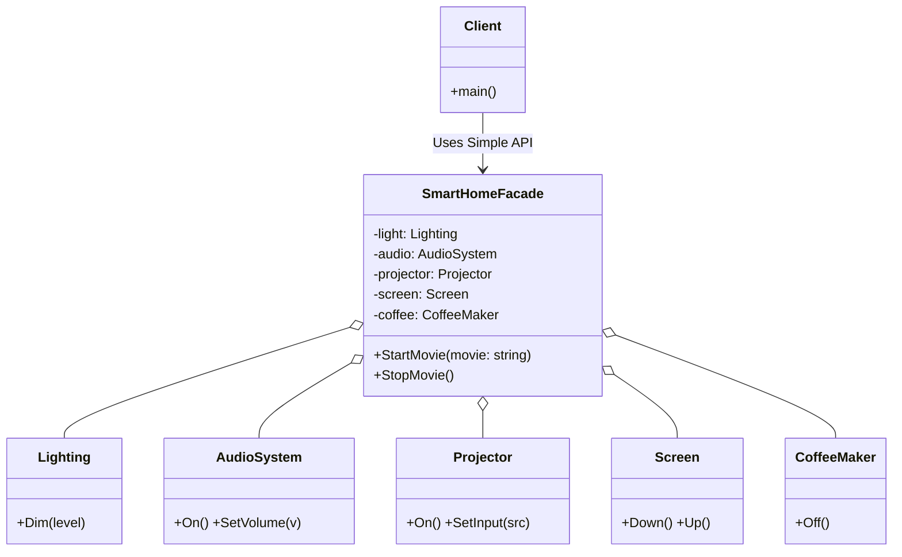

# Go Facade Pattern Example (Clean Architecture)

This project is an educational sample code that implements the **Facade Pattern** using the **Go** language.
It demonstrates how to hide the complex operational procedures of numerous subsystems (lighting, audio, projector, etc.) behind a single interface (`SmartHomeFacade`), making them easy for clients to use.

## 🏠 Scenario: Smart Home Theater Mode

When watching a movie, users do not want to perform the following operations one by one:

1. Turn off the coffee maker
2. Dim the lights
3. Lower the screen
4. Turn on the projector...

Using the Facade pattern, a single button (method) like "Start Movie (`StartMovie`)" can coordinate everything.

## 🏗 Architecture Diagram



### Role of Each Layer

1. **Facade (`/facade`)**:
    * `SmartHomeFacade`: The "window" that hides the complexity of the subsystems.
    * It exposes only simple methods (e.g., `StartMovie`) to the client.
2. **Subsystems (`/subsystems`)**:
    * `Lighting`, `AudioSystem`, etc.: A group of classes, each with independent functionality. They are unaware of the Facade.

## 💡 Architecture Design Notes (Q&A)

### Q1. What is the difference from the Mediator pattern?

**A. The difference is whether it's "unidirectional" or "bidirectional."**

* **Facade**: Its purpose is to simplify the "unidirectional" interface from the client to the subsystems. Subsystems do not interact with each other (or the Facade hides this interaction).
* **Mediator**: Its purpose is to organize the complexity when objects interact "bidirectionally."

### Q2. Should a Facade be a Singleton?

**A. In many cases, making it a Singleton is natural.**

Often, a single "window" for the entire system is sufficient. However, it is not mandatory.

## 🚀 How to Run

```bash
go run main.go
```
