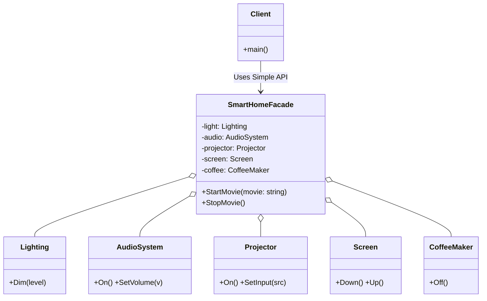

# Go Facade Pattern Example (Clean Architecture)

This project is an educational sample code that implements the **Facade Pattern** using the **Go** language.
It demonstrates how to hide the complex operational procedures of numerous subsystems (lighting, audio, projector, etc.) behind a single interface (`SmartHomeFacade`), making them easy for clients to use.

## What This Example Shows

- Encapsulating multiple subsystems behind a single façade (`SmartHomeFacade`)
- Letting clients trigger a complex workflow with one simple method call
- Wiring the façade and subsystems together in `main.go`

## Quick Start

In the `facade-example` directory:

```bash
go run main.go
```

## 🏠 Scenario: Smart Home Theater Mode

When watching a movie, users do not want to perform the following operations one by one:

1. Turn off the coffee maker
2. Dim the lights
3. Lower the screen
4. Turn on the projector...

Using the Facade pattern, a single button (method) like "Start Movie (`StartMovie`)" can coordinate everything.

## 🏗 Architecture Diagram



### Role of Each Layer

1. **Facade (`/facade`)**:
    - `SmartHomeFacade`: The "window" that hides the complexity of the subsystems.
    - It exposes only simple methods (e.g., `StartMovie`) to the client.
2. **Subsystems (`/subsystems`)**:
    - `Lighting`, `AudioSystem`, etc.: A group of classes, each with independent functionality. They are unaware of the Facade.

## 💡 Architecture Design Notes (Q&A)

### Q1. Can I still access subsystems directly?

**A. Yes, you can.**
A Facade is just a "convenient shortcut." It doesn't prevent you from using the subsystems directly if you need fine-grained control.

### Q2. What is the difference from the Mediator pattern?

**A. The difference is whether it's "unidirectional" or "bidirectional."**

- **Facade**: Its purpose is to simplify the "unidirectional" interface from the client to the subsystems. Subsystems do not interact with each other (or the Facade hides this interaction).
- **Mediator**: Its purpose is to organize the complexity when objects interact "bidirectionally."

### Q3. Can a Facade become a "God Object"?

**A. It can if you are not careful.**
A Facade should only "delegate" tasks and should not contain complex business logic itself. If it becomes too large, consider splitting it into multiple facades (e.g., `EntertainmentFacade`, `KitchenFacade`).

### Q4. Should a Facade be a Singleton?

**A. While you usually only need one instance, avoid the "Singleton Pattern" (global state).**

A single instance is often sufficient, but providing global access via something like `GetInstance()` makes testing difficult. We recommend creating a single instance in `main.go` and passing it where needed (Dependency Injection).

## 🚀 How to Run

```bash
go run main.go
```
