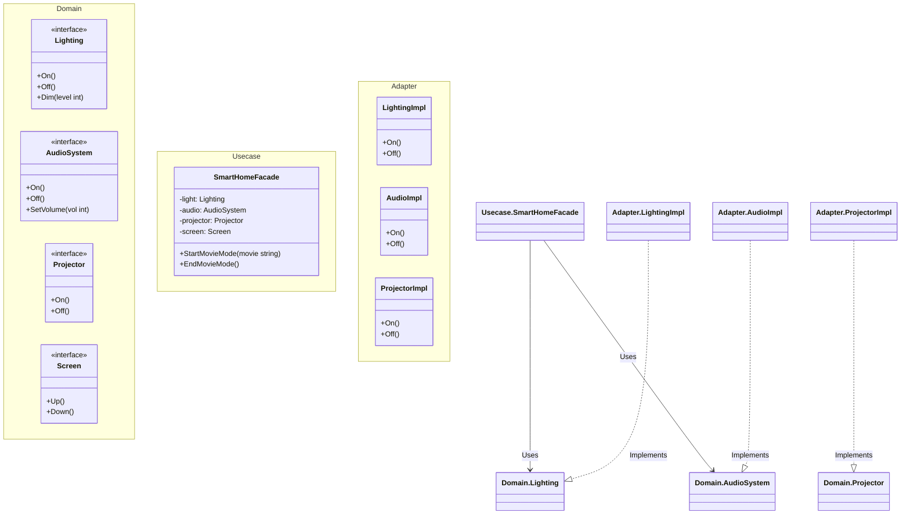

# Go Facade Pattern Example (Clean Architecture)

このプロジェクトは、**Go**言語を用いて**Facade Pattern（ファサードパターン）**を実装した教育用のサンプルコードです。複雑なサブシステムの集合に対して、シンプルで統一されたインターフェース（窓口）を提供する方法を学びます。

## この例で学べること

- **シンプルな窓口の提供**: `SmartHomeFacade` が `StartMovieMode` のようなメソッドを提供し、照明・オーディオ・プロジェクター等の複雑な連携を隠蔽します。
- **結合度の低減**: クライアントコード（`main.go`）は主にFacadeと対話するため、サブシステムの変更影響を受けにくくなります。
- **Clean Architecture構成**:
    - **Domain**: デバイスのインターフェース定義 (`Lighting`, `AudioSystem` など)。
    - **Usecase**: ファサードのロジック (`SmartHomeFacade`)。
    - **Adapter**: デバイスの具体的な実装 (`Lighting`, `Projector` など)。

## 🏠 シナリオ：スマートホーム

あなたの家には、照明、オーディオ、プロジェクター、スクリーン、コーヒーメーカーなど多くのデバイスがあります。
「映画を見る」ためには、10以上の操作（照明を暗くし、スクリーンを下げ、プロジェクターをつけ、入力を切り替え...）が必要です。
**Facade** は、これらを一括で行う `StartMovieMode` ボタンを提供します。

## 🏗 アーキテクチャ構成



### 各レイヤーの役割

1. **Domain (`/domain`)**: 各サブシステム（デバイス）のインターフェースを定義します。
2. **Usecase (`/usecase`)**: `SmartHomeFacade` を含みます。デバイスを協調させて、「映画モード」や「おはようモード」といった高レベルなタスクを実行します。
3. **Adapter (`/adapter`)**: デバイスの具体的な実装を含みます。実際のアプリでは、IoT機器のAPIを叩く処理がここに入ります。

## 💡 アーキテクチャ設計ノート (Q&A)

### Q1. Facadeを使うと、サブシステムに直接アクセスできなくなりますか？

**A. いいえ、可能です。**
Facadeはあくまで「便利なショートカット」を提供するだけです。細かい制御が必要な場合は、サブシステムに直接アクセスすることも可能です（禁止されていなければ）。

### Q2. Facadeは「神クラス（God Object）」になりませんか？

**A. 注意しないとそうなります。**
Facadeはあくまで処理を「委譲」すべきであり、複雑なビジネスロジックを自ら持つべきではありません。もし巨大になりすぎたら、機能ごとに分割（`EntertainmentFacade`, `KitchenFacade` など）することを検討してください。

### Q3. Facadeはシングルトン（Singleton）にすべきですか？

**A. インスタンスは1つで十分ですが、Singletonパターン（Global変数）は避けましょう。**

Facadeはシステム内に1つあれば十分なことが多いですが、`GetInstance()`のようなグローバルアクセスを提供する「Singletonパターン」にしてしまうと、テストが困難になります。
`main.go` で1つだけインスタンスを生成し、それを必要な場所に渡す（Dependency Injection）設計を推奨します。

## 🚀 実行方法

```bash
go run main.go
```