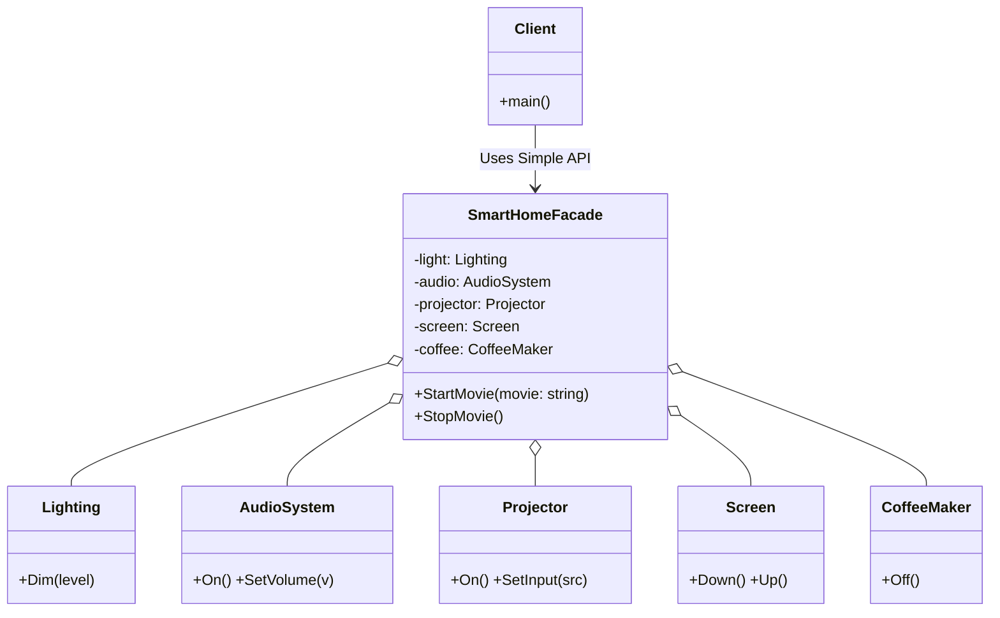

# Go Facade Pattern Example (Clean Architecture)

このプロジェクトは、**Go**言語を用いて**Facade Pattern（ファサードパターン）**を実装した教育用のサンプルコードです。
多数のサブシステム（照明、オーディオ、プロジェクターなど）の複雑な操作手順を、単一のインターフェース（`SmartHomeFacade`）の裏側に隠蔽し、クライアントが簡単に利用できるようにします。

## 🏠 シナリオ: スマートホームのシアターモード

映画を見ようとするとき、ユーザーは以下の操作をひとつひとつ行いたくありません。
1.  コーヒーメーカーの電源を切る
2.  照明を暗くする
3.  スクリーンを下ろす
4.  プロジェクターをつける...

Facadeパターンを使って、「映画モード開始(`StartMovie`)」というたった一つのボタン（メソッド）ですべてを連動させます。

## 🏗 アーキテクチャ構成



### 各レイヤーの役割

1.  **Facade (`/facade`)**:
    *   `SmartHomeFacade`: サブシステムの複雑さを隠蔽する「窓口」。
    *   クライアントに対してはシンプルなメソッド（`StartMovie`）のみを公開します。
2.  **Subsystems (`/subsystems`)**:
    *   `Lighting`, `AudioSystem`, etc.: それぞれが独立した機能を持つクラス群。Facadeのことは知りません。

## 💡 アーキテクチャ設計ノート (Q&A)

### Q1. Mediatorパターンとの違いは？

**A. 「一方向」か「双方向」かが違います。**

*   **Facade**: クライアントからサブシステムへの「一方向」のインターフェースをシンプルにするのが目的です。サブシステム同士は連携しません（あるいはFacadeがそれを隠蔽します）。
*   **Mediator**: オブジェクト同士が「双方向」に連携する場合の複雑さを整理するのが目的です。

### Q2. Facadeはシングルトンにするべきですか？

**A. 多くの場合、シングルトンにするのが自然です。**

システム全体で一つの「窓口」があれば十分な場合が多いためです。ただし、必須ではありません。

## 🚀 実行方法

```bash
go run main.go
```