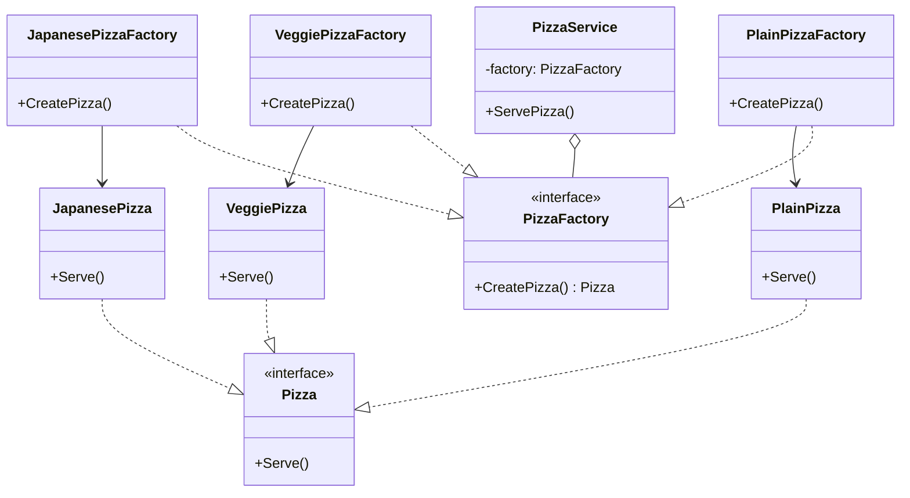

# Go Factory Method Example (Clean Architecture)

This project is a sample to explain the **Factory Method Pattern** in the **Go** language.
Using a "pizza shop" as an example, you will experience a mechanism to flexibly switch ingredients and toppings by separating concrete classes from business logic.

## 🍕 Scenario: Pizza Shop Order Flow

A pizza shop offers multiple types of pizzas such as "Plain," "Veggie," and "Japanese-style."
The `PizzaService` simply delegates the order to a `PizzaFactory` without knowing the concrete classes, and the creation rules can be swapped in `main.go` through Dependency Injection (DI).
In this sample, you can learn two types of creation strategies at the same time: the Factory Method (where a struct implements `PizzaFactory`) and the more lightweight Simple Factory (branching with a function).

## 🏗 Architecture Diagram



### Role of Each Layer

1. **Domain (`/domain`)**
    * `Pizza` (Product Interface): Defines the sequence of preparing, baking, cutting, and serving a pizza (`Prepare()`, `Bake()`, `Cut()`, `Serve()`).
    * `PizzaFactory` (Creator Interface): Has only the responsibility of creating a pizza.
2. **Usecase (`/usecase`)**
    * `PizzaService`: Is injected with a `PizzaFactory` and serves pizza without knowing its dependencies.
3. **Adapter (`/adapter`)**
    * **Concrete Factories**: `PlainPizzaFactory`, `VeggiePizzaFactory`, `JapanesePizzaFactory`.
    * **Concrete Products**: `PlainPizza`, `VeggiePizza`, `JapanesePizza`.
    * **Simple Factory**: The `SimplePizzaFactory` function creates a pizza from a string (useful for tests and small configurations).
    * **Shared Base**: Each pizza embeds a common `pizzaBase` to provide `"<Action> <Pizza name>..."` logs for `Prepare()`, `Bake()`, `Cut()`, `Serve()`, while allowing necessary steps to be overridden to express differences.

## 💡 Design Notes

### Q1. Why doesn't `PizzaService` create `&PlainPizza{}` directly?

**A.** By getting a pizza via `PizzaFactory`, `PizzaService` avoids dependency on concrete classes, making it easy to switch configurations and test.

`PizzaService` ensures the entire cooking process by calling `Prepare()`, `Bake()`, `Cut()`, and `Serve()` in order on the result of `CreatePizza()`, enforcing a common lifecycle for each pizza. For example, even if there are differences between `PlainPizzaFactory` and `VeggiePizzaFactory`, they can be served using the same procedure.

### Q2. When should I use `SimplePizzaFactory`?

**A.** For small-scale mode switching, a Simple Factory is sufficient. You can generate `PlainPizza`, `VeggiePizza`, and `JapanesePizza` based on strings until DI or mocking becomes necessary. However, as branching increases, it becomes difficult to extend, so in that case, you should revert to the Factory Method.

### Q3. What is the role of `pizzaBase`?

**A.** The `pizzaBase` embedded in each pizza standardizes the entry points for `Prepare`, `Bake`, `Cut`, and `Serve`, and maintains logs like `Preparing Plain Pizza...`. Individual pizzas only need to override the necessary steps to add differences, avoiding the need to write many redundant methods.

## 🚀 How to Run

```bash
cd factory-example
go run main.go
```
